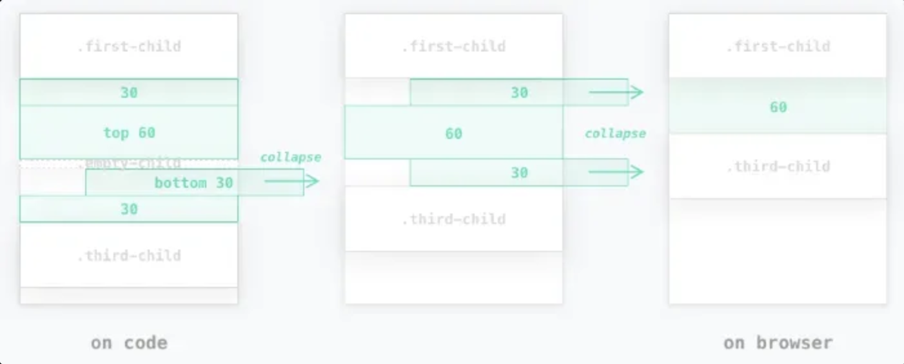

## CSS

### CSS란?


- Cascading Style Sheet
- HTML 요소의 style(디자인, 레이아웃 등)을 정의하는 데 사용

### HTML에서 외부 CSS 파일 로드하는 방법 (가장 권장하는 방법)

```html
<!DOCTYPE html>
<html>
  <head>
    <link rel="stylesheet" href="css/style.css">
  </head>
  <body>
    <h1>Hello World</h1>
    <p>This is a web page.</p>
  </body>
</html>
```

```css
h1 { color: red; }
p  { background: blue; }
```

### HTML 내부에 Embedding Style로 CSS 적용하는 방법

```html
<!DOCTYPE html>
<html>
  <head>
    <style>
      h1 { color: red; }
      p  { background: aqua; }
    </style>
  </head>
  <body>
    <h1>Hello World</h1>
    <p>This is a web page.</p>
  </body>
</html>
```

```html
<!DOCTYPE html>
<html>
  <body>
    <h1 style="color: red">Hello World</h1>
    <p style="background: aqua">This is a web page.</p>
  </body>
</html>
```

### Reset CSS

- 모든 웹 브라우저마다 각자만의 디폴트 스타일을 가지고 있어 CSS가 없어도 작동함
- 여기서 각자만의 스타일이라는 말은 브라우저마다 같은 태그라도 보이는 스타일이 다르다는 것을 의미
- 그럴 때 사용되는 것이 Reset CSS
- HTML 요소의 기본 적용되는 디폴트 스타일을 하나의 스타일로 통일시켜 CSS를 초기화하는 용도로 사용
- [가장 자주 사용되는 reset css](https://meyerweb.com/eric/tools/css/reset/)

### CSS3 Selector

- `*`: 전체 셀렉터(HTML 문서 내 모든 요소 선택)
    - 예시 코드
        
        ```html
        <!DOCTYPE html>
        <html>
        <head>
          <style>
            /* 모든 요소를 선택 */
            * { color: red; }
          </style>
        </head>
        <body>
          <h1>Heading</h1>
          <div>
            <p>paragraph 1</p>
            <p>paragraph 2</p>
          </div>
          <p>paragraph 3</p>
        </body>
        </html>
        ```
        
- `tag`: 태그 셀렉터(지정된 태그명을 가지는 요소 선택)
    - 예시 코드
        
        ```html
        <!DOCTYPE html>
        <html>
        <head>
          <style>
            /* 모든 p 태그 요소를 선택 */
            p { color: red; }
          </style>
        </head>
        <body>
          <h1>Heading</h1>
          <div>
            <p>paragraph 1</p>
            <p>paragraph 2</p>
          </div>
          <p>paragraph 3</p>
        </body>
        </html>
        ```
        
- `#id` : ID 셀렉터(#id로 지정한 값과 일치하는 요소 선택)
    - `id`는 중복될 수 없는 유일한 값
    - 예시 코드
        
        ```html
        <!DOCTYPE html>
        <html>
        <head>
          <style>
            /* id 어트리뷰트 값이 p1인 요소를 선택 */
            #p1 { color: red; }
          </style>
        </head>
        <body>
          <h1>Heading</h1>
          <div class="container">
            <p id="p1">paragraph 1</p>
            <p id="p2">paragraph 2</p>
          </div>
          <p>paragraph 3</p>
        </body>
        </html>
        ```
        
- `.class` : 클래스 셀렉터 (.class로 지정한 값과 일치하는 요소 선택)
    - `class` 는 중복될 수 있다.
    - 예시 코드
        
        ```jsx
        <!DOCTYPE html>
        <html>
        <head>
          <style>
            /* class 어트리뷰트 값이 container인 모든 요소를 선택 */
            /* color 어트리뷰트는 자식 요소에 상속된다. */
            .container { color: red; }
            /* not supported in IE */
            #p2 { color: initial; }
          </style>
        </head>
        <body>
          <h1>Heading</h1>
          <div class="container">
            <p id="p1">paragraph 1</p>
            <p id="p2">paragraph 2</p>
          </div>
          <p>paragraph 3</p>
        </body>
        </html>
        ```
        
    - 하나의 HTML 요소에 여러 개 class 추가하는 법 ⇒ 재사용 유용
        
        ```html
        <!DOCTYPE html>
        <html>
        <head>
          <style>
            /* class 어트리뷰트 값이 text-center인 모든 요소를 선택 */
            .text-center { text-align: center; }
            /* class 어트리뷰트 값이 text-large인 모든 요소를 선택 */
            .text-large  { font-size: 200%; }
            /* class 어트리뷰트 값이 text-red인 모든 요소를 선택 */
            .text-red    { color: red; }
            /* class 어트리뷰트 값이 text-blue인 모든 요소를 선택 */
            .text-blue   { color: blue; }
          </style>
        </head>
        <body>
          <p class="text-center">Center</p>
          <p class="text-large text-red">Large Red</p>
          <p class="text-center text-large text-blue">Center Large Blue</p>
        </body>
        </html>
        ```
        
- `후손 셀렉터` : 자신보다 아래에 있는 모든 요소들 중 일치하는 요소 전부 선택
    - 예시 코드
        
        ```html
        <!DOCTYPE html>
        <html>
        <head>
          <style>
            /* div 요소의 후손요소 중 p 요소 */
            div p { color: red; }
          </style>
        </head>
        <body>
          <h1>Heading</h1>
          <div>
            <p>paragraph 1</p>
            <p>paragraph 2</p>
            <span><p>paragraph 3</p></span>
          </div>
          <p>paragraph 4</p>
        </body>
        </html>
        ```
        
- `자손 셀렉터` : 자신보다 1레벨(바로 아래) 하위 속하는 요소 중 일치하는 요소 전부 선택
    - 예시 코드
        
        ```html
        <!DOCTYPE html>
        <html>
        <head>
          <style>
            /* div 요소의 자식요소 중 p 요소 */
            div > p { color: red; }
          </style>
        </head>
        <body>
          <h1>Heading</h1>
          <div>
            <p>paragraph 1</p>
            <p>paragraph 2</p>
            <span><p>paragraph 3</p></span>
          </div>
          <p>paragraph 4</p>
        </body>
        </html>
        ```
        
- `:가상 클랙스 셀렉터` : 요소의 특정 상태에 따라 스타일 정의
    - `:link` : 셀렉터가 방문하지 않은 링크일 때
    - `:visited` : 셀렉터가 방문한 링크일 때
    - `:hover` : 셀렉터에 마우스가 올라와 있을 때
    - `:active` : 셀렉터가 클릭된 상태일 때
    - `:focus` : 셀렉터에 포커스가 들어와 있을 때
    - 예시 코드
        
        ```html
        <!DOCTYPE html>
        <html>
        <head>
          <style>
            /* a 요소가 방문하지 않은 링크일 때 */
            a:link { color: orange; }
        
            /* a 요소가 방문한 링크일 때 */
            a:visited { color: green; }
        
            /* a 요소에 마우스가 올라와 있을 때 */
            a:hover { font-weight: bold; }
        
            /* a 요소가 클릭된 상태일 때 */
            a:active { color: blue; }
        
            /* text input 요소와 password input 요소에 포커스가 들어와 있을 때 */
            input[type=text]:focus,
            input[type=password]:focus {
              color: red;
            }
            </style>
          </head>
        <body>
          <a href="#" target="_blank">This is a link</a><br>
          <input type="text" value="I'll be red when focused"><br>
          <input type="password" value="I'll be red when focused">
        </body>
        </html>
        ```
        
    
    - `:checked` : 셀렉터가 체크 상태일 때
    - `:enabled` : 셀렉터가 사용 가능한 상태일 때
    - `:disabled` : 셀렉터가 사용 불가능한 상태일 때
    - 예시 코드
        
        ```html
        <!DOCTYPE html>
        <html>
        <head>
          <style>
            /* input 요소가 사용 가능한 상태일 때,
               input 요소 바로 뒤에 위치하는 인접 형제 span 요소를 선택 */
            input:enabled + span {
              color: blue;
            }
            /* input 요소가 사용 불가능한 상태일 때,
               input 요소 바로 뒤에 위치하는 인접 형제 span 요소를 선택 */
            input:disabled + span {
              color: gray;
              text-decoration: line-through;
            }
            /* input 요소가 체크 상태일 때,
               input 요소 바로 뒤에 위치하는 인접 형제 span 요소를 선택 */
            input:checked + span {
              color: red;
            }
          </style>
        </head>
        <body>
          <input type="radio" checked="checked" value="male" name="gender"> <span>Male</span><br>
          <input type="radio" value="female" name="gender"> <span>Female</span><br>
          <input type="radio" value="neuter" name="gender" disabled> <span>Neuter</span><hr>
        
          <input type="checkbox" checked="checked" value="bicycle"> <span>I have a bicycle</span><br>
          <input type="checkbox" value="car"> <span>I have a car</span><br>
          <input type="checkbox" value="motorcycle" disabled> <span>I have a motorcycle</span>
        </body>
        </html>
        ```
        
    
    - `:first-child` : 셀렉터에 해당하는 모든 요소 중 첫번째 자식인 요소를 선택
    - `:last-child` : 셀렉터에 해당하는 모든 요소 중 마지막 자식인 요소를 선택
    - 예시 코드
        
        ```html
        <!DOCTYPE html>
        <html>
        <head>
          <style>
            /* p 요소 중에서 첫번째 자식을 선택 */
            p:first-child { color: red; }
        
            /* p 요소 중에서 마지막 자식을 선택 */
            /* body 요소의 두번째 p 요소는 마지막 자식 요소가 아니다.
               body 요소의 마지막 자식 요소는 div 요소이다. */
            p:last-child { color: blue; }
          </style>
        </head>
        <body>
          <p>This paragraph is the first child of its parent (body).</p>
        
          <h1>Welcome to My Homepage</h1>
          <p>This paragraph is not the first child of its parent.</p>
        
          <div>
            <p>This paragraph is the first child of its parent (div).</p>
            <p>This paragraph is not the first child of its parent.</p>
          </div>
        </body>
        </html>
        ```
        
    
    - `:nth-child(n)`: 셀렉터에 해당하는 모든 요소 중 앞에서 n번째 자식인 요소를 선택
    - `:nth-last-child(n)`: 셀렉터에 해당하는 모든 요소 중 뒤에서 n번째 자식인 요소를 선택
    - 예시 코드
        
        ```html
        <!DOCTYPE html>
        <html>
        <head>
          <style>
            /* ol 요소의 자식 요소인 li 요소 중에서 짝수번째 요소만을 선택 */
            ol > li:nth-child(2n)   { color: orange; }
            /* ol 요소의 자식 요소인 li 요소 중에서 홀수번째 요소만을 선택 */
            ol > li:nth-child(2n+1) { color: green; }
        
            /* ol 요소의 자식 요소인 li 요소 중에서 첫번쨰 요소만을 선택 */
            ol > li:first-child     { color: red; }
            /* ol 요소의 자식 요소인 li 요소 중에서 마지막 요소만을 선택 */
            ol > li:last-child      { color: blue; }
        
            /* ol 요소의 자식 요소인 li 요소 중에서 4번째 요소 요소만을 선택 */
            ol > li:nth-child(4)    { background: brown; }
        
            /* ul 요소의 모든 자식 요소 중에서 뒤에서부터 시작하여 홀수번째 요소만을 선택 */
            ul > :nth-last-child(2n+1) { color: red; }
            /* ul 요소의 모든 자식 요소 중에서 뒤에서부터 시작하여 짝수번째 요소만을 선택 */
            ul > :nth-last-child(2n)   { color: blue; }
          </style>
        </head>
        <body>
          <ol>
            <li>Espresso</li>
            <li>Americano</li>
            <li>Caffe Latte</li>
            <li>Caffe Mocha</li>
            <li>Caramel Latte</li>
            <li>Cappuccino</li>
          </ol>
        
          <ul>
            <li>Espresso</li>
            <li>Americano</li>
            <li>Caffe Latte</li>
            <li>Caffe Mocha</li>
            <li>Caramel Latte</li>
            <li>Cappuccino</li>
          </ul>
        </body>
        </html>
        ```
        

- `::가상 요소 셀렉터` : 요소의 특정 부분에 스타일을 적용하기 위해 사용
    - `::first-letter` : 콘텐츠의 첫글자를 선택
    - `::first-line` : 콘텐츠의 첫 줄을 선택, 블록 요소에만 적용 가능
    - `::after` : 콘텐츠의 뒤에 위치하는 공간을 선택, 일반적으로 content 프로퍼티와 함께 사용
    - `::before` : 콘텐츠의 앞에 위치하는 공간을 선택, 일반적으로 content 프로퍼티와 함께 사용
    - `::selection` : 드래그한 콘텐츠를 선택. iOS Safari 등 일부 브라우저에서 동작하지 않음
    - 예시 코드
        
        ```html
        <!DOCTYPE html>
        <html>
        <head>
          <style>
            /* p 요소 콘텐츠의 첫글자를 선택 */
            p::first-letter { font-size: 3em; }
            /* p 요소 콘텐츠의 첫줄을 선택 */
            p::first-line   { color: red; }
        
            /* h1 요소 콘텐츠의 앞 공간에 content 어트리뷰트 값을 삽입한다 */
            h1::before {
              content: " HTML!!! ";
              color: blue;
            }
            /* h1 요소 콘텐츠의 뒷 공간에 content 어트리뷰트 값을 삽입한다 */
            h1::after {
              content: " CSS3!!!";
              color: red;
            }
        
            /* 드래그한 콘텐츠를 선택한다 */
            ::selection {
              color: red;
              background: yellow;
            }
          </style>
        </head>
        <body>
          <h1>This is a heading</h1>
          <p>Lorem ipsum dolor sit amet, consectetur adipisicing elit. Explicabo illum sunt distinctio sed, tempore, repellat rerum et ea laborum voluptatum! Quisquam error fugiat debitis maiores officiis, tenetur ullam amet in!</p>
        </body>
        </html>
        ```
        

### CSS 프로퍼티 값의 단위

- 크기 단위
    - `px` : 픽셀 단위 (1px 화소 1개 크기)
    - `em` : 배수 단위로 상대 단위, 요소에 지정된 사이즈에 상대적 사이즈 설정
        - 예시 코드
            
            ```html
            <!DOCTYPE html>
            <html>
            <head>
              <style>
                body {
                  font-size: 14px;
                  text-align: center;
                }
                div {
                  font-size: 1.2em; /* 14px * 1.2 = 16.8px */
                  font-weight: bold;
                  padding: 2em;     /* 16.8px * 2 = 33.6px */
                  background-color: rgba(255, 0, 0, 0.2);
                }
              </style>
            </head>
            <body>
              <div>Font size: 1.2em → 14px * 1.2 = 16.8px</div>
            </body>
            </html>
            ```
        
        > ❗ 중첩된 자식 요소 em 지정하면 모든 자식 요소의 사이즈에 영향을 미치기 때문에 주의해야 함
        > - 예시 코드    
        >    ```html
        >    <!DOCTYPE html>
        >    <html>
        >    <head>
        >      <style>
        >        body {
        >          font-size: 14px;
        >          text-align: center;
        >        }
        >        div {
        >          font-size: 1.2em; /* 14px * 1.2 = 16.8px */
        >          font-weight: bold;
        >          padding: 2em;
        >        }
        >        .box1 { background-color: rgba(255, 0, 0, 0.2); }
        >        .box2 { background-color: rgba(255, 0, 0, 0.6); }
        >        .box3 { background-color: rgba(255, 0, 0, 0.8); }
        >      </style>
        >    </head>
        >    <body>
        >      <div class='box1'>
        >        Font size: 1.2em ⇒ 14px * 1.2 = 16.8px
        >        <div class='box2'>
        >          Font size: 1.2em ⇒ 16.8px * 1.2 = 20.16px
        >          <div class='box3'>
        >            Font size: 1.2em ⇒ 20.16px * 1.2 = 24.192px
        >          </div>
        >        </div>
        >      </div>
        >    </body>
        >    </html>
        >    ```
        >   → 위 예시를 통해 em은 상대적 사이즈가 적용되어 상황에 따라 같은 1.2em이더라도 각기 다른 값을 가질 수 있다는 것을 알 수 있다.
        
    - `rem` : 최상위 요소(html)의 사이즈를 기준으로 삼는다. rem의 r은 root를 의미
        - 예시 코드
            
            ```html
            <!DOCTYPE html>
            <html>
            <head>
              <style>
                html {
                  font-size: 14px;
                  /* font-size 미지정 시에는 16px */
                }
                div {
                  font-size: 1.2rem; /* html font-size: 14px * 1.2 = 16.8px */
                  font-weight: bold;
                  padding: 2em;
                  text-align: center;
                }
                .box1 { background-color: rgba(255, 0, 0, 0.2); }
                .box2 { background-color: rgba(255, 0, 0, 0.6); }
                .box3 { background-color: rgba(255, 0, 0, 0.8); }
              </style>
            </head>
            <body>
              <div class='box1'>
                Font size: 1.2rem ⇒ 14px * 1.2 = 16.8px
                <div class='box2'>
                  Font size: 1.2rem ⇒ 14px * 1.2 = 16.8px
                  <div class='box3'>
                    Font size: 1.2rem ⇒ 14px * 1.2 = 16.8px
                  </div>
                </div>
              </div>
            </body>
            </html>
            ```
            
    - `%` : 백분률 단위의 상대 단위, 요소에 지정된 사이즈에 상대적인 사이즈 설정
        - 예시 코드
            
            ```css
            .box {
            	width: 500px;
            }
            
            .box > .inner-box {
            	width: 100%; // 500px로 설정될거에요.
            }
            ```
            
- viewport : vh, vw
    - `1vw` : viewport 너비의 1/100
    - `1vh` : viewport 높이의 1/100
    
    > ❗ 브라우저에 꽉 차게 너비를 잡고자 하면 `100vw` 로 뷰포트 전체를 잡기도 함
    
### CSS 속성

- box model
    
    
    
    - Content: 요소의 텍스트나 이미지 등의 실제 내용이 위치하는 영역, width, height 프로퍼티를 가짐
    - Padding: 테두리(Border) 안쪽에 위치하는 요소의 내부 여백 영역, padding 프로퍼티 값은 패딩 영역의 두께를 의미하며 기본색은 투명, 요소에 적용된 배경의 컬러, 이미지는 패딩 영역까지 적용
    - Border: 테두리 영역으로 border 프로퍼티 값은 테두리의 두께를 의미
    - Margin: 테두리(Border) 바깥에 위치하는 요소의 외부 여백 영역, margin 프로퍼티 값은 마진 영역의 두께를 의미, 기본적으로 투명(transparent)하며 배경색을 지정할 수 없음.
    - 예시 코드
        
        ```html
        <!DOCTYPE html>
        <html>
        <head>
          <style>
            div {
              /* 배경색의 지정: 콘텐츠 영역과 패딩 영역에 적용된다. */
              background-color: lightgrey;
              /* 콘텐츠 영역의 너비 */
              width: 300px;
              /* 패딩 영역의 두께 */
              padding: 25px;
              /* 테두리: 두께 형태 색상 */
              border: 25px solid navy;
              /* 마진 영역의 두께 */
              margin: 25px;
            }
          </style>
        </head>
        <body>
          <h2>Box Model</h2>
        
          <div>Lorem ipsum dolor sit amet, consectetur adipiscing elit, sed do eiusmod tempor incididunt ut labore et dolore magna aliqua. Ut enim ad minim veniam, quis nostrud exercitation ullamco laboris nisi ut aliquip ex ea commodo consequat. Duis aute irure dolor in reprehenderit in voluptate velit esse cillum dolore eu fugiat nulla pariatur. Excepteur sint occaecat cupidatat non proident, sunt in culpa qui officia deserunt mollit anim id est laborum.</div>
        </body>
        </html>
        ```
        
    
- `width / height`
    - 요소의 너비와 높이를 지정하기 위해 사용 → Content 영역을 대상
    - 만약 width, height로 지정한 영역보다 실제 콘텐츠가 크면 content 영역을 넘쳐 흐름
    - 예시 코드
        
        ```html
        <!DOCTYPE html>
        <html>
        <head>
          <meta charset="UTF-8">
          <style>
            div {
              width: 300px;
              height: 100px;
              background-color: cornsilk;
              border: 5px solid navy;
            }
          </style>
        </head>
        <body>
          <div>
            Lorem ipsum dolor sit amet, consectetur adipisicing elit, sed do eiusmod tempor incididunt ut labore et dolore magna aliqua. Ut enim ad minim veniam, quis nostrud exercitation ullamco laboris nisi ut aliquip ex ea commodo consequat. Duis aute irure dolor in reprehenderit in voluptate velit esse cillum dolore eu fugiat nulla pariatur. Excepteur sint occaecat cupidatat non proident, sunt in culpa qui officia deserunt mollit anim id est laborum.
          </div>
        </body>
        </html>
        ```
        
    - `min-width` : 최소 너비 지정
    - `max-width` : 최대 너비 지정
    - `min-height` : 최소 높이 지정
    - `max-height` : 최대 높이 지정

> ❗ `box-sizing` : width, height 프로퍼티 대상 영역을 변경할 수 있다.
> 
> - box-sizing 프로퍼티의 값
>    - `content-box(기본값)` : width, height 대상 영역이 content 영역을 의미
>    - `border-box` : margin을 제외한 박스 모델 전체를 width, height 대상 >영역으로 지정 가능
>- 예시 코드
>    
>    ```html
>    <!DOCTYPE html>
>    <html>
>      <head>
>        <style>
>          .content-box {
>            width: 600px;
>            border: 10px solid;
>            padding: 50px;
>            margin: 50px;
>            background-color: red;
>          }
>          .border-box {
>            box-sizing: border-box;
>            width: 600px;
>            border: 10px solid;
>            padding: 50px;
>            margin: 50px;
>            background-color: red;
>          }
>        </style>
>      </head>
>      <body>
>      <div class="content-box">content-box</div>
>      <div class="border-box">border-box</div>
>    </body>
>    </html>
>    ```

- `margin / padding`
    
    
    
    - 바깥 여백 / 안쪽 여백을 지정하는 프로퍼티
    - top, right, left, bottom 각 방향에 전부 지정 가능
    - 예시 코드
        
        ```html
        <!DOCTYPE html>
        <html>
          <head>
            <style>
              div {
                border: 5px solid red;
        
                margin-top: 40px;
                margin-right: 30px;
                margin-bottom: 20px;
                margin-left: 10px;
        
                padding-top: 10px;
                padding-right: 20px;
                padding-bottom: 30px;
                padding-left: 40px;
              }
            </style>
          </head>
          <body>
            <div>Lorem ipsum dolor sit amet, consectetur adipiscing elit, sed do eiusmod tempor incididunt ut labore et dolore magna aliqua. Ut enim ad minim veniam, quis nostrud exercitation ullamco laboris nisi ut aliquip ex ea commodo consequat. Duis aute irure dolor in reprehenderit in voluptate velit esse cillum dolore eu fugiat nulla pariatur. Excepteur sint occaecat cupidatat non proident, sunt in culpa qui officia deserunt mollit anim id est laborum.</div>
          </body>
        </html>
        ```

>    ❗ margin을 모든 방향 한 번에 줄 수 있고 따로따로 줄 수 있음, 코드를 한줄로, 혹은 나눠서 적을 수 있음    
>    - `margin: 25px;` : top, right, bottom, left 전부 25px
    
- `border-style` : 테두 선의 스타일을 지정
    - 종류: https://developer.mozilla.org/ko/docs/Web/CSS/border-style
- `border-color` : 테두리 선의 색상을 지정
    - 예시 코드
        
        ```html
        <!DOCTYPE html>
        <html>
          <head>
            <style>
              p {
                background: palegreen;
                padding: 10px;
                border-style: solid;
              }
              p.one {
                border-color: red;
              }
              p.two {
                border-color: green;
              }
              p.three {
                border-color: red green blue yellow;
              }
        
            </style>
          </head>
          <body>
            <h2>border-color Property</h2>
        
            <p class="one">border-color: red</p>
            <p class="two">border-color: green</p>
            <p class="three">border-color: red green blue yellow</p>
          </body>
        </html>
        ```
        
- `border-radius` : 테두리 모서리를 둥글게 표현
    
    
    
    - 예시 코드
        
        ```html
        <!DOCTYPE html>
        <html>
        <head>
          <style>
            div {
              background: #eaeaed;
              color: #666;
              width: 150px;
              height: 150px;
              line-height: 150px;
              text-align: center;
            }
            .border-rounded {
              /* 모든 모서리를 동일하게 설정 */
              border-radius: 20px;
            }
          </style>
        </head>
        <body>
          <div class="border-rounded">border-radius: 20px</div>
        </body>
        </html>
        ```
        
    - 공식 문서 : https://developer.mozilla.org/en-US/docs/Web/CSS/border-radius
- `border` : `border-width, border-style, border-color` 한 번에 설정하기 위해 shorthand 프로퍼티
    
    ```css
    /* Syntax */
    border: border-width border-style border-color;
    
    p {
      /* border-width border-style border-color */
      border: 5px solid red;
    }
    ```
    
- `display` : layout 정의에 자주 사용되는 아주 중요한 프로퍼티
    
    
    | 프로퍼티값 키워드 | 설명 |
    | --- | --- |
    | block | block 특성을 가지는 요소(block 레벨 요소)로 지정 |
    | inline | inline 특성을 가지는 요소(inline 레벨 요소)로 지정 |
    | inline-block | inline-block 특성을 가지는 요소(inline-block 레벨 요소)로 지정 |
    | none | 해당 요소를 화면에 표시하지 않음(공간조차 사라짐) |
    - `block` (레벨) 요소 = `display: block;`
        - 줄바꿈이 들어가 다른 요소들을 다른 줄로 밀어내고 혼자 한 줄을 차지
        - ex) `<div> <p> <h1> …`
        - width, height, margin, padding 속성이 모두 반영
        - 기본적으로 화면 크기 전체의 가로폭을 차지(`width: 100%`)
    - `inline` (레벨) 요소 = `display: inline;`
        - 줄바꿈 없이 한 줄에 다른 요소들과 나란히 배치
        - ex) `<span> <a> <em> …`
        - 주의할 점: width, height 속성을 지정해도 무시 + margin, padding은 좌우만 반영(상하 x)
        - inline 요소 내에 block 레벨 요소를 포함할 수 없다.
    - `inline-block` = `display: inline-block;`
        - inline + block 두 레벨의 요소를 합친 하이브리드
        - 줄바꿈 없이 한 줄로 다른 요소들과 나란히 배치(inline) + width, height 가능(block) + margin, padding 상하좌우 전부 가능(block)
        - ex) `<button> <input> <select> …`
- background
    - `background-image` : 배경 이미지 지정
    - `background-repeat` : 배경 이미지 반복 지정 (반복 출력을 멈추고 싶을 때 no-repeadt 설정)
    - `background-size` : 배경 이미지 width, height (하나 값만 지정하면 width를 의미, height는 auto)
        - `background-size: cover;` : 배경 이미지 크기 비율 유지한 상태로 부모 요소의 width, height 중 큰 값에 배경 이미지를 맞춤
        - `background-size: contain;` : 배경이미지의 크기 비율을 유지한 상태에서 부모 요소의 영역에 배경 이미지가 보이지 않는 부분 없이 전체가 들어갈 수 있도록 이미지 스케일을 조정
    - `background-attachment` : 일반적으로 화면을 스크롤하며 배경 이미지도 함께 스크롤
        - `background-attachment: fixed;` : 화면이 스크롤되더라도 배경 이미지는 스크롤되지 않고 고정되어 있음
    - `background-color` : 배경 색상 지정 (`색상값` 혹은 `transparent` 지정 가능)
- font / text
    - `font-size: 10px;` : 텍스트 크기
    - `font-family: Arial, Helvetica, sans-serif;` : 폰트 지정
        - 첫 폰트가 클라이언트에 설치되어 있지 않은 경우, 다음 지정된 폰트를 적용
        - 따라서 마지막에 지정하는 폰트는 대부분 OS에 기본적으로 설치되어 있는 generic-family 폰트(Serif, Sans-serif, Mono space)를 지정하는 것이 일반적
    - `font-weight: bold;` : 폰트 굵기 지정
    - `line-height: 70%;` : 텍스트 높이 지정
    - `leeter-sapcing: 2px;` : 글자 사이 간격 지정
    - `text-align- center;` : 텍스트 수평 정렬
    
>    ❗ 부모 영역을 벗어난 텍스트를 잘라내어 보이지 않게 하고 말 줄임포(…)를 표시하는 법
>    
>    ```css
>    .truncate {
>      width: 150px;             /* width가 지정되어 있어야 한다. */
>      white-space: nowrap;      /* 자동 줄바꿈을 방지 */
>      overflow: hidden;         /* 반드시 "visible" 이외의 값이 지정되어 있어야 한다. */
>      text-overflow: ellipsis;  /* ellipsis or clip */
>    }
>    ```
>    
>    - 예시코드
>        
>        ```css
>        <!DOCTYPE html>
>        <html>
>        <head>
>          <meta charset="utf-8">
>          <style>
>            div {
>              width: 150px; /* width가 지정되어 있어야 한다. */
>              height: 150px;
>              padding: 10px;
>              margin: 40px;
>              border-radius: 6px;
>              border-color: gray;
>              border-style: dotted;
>              white-space: nowrap; /* 자동 줄바꿈을 방지 */
>              overflow: hidden;    /* 반드시 "visible" 이외의 값이 지정되어 있어야 한다. */
>            }
>            .clip     { text-overflow: clip; }
>            .ellipsis { text-overflow: ellipsis; }
>          </style>
>        </head>
>        <body>
>          <h1>text-overflow</h1>
>          <div class="clip">
>            <h3>clip</h3>
>            Lorem ipsum dolor sit amet, consectetur adipisicing elit
>          </div>
>          <div class="ellipsis">
>            <h3>ellipsis</h3>
>            Lorem ipsum dolor sit amet, consectetur adipisicing elit
>          </div>
>        </body>
>        </html>
>        ```
    
- position - 요소 위치 정의
    - `position: static;` : position의 기본값, 지정하지 않았을 때와 같음.
    - `position: relative;` : 기본 위치를 기준으로 좌표 프로퍼티(top, bottom, left, right)를 사용하여 위치를 이동시킴
        - static을 선언한 요소와 relative를 선언한 요소의 차이점은 좌표 프로퍼티의 동작 여부 뿐, 그 외는 동일하게 동작
    - `postion: absolute;` : 부모 요소 또는 가장 가까이 있는 조상 요소(static 제외)를 기준으로 좌표 프로퍼티(top, bottom, left, right)만큼 이동
        - 만약 부모 또는 조상 요소가 `static` 이라면 `document body` 를 기준으로 위치
        - `absolute` 선언 시, blcok 레벨 요소의 width는 inline 요소와 같이 content에 맞게 변화 되므로 적절한 width를 지정하여야 함
        - 예시 코드
            
            ```css
            <!DOCTYPE html>
            <html>
            <head>
              <style>
                body { margin: 0; }
                .parent {
                  width: 200px;
                  height: 200px;
                  background: #bcbcbc;
                  border: 1px solid #bcbcbc;
                  margin: 50px 0 0 300px;
                  position: relative;
                }
                .absolute-box {
                  position: absolute;
                  height: 200px; width: 200px;
                  top: 50px; left: 50px;
                  color: #e55c3c;
                  font-weight: bold;
                  text-align: center;
                  background: #2E303D;
                  line-height: 200px;
                }
              </style>
            </head>
            <body>
              <div class="parent">
                <div class="absolute-box">absolute box (in parent)</div>
              </div>
              <div class="absolute-box">absolute box (no parent)</div></body>
            </html>
            ```
            
        - relative 있고 없고의 absolute 차이 → https://codepen.io/ungmo2/pen/pewbWo
    - `position: fixed;` : 부모 요소와 관계없이 브라우저의 viewport를 기준으로 좌표 프로퍼티(top, bottom, left, right)을 사용해 위치를 이동
        - 스크롤 되어도 화면에서 사라지지 않고 항상 같은 곳에 위치
        - fixed 선언 시, block 요소의 width는 inline 요소와 같이 content에 맞게 변화되므로 적절한 width 지정
        - 예시 코드
            
            ```css
            <!DOCTYPE html>
            <html>
            <head>
              <style>
                body { margin: 0; }
                .fixed-box {
                  position: fixed;
                  color: #e55c3c;
                  font-weight: bold;
                  text-align: center;
                  background: #2E303D;
                }
                .sidebar {
                  width: 50px;
                  height: 100%;
                  top: 0;
                  right: 0;
                  padding-top: 100px;
                }
                .footer {
                  width: 200px;
                  width: 100%;
                  height: 50px;
                  bottom: 0;
                  left: 0;
                  line-height: 50px;
                }
              </style>
            </head>
            <body>
              <div class="fixed-box sidebar">fixed box (side-bar)</div>
              <div class="fixed-box footer">fixed box (footer)</div>
            </body>
            </html>
            ```
            
    > ❗ `position` 과 짝꿍으로 자주 사용되는 `z-index` 프로퍼티
>     
>    - `z-index` : 값에 큰 숫자를 지정할 수록 화면 전면에 출력, 단 position이 static 이외인 요소만 적용
>        
>        
>        
>    - 예시 코드
>        
>        ```html
>        <!DOCTYPE html>
>        <html>
>        <head>
>          <style>
>            .normal-box {
>              width: 100px; height: 100px;
>            }
>            .absolute-box {
>             width: 100px; height: 100px;
>             position: absolute;
>           }
>           /* z-index는 position 프로퍼티가 static 이외인 요소에만 적용된다. */
>            .orange {
>              background-color: orange;
>              z-index: 1000;
>            }
>            .red {
>              background-color: red;
>              left: 50px; top: 50px;
>              z-index: 100;
>            }
>            .green {
>              background-color: green;
>              left: 100px; top: 100px;
>              z-index: 10;
>            }
>            .blue {
>              background-color: blue;
>              left: 150px; top: 150px;
>              z-index: 1;
>            }
>          </style>
>        </head>
>        <body>
>          <div class="normal-box orange"></div>
>         <div class="absolute-box red"></div>
>          <div class="absolute-box green"></div>
>          <div class="absolute-box blue"></div>
>        </body>
>        </html>
>        ```        
    
- float: 주로 레이아웃 구성할 때 block 레벨 요소를 가로 정렬하기 위해 사용되는 중요한 기법
    
    
    
    - `float` : 이 속성은 원래 이미지 주위를 텍스트로 감싸기 위해 만들어진 것
    - 프로퍼티 값
        - none: 요소를 떠 있게 하지 않는다. (기본값)
        - right: 요소를 오른쪽으로 이동
        - left: 요소를 왼쪽으로 이동
    - 예시 코드
        
        ```html
        <!DOCTYPE html>
        <html>
          <head>
            <style>
              img {
                float: left;
                margin-right: 10px;
              }
            </style>
          </head>
          <body>
            
            <div>
              Lorem ipsum dolor sit amet, consectetur adipisicing elit, sed do eiusmod
              tempor incididunt ut labore et dolore magna aliqua. Ut enim ad minim
              veniam, quis nostrud exercitation ullamco laboris nisi ut aliquip ex ea
              commodo consequat. Duis aute irure dolor in reprehenderit in voluptate
              velit esse cillum dolore eu fugiat nulla pariatur. Excepteur sint occaecat
              cupidatat non proident, sunt in culpa qui officia deserunt mollit anim id
              est laborum.Lorem ipsum dolor sit amet, consectetur adipisicing elit, sed
              do eiusmod tempor incididunt ut labore et dolore magna aliqua. Ut enim ad
              minim veniam, quis nostrud exercitation ullamco laboris nisi ut aliquip ex
              ea commodo consequat. Duis aute irure dolor in reprehenderit in voluptate
              velit esse cillum dolore eu fugiat nulla pariatur. Excepteur sint occaecat
              cupidatat non proident, sunt in culpa qui officia deserunt mollit anim id
              est laborum.
            </div>
          </body>
        </html>
        
        ```
        
    - float 선언 시, width가 inline 요소와 같이 콘텐츠에 맞게 최소화되고, 다음 요소 위에 떠 있게 한다.
- float 사용 시 겪을 수 있는 문제
    - float 선언된 요소 & 선언되지 않은 요소 간 margin 사라짐
        - 해결 방법 + 예시 코드
            
            float 프로퍼티 선언하지 않은 요소에 `overflow: hidden;` 선언
            → `overflow: hidden;` 는 자식 요소가 부모 요소보다 클 경우 넘치는 부분을 안 보이게 해주는데, 여기서 float 프로퍼티가 없어서 제대로 표현되지 못하는 요소를 제대로 출력
            
            ```html
            <!DOCTYPE html>
            <html>
            <head>
              <style>
                .box {
                  color: white;
                  font-weight: bold;
                  font-size: 30px;
                  line-height: 50px;
                  height: 50px;
                  margin: 0 10px;
                  padding: 10px;
                }
                .d1 {
                  float: left;
                  background: red;
                }
                .d2 {
                  /* overflow: hidden; */ -> 이 친구 주석을 풀어보세요.
                  background: orange;
                }
              </style>
            </head>
            <body>
              <div class="box d1"> float: left; </div>
              <div class="box d2"> div </div>
            </body>
            </html>
            ```
            
    - float 선언된 자식 요소를 포함하는 부모 요소의 높이가 정상적 반영 X
        - 해결 방법 + 예시 코드
            
            문제 원인: float 요소는 일반적 흐름 상에 존재하지 않음(float 요소의 높이를 알 수 없음)
            → 즉, 자식 요소의 높이를 모르기에 부모 요소가 높이를 자동으로 잡지 못한 것
            
            - 해결 방법 1: float 선언된 자식 요소의 부모 요소에 `overflow: hidden;`
            - 해결 방법 2: `:after` 가상 요소 선택자 사용
            
            ```html
            // 문제 발생 코드
            <!DOCTYPE html>
            <html>
            <head>
              <style>
                .container {
                  color: white;
                  text-align: center;
                  padding: 10px;
                  background-color: #def0c2;
                }
                .d1, .d2 {
                  float: left;
                  width: 50%;
                  padding: 20px 0;
                }
                .d1 {
                  background-color: #59b1f6;
                }
                .d2 {
                  background-color: #ffb5b4;
                }
              </style>
            </head>
            <body>
              <div class="container">
                <div class="d1">1</div>
                <div class="d2">2</div>
              </div>
              <div style="background:red;padding:10px;color:white;">3</div>
            </body>
            </html>
            ```
            
            ```html
            // 문제 해결 코드
            <!DOCTYPE html>
            <html>
            <head>
              <style>
                .container {
                  color: white;
                  text-align: center;
                  padding: 10px;
                  background-color: #def0c2;
                  /*overflow: hidden;*/
                }
                .clearfix:after {
                  content: "";
                  display: block;
                  clear: both;
                }
                .d1, .d2 {
                  float: left;
                  width: 50%;
                  padding: 20px 0;
                }
                .d1 {
                  background-color: #59b1f6;
                }
                .d2 {
                  background-color: #ffb5b4;
                }
              </style>
            </head>
            <body>
              <div class="container clearfix">
                <div class="d1">1</div>
                <div class="d2">2</div>
              </div>
              <div style="background:red;padding:10px;color:white;">3</div>
            </body>
            </html>
            ```
            
>    ❗ float를 clear하라고?
>    
>    float으로 컨텐츠를 띄울 시 다음 내용은 빈자리를 채우려 올라오게 된다.
>    
>    이러한 현상은 브라우저의 오류로 생겨난 것이고,
>    
>    이를 해결하는 `clearfix`는 위의 오류를 해결하기 위한 일종의 버그 해결 방법
>    
>    > clearfix 4가지 방법
>    > 
>    1. 가상 요소 `::after` 사용 (권장)
>         
>       1. 가상 요소로 nav 태그 뒤에 빈 내용 `(content: ‘’)` 블럭을 `display: block;` 만들고, `float: left; float: right;` 를 초기화 시키겠다는 뜻 `(clear: both;)`            
>                   
>       2. 코드는            
>            ```jsx
>            nav::after {
>              dispaly: block;
>              content: '';
>              clear: both;
>            }
>            ```            
>    2. `overflow: hidden;` /`overflow: auto;`
>        1. float 속성을 가진 요소의 부모 요소에 적용 시켜준다.
>        2. `overflow: auto;` : 자식의 너비가 부모의 너비보다 크다면 바로 스크롤바가 생김
>        3. `overflow: hidden;` : 넘치는 부분이 잘리기 때문에 사용하지 않는 것이 좋음
>    3. 빈 엘리먼트에 clear 속성 적용
>        1. 1번과 비슷한데 이 방법은 빈 태그를 만들어서 `clear: both; height: 0; overflow: hidden;` 를 적용해 높이가 0인 보이지 않는 태그를 만들어 float 해제하는 방법
    
- 마진 상쇄란? (생각보다 자주 만나고, 모르면 얼타는 내용)
    - https://developer.mozilla.org/ko/docs/Web/CSS/CSS_box_model/Mastering_margin_collapsing
    - 마진 상쇄 = 마진 겹침 현상
    - 여러 블록 요소의 상하 마진이 겹칠 때 제일 큰 여백의 크기를 가진 단일 여백으로 합쳐지는 브라우저 나름의 렌더링 규칙
    - 마진 상쇄가 일어나는 상황
        1. 인접 형제 박스 간 상하 마진이 겹칠 때
            
            겹쳐진 두 마진 값 중 더 큰 마진 값으로 상쇄해 렌더링하고, 두 갑이 동일한 경우 중복을 상쇄
            
            
            
        2. 빈 요소의 상하 마진이 겹칠 때
            
            빈 요소란? - height가 0인 상태의 블록 요소
            즉, height/min-height/padding/border 등 상하로 늘어나는 프로퍼티 값을 명시적으로 주지 않았거나 내부에 inline content가 존재하지 않는 요소
            
            빈 요소가 위 아래를 가르는 경계가 없으므로 자신의 상단, 하단의 마진 값을 비교해 더 큰 값으로 상쇄하고, 두 값이 동일한 경우 중복을 상쇄
            
            
            
        3. 부모 margin top과 첫 번째 자식의 margin top 겹칠 때
            
            
            
            
            
            
            
        4. 부모 margin bottom과 마지막 자식의 하단 margin bottom 겹칠 때
            
            
            
    - 마진 상쇄가 일어나는 상황이 적용되는 규칙 (아무때나 일어나는 것은 아님)
        1. 인접한 두 박스가 온전한 block-level 요소일 경우에만 적용
            1. inline, inline-block 등의 요소는 block level이 아님
        2. 마진값이 0이더라도 상쇄 규칙은 적용됨
        3. 좌우 마진은 겹쳐도 상쇄되지 않음
    - 마진 상쇄 해결법
        1. 부모 상단 혹은 하단에 padding 혹은 border 값으로 일종의 벽을 만들어주는 것이 안전
        2. 박스가 `position: absolute;` or `float: left/right;` 상태일 때 (상쇄 규칙 적용 예외 처리)
        3. 박스가 `display: flex;` or `display: grid;` 일 때 내부 item (상쇄 규칙 적용 예외 처리)

### CSS에는 상속과 우선 순위가 있음(= cascading)

- 상속: 상위 요소에 적용된 프로퍼티를 하위 요소가 물려 받는 것

- 상속되는 속성
    - width / height
    - margin
    - padding
    - border
    - box-sizing
    - display
    - background
    - text-decoration
    - position
    - top / right / bottom / left
    - z-index
    - overflow
    - float

- 상속되지 않는 속성
    - visibility
    - opacity
    - font
    - color
    - line-height
    - text-align
    - white-space
    
- 예시 코드
    
    ```jsx
    <!DOCTYPE html>
    <html>
    <head>
      <meta charset="utf-8">
      <style>
        .text-red {
          color: red;
          border: 1px solid #bcbcbc;
          padding: 10px;
        }
      </style>
    </head>
    <body>
      <div class="text-red">
        <h1>Heading</h1>
        <p>Paragraph<strong>strong</strong></p>
        <button>Button</button>
      </div>
    </body>
    </html>
    ```
    
- ⭐⭐⭐ 캐스캐이딩 (cascading): CSS 적용 우선순위 → 면접 단골 질문
    
    요소가 하나 이상의 CSS 선언에 영향을 받을 수 있다. 이 때 충돌을 피하기 위해 필요한 것이 CSS 적용 우선순위이다.
    
- cascading 규칙
    1. 중요도: CSS가 어디에 선언 되었는지에 따라 서 우선순위가 달라짐
        
        ```jsx
        1. head 요소 내의 style 요소
        2. head 요소 내의 style 요소 내의 @import 문
        3. <link> 로 연결된 CSS 파일
        4. <link> 로 연결된 CSS 파일 내의 @import 문
        5. 브라우저 디폴트 스타일시트
        ```
        
    2. 명시도: 대상을 명확하게 특정할수록 명시도가 높아지고, 우선순위가 높아짐
        
        `!important` > 인라인 스타일 > 아이디 선택자 > 클래스/어트리뷰트/가상 선택자 > 태그 선택자 > 전체 선택자 > 상위 요소에 의해 상속된 속성
        
        - 예시 코드 (직접 명시도를 확인해보자)
            
            ```jsx
            <!DOCTYPE html>
            <html>
            <head>
              <style>
                p        { color: red !important; }
                #thing   { color: blue; }
            
                div.food { color: chocolate; }
                .food    { color: green; }
                div      { color: orange; }
              </style>
            </head>
            <body>
              <p id="thing">Will be Red.</p>
              <div class="food">Will be Chocolate.</div>
            </body>
            </html>
            ```
            
    3. 선언순서: 선언된 순서에 따라 우선순위 적용됨. 즉, 나중에 선언된 스타일 우선 적용
        - 예시 코드
            
            ```html
            <!DOCTYPE html>
            <html>
            <head>
              <style>
                p { color: blue; }
                p { color: red; }
            
                .red { color: red; }
                .blue { color: blue; }
              </style>
            </head>
            <body>
              <p>Will be RED.</p>
              <p class="blue red">Will be BLUE.</p>
            </body>
            </html>
            ```
            

### 그림자 효과 부여하기

- `text-shadow: Horizontal-offset Vertical-offset Blur-Radius Shadow-Color;`
    
    
    | 프로퍼티 값 | 단위 | 설명 | 생략 |
    | --- | --- | --- | --- |
    | Horizontal-offset | px | 그림자를 텍스트의 오른쪽으로 지정값만큼 이동 |  |
    | Vertical-offset | px | 그림자를 텍스트의 아래로 지정값만큼 이동 |  |
    | Blur-Radius | ps | 그림자의 흐림 정도를 지정, 지정값만큼 그림자가 커지고 흐려짐 | 가능 |
    | Shadow-Color | color | 그림자의 색상 지정 | 가능 |
    - 예시 코드
        
        ```css
        <!DOCTYPE html>
        <html>
        <head>
          <style>
            h1:nth-child(1) {
              text-shadow: 5px 5px;
            }
            h1:nth-child(2) {
              text-shadow: 5px 5px red;
            }
            h1:nth-child(3) {
              text-shadow: 5px 5px 3px red;
            }
            h1:nth-child(4) {
              color: white;
              text-shadow: 5px 5px 3px black;
            }
            h1:nth-child(5) {
              text-shadow: 0 0 3px red;
            }
            /*Multiple Shadows*/
            h1:nth-child(6) {
              text-shadow: 0 0 3px red, 0 0 10px blue;
            }
            /*Multiple Shadows*/
            h1:nth-child(7) {
              color: white;
              text-shadow: 1px 1px 2px black, 0 0 25px blue, 0 0 5px darkblue;
            }
          </style>
        </head>
        <body>
          <h1>Text-shadow effect!</h1>
          <h1>Text-shadow effect!</h1>
          <h1>Text-shadow effect!</h1>
          <h1>Text-shadow effect!</h1>
          <h1>Text-shadow effect!</h1>
          <h1>Text-shadow effect!</h1>
          <h1>Text-shadow effect!</h1>
        </body>
        </html>
        ```
        
- `box-shadow: Inset Horizontal-offset Vertical-offset Blur-Radius Spread Shadow-Color;`
    
    
    | 프로퍼티 값 | 단위 | 설명 | 생략 |
    | --- | --- | --- | --- |
    | Inset | inset | inset 키워드를 지정하면 그림자가 요소 안쪽에 위치 | 가능 |
    | Horizontal-offset | px | 그림자를 텍스트의 오른쪽으로 지정값만큼 이동 |  |
    | Vertical-offset | px | 그림자를 텍스트의 아래로 지정값만큼 이동 |  |
    | Blur-Radius | px | 그림자의 흐림 정도를 지정, 지정값만큼 그림자가 커지고 흐려짐 | 가능 |
    | Spread | px | 그림자를 더 크게 확장.(음수, 양수) | 가능 |
    | Shadow-Color | color | 그림자의 색상을 지정 | 가능 |
    - 예시 코드
        
        ```css
        <!DOCTYPE html>
        <html>
        <head>
          <style>
            div {
              width: 300px;
              height: 100px;
              padding: 15px;
              margin: 20px;
              background-color: yellow;
            }
            /*box-shadow: Inset Horizontal-offset Vertical-offset Blur-Radius Spread Shadow-Color;*/
            /* Horizontal-offset Vertical-offset */
            div:nth-of-type(1) {
              box-shadow: 10px 10px;
            }
            /* Horizontal-offset Vertical-offset Shadow-Color */
            div:nth-of-type(2) {
              box-shadow: 10px 10px blue;
            }
            /* Horizontal-offset Vertical-offset Blur-Radius Shadow-Color */
            div:nth-of-type(3) {
              box-shadow: 10px 10px 5px blue;
            }
            /* Horizontal-offset Vertical-offset Blur-Radius Spread Shadow-Color */
            div:nth-of-type(4) {
              box-shadow: 10px 10px 5px 5px blue;
            }
            /* Inset Horizontal-offset Vertical-offset Blur-Radius Spread Shadow-Color */
            div:nth-of-type(5) {
              box-shadow: inset 10px 10px 5px 5px blue;
            }
            /* Horizontal-offset Vertical-offset Blur-Radius Spread Shadow-Color */
            div:nth-of-type(6) {
              background-color: white;
              box-shadow: 0 4px 8px 0 rgba(0, 0, 0, 0.2), 0 6px 20px 0 rgba(0, 0, 0, 0.19);
            }
          </style>
        </head>
        <body>
          <div>This is a div element with a box-shadow</div>
          <div>This is a div element with a box-shadow</div>
          <div>This is a div element with a box-shadow</div>
          <div>This is a div element with a box-shadow</div>
          <div>This is a div element with a box-shadow</div>
          <div>This is a div element with a box-shadow</div>
        </body>
        </html>
        ```
        

### Interactive UI를 구현하기 위해 반드시 알아야 하는 속성들

- transition: CSS 프로퍼티 값 변화할 때, 프로퍼티 값 변화가 일정 시간에 걸쳐 일어나도록 하는 것
    
    ```html
    <!DOCTYPE html>
    <html>
    <head>
      <style>
        div {
          width: 100px;
          height: 100px;
          background: red;
        }
        div:hover {
          border-radius: 50%;
          background: blue;
        }
      </style>
    </head>
    <body>
      <div></div>
    </body>
    </html>
    ```
    
    위 코드에서는 `hover` 되면 `border-radius`, `background` 프로퍼티 값이 즉시 변경됨
    
    `hover` 됐을 때 + `hover` 풀릴 때 프로퍼티 값 변경을 부드럽게 해보자.
    
    ```html
    <!DOCTYPE html>
    <html>
    <head>
      <style>
        div {
          width: 100px;
          height: 100px;
          background: red;
          /* 트랜지션 효과: 모든 프로퍼티의 변화를 2초에 걸쳐 전환한다. */
          transition: all 2s;
        }
        div:hover {
          border-radius: 50%;
          background: blue;
        }
      </style>
    </head>
    <body>
      <div></div>
    </body>
    </html>
    ```
    
    만약, hover 됐을 때만 부드럽게 하고, 마우스 뺄 때는 애니메이션이 필요 없다면?
    
    ```html
    <!DOCTYPE html>
    <html>
    <head>
      <style>
        div {
          width: 100px;
          height: 100px;
          background: red;
        }
        div:hover {
          background: blue;
          border-radius: 50%;
          /* hover on에서만 발동한다. */
          transition: all 2s;
        }
      </style>
    </head>
    <body>
      <div></div>
    </body>
    </html>
    ```
    
    | 프로퍼티 | 설명 | 기본값 |
    | --- | --- | --- |
    | transition-property | 트랜지션의 대상이 되는 CSS 프로퍼티를 지정 | all |
    | transition-duration | 트랜지션이 일어나는 지속시간(duration)을 초 단위(s) 또는 밀리 초 단위(ms)로 지정 | 0s |
    | transition-timing-function | 트랜지션 효과를 위한 수치 함수를 지정 | ease |
    | transition-delay | 프로퍼티가 변화한 시점과 트랜지션이 실제로 시작하는 사이에 대기하는 시간에 초 단위(s) 또는 밀리 초 단위(ms)로 지정 | 0s |
    | transition | 모든 트랜지션 프로퍼티를 한 번에 지정 ([shorthand syntax](https://www.w3.org/TR/css3-transitions/#transition-shorthand-property)) |  |
    - shorthand: `transition: proprty duration funciton delay`
- animation: [공식문서 보러가기](https://developer.mozilla.org/ko/docs/Web/CSS/animation) CSS 스타일을 다른 CSS 스타일로 부드럽게 변화시키는 것
    
    애니메이션 나타내는 CSS + 애니메이션 시퀀스를 나타내는 복수의 키프레임(`@keyframes`)로 이루어짐
    
    | 프로퍼티 | 설명 | 기본값 |
    | --- | --- | --- |
    | animation-name | `@keyframes` 애니메이션 이름을 지정 |  |
    | animation-duration | 한 싸이틀의 애니메이션에 소요되는 시간을 초 단위(s) 또는 밀리 초 단위(ms)로 지정 | 0s |
    | animation-timing-function | 애니메이션 효과를 위한 타이밍 함수를 지정 | ease |
    | animation-delay | 요소가 로드된 시점과 애니메이션이 실제로 시작하는 사이에 대기하는 시간을 초 단위(s) 또는 밀리 초 단위(ms)로 지정 | 0s |
    | animaiton-iteration-count | 애니메이션 재생 횟수를 지정 | 1 |
    | animation-direction | 애니메이션이 종료된 이후 반복될 때 진행하는 방향을 지정 | normal |
    | animation-fill-mode | 애니메이션 미실행 시(종료 또는 대기) 요소의 스타일을 지정 |  |
    | animation-play-state | 애니메이션 재생 상태(재생 또는 중지)를 지정 | running |
    | animation | 모든 애니메이션 프로퍼티를 한 번에 지정 ([shorthand syntax](https://drafts.csswg.org/css-animations/#animation)) |  |

> ❗ animation `css` vs `javascript`
>
>- 비교적 작은 효과나 CSS 만으로도 충분환 효과를 볼 수 있는 것은 CSS를 사용
>    - width 변경 애니메이션 등등
>- 세밀한 제어를 위해서 자바스크립트 사용
>    - 바운스, 중지, 일시 중지, 되감기, 감속 등등의 고급 효과

- `@keyframes` : 여러 시점(breakpoint)에서 CSS 프로퍼티 값을 지정([공식문서 보러가기](https://developer.mozilla.org/ko/docs/Web/CSS/@keyframes))
    - 예시 코드
        
        ```html
        <!DOCTYPE html>
        <html>
        <head>
          <style>
            div {
              position: absolute;
              width: 100px;
              height: 100px;
              background-color: red;
              animation-name: move;
              animation-duration: 5s;
              animation-iteration-count: infinite;
            }
            /* @keyframes rule */
            @keyframes move {
              /* keyframe */
              from {
                left: 0;
              }
              /* keyframe */
              to {
                left: 300px;
              }
            }
          </style>
        </head>
        <body>
          <div></div>
        </body>
        </html>
        ```
        
- animation shorthands
    
    ```css
    animation: name duration timing-function delay iteration-count direction fill-mode play-state
    ```
    
- `transform`: 요소에 이동(translate), 회전(rotate), 확대 축소(scale), 비틀기(skew) 효과를 부여하기 위한 함수를 제공(단, 애니메이션 효과를 제공하지는 않기에 바로 적용되어 화면에 표시)
    - `2D transform` 프로퍼티 값으로 사용되는 변환함수(transform function)
        
        
        | transform function | 설명 | 단위 |
        | --- | --- | --- |
        | translate(x,y) | 요소의 위치를 X축으로 x만큼, Y축으로 y만큼 이동시킨다. | px, %, em 등 |
        | translateX(n) | 요소의 위치를 X축으로 x만큼 이동시킨다. | px, %, em 등 |
        | translateY(n) | 요소의 위치를 Y축으로 y만큼 이동시킨다. | px, %, em 등 |
        | scale(x,y) | 요소의 크기를 X축으로 x배, Y축으로 y배 확대 또는 축소 시킨다. | 0과 양수 |
        | scaleX(n) | 요소의 크기를 X축으로 x배 확대 또는 축소 시킨다. | 0과 양수 |
        | scaleY(n) | 요소의 크기를 Y축으로 y배 확대 또는 축소 시킨다. | 0과 양수 |
        | skew(x-angle,y-angle) | 요소를 X축으로 x 각도만큼, Y축으로 y 각도만큼 기울인다. | +/- 각도(deg) |
        | skewX(x-angle) | 요소를 X축으로 x 각도만큼 기울인다. | +/- 각도(deg) |
        | skewY(y-angle) | 요소를 Y축으로 y 각도만큼 기울인다. | +/- 각도(deg) |
        | rotate(angle) | 요소를 angle만큼 회전시킨다. | +/- 각도(deg) |
        - 예시 코드
            
            ```html
            <!DOCTYPE html>
            <html>
            <head>
              <style>
              .box {
                width: 95px;
                height: 95px;
                line-height: 95px;
                color: white;
                text-align: center;
                border-radius: 6px;
              }
              .original {
                margin: 30px;
                border: 1px dashed #cecfd5;
                background: #eaeaed;
                float: left;
              }
              .child {
                background: #2db34a;
                cursor: pointer;
              }
              .translate {
                transform: translate(10px, 50px);
              }
              .scale {
                transform: scale(.75);
              }
              .skew {
                transform: skew(5deg, -20deg);
              }
              .rotate {
                transform: rotate(70deg);
              }
              .complex {
                transform: scale(.5) rotate(20deg);
              }
            
              /* Animation Effect */
              .translate:hover {
                transition: transform 1s linear;
                transform: translate(0px, 0px);
              }
              /* .translate:hover {
                animation: translate 1s linear forwards;
              }
              @keyframes translate {
                100% {
                  transform: translate(0px, 0px);
                }
              } */
              .scale:hover {
                transition: transform 1s linear;
                transform: scale(1);
              }
              .skew:hover {
                transition: transform 1s linear;
                transform: skew(0, 0);
              }
              .rotate:hover {
                transition: transform 1s linear;
                transform: rotate(0);
              }
              .complex:hover {
                transition: transform 1s linear;
                transform: scale(1) rotate(0);
              }
              </style>
            </head>
            <body>
              <div class="original box">
                <div class="child box translate">translate</div>
              </div>
              <div class="original box">
                <div class="child box scale">scale</div>
              </div>
              <div class="original box">
                <div class="child box skew">skew</div>
              </div>
              <div class="original box">
                <div class="child box rotate">rotate</div>
              </div>
              <div class="original box">
                <div class="child box complex">complex</div>
              </div>
            </body>
            </html>
            ```
            
        > ❗
        >
        >`transform-origin` : 요소의 기본 기준점을 설정할 때 사용 (기본값은 정중앙인 50%, 50%)
        >
        >- 예시 코드
        >    
        >    ```html
        >    <!DOCTYPE html>
        >    <html>
        >    <head>
        >      <style>
        >      .box {
        >        width: 150px;
        >        height: 150px;
        >        line-height: 150px;
        >        color: white;
        >        text-align: center;
        >        border-radius: 6px;
        >      }
        >      .original {
        >        margin: 20px;
        >        border: 1px dashed #cecfd5;
        >        background: #eaeaed;
        >        float: left;
        >      }
        >      .child {
        >        background: #2db34a;
        >        cursor: pointer;
        >      }
        >      .scale1:hover {
        >        transition: transform 1s linear;
        >        transform-origin: 0 0;
        >        transform: scale(.5);
        >      }
        >      .scale2:hover {
        >        transition: transform 1s linear;
        >        transform-origin: 50% 50%;
        >        transform: scale(.5);
        >      }
        >      .scale3:hover {
        >        transition: transform 1s linear;
        >        transform-origin: 100% 100%;
        >        transform: scale(.5);
        >      }
        >      .translate:hover {
        >        transition: transform 1s linear;
        >        /*transform-origin: 100% 100%;*/
        >        transform: translate(10px, 10px);
        >      }
        >      </style>
        >   </head>
        >    <body>
        >      <div class="original box">
        >        <div class="child box scale1">scale1</div>
        >      </div>
        >      <div class="original box">
        >        <div class="child box scale2">scale2</div>
        >      </div>
        >      <div class="original box">
        >        <div class="child box scale3">scale3</div>
        >      </div>
        >      <div class="original box">
        >        <div class="child box translate">translate</div>
        >      </div>
        >    </body>
        >    </html>
        >    ```
        
    - `3D Transform` 프로퍼티 값으로 사용하는 변환 함수(transform function)
        
        
        | transform function | 설명 | 단위 |
        | --- | --- | --- |
        | translate3d(x,y,z) | 요소의 위치를 X축으로 x만큼, Y축으로 y만큼 Z축으로 z만큼 이동시킨다. | px, %, em 등 |
        | translateX(n) | 요소의 위치를 X축으로 x만큼 이동시킨다. | px, %, em 등 |
        | translateY(n) | 요소의 위치를 Y축으로 y만큼 이동시킨다. | px, %, em 등 |
        | translateZ(n) | 요소의 위치를 Z축으로 z만큼 이동시킨다. | px, %, em 등 |
        | scale3d(x,y) | 요소의 크기를 X축으로 x배, Y축으로 y배, Z축으로 z배 확대 또는 축소 시킨다. | 0과 양수 |
        | scaleX(n) | 요소의 크기를 X축으로 x배 확대 또는 축소 시킨다. | 0과 양수 |
        | scaleY(n) | 요소의 크기를 Y축으로 y배 확대 또는 축소 시킨다. | 0과 양수 |
        | scaleZ(n) | 요소의 크기를 Z축으로 z배 확대 또는 축소 시킨다. | 0과 양수 |
        | rotate3d(x,y,z) | 요소를 X축으로 x각도, Y축으로 y각도, Z축으로 z각도 회전시킨다. | +/- 각도(deg) |
        | rotateX(x) | 요소를 X축으로 x각도 회전시킨다. | +/- 각도(deg) |
        | rotateY(y) | 요소를 Y축으로 y각도 회전시킨다. | +/- 각도(deg) |
        | rotateZ(z) | 요소를 Z축으로 z각도 회전시킨다. | +/- 각도(deg) |
