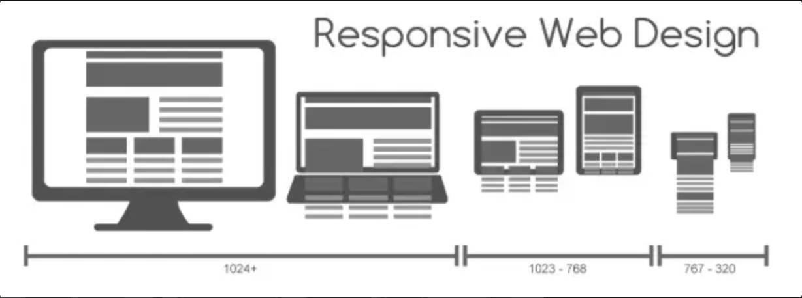
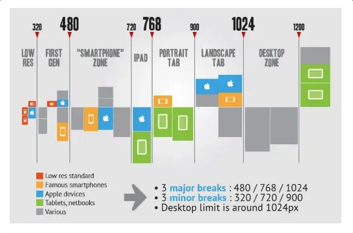
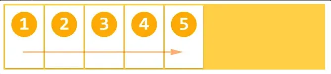
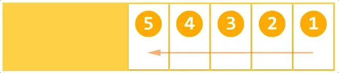
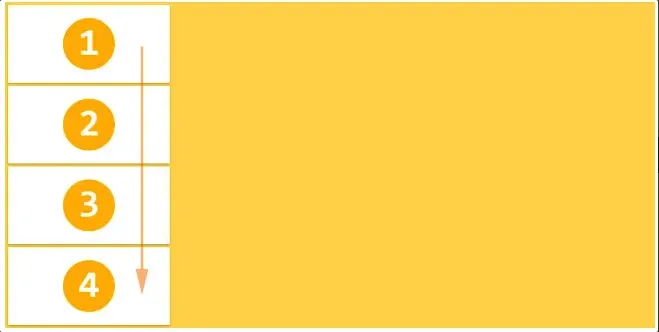
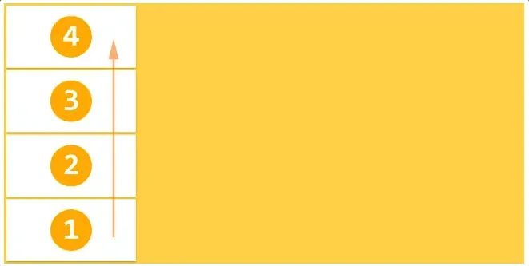
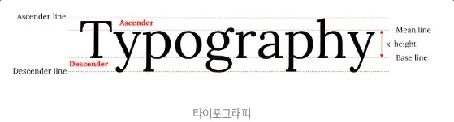
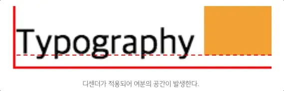

## 레이아웃이란?

→ layout의 핵심은 block 레벨 요소들을 원하는 위치에 배열하는 것

- layout에 사용되는 용어들
    - Header & Navigation Bar
    - Section(콘텐츠 영역) & Aside(콘텐츠에 대한 부가 정보 영역)
    - Footer

## 반응형 레이아웃

- 반응형 웹 디자인이란?
    
    
    
    사용자가 어떤 디바이스로 웹사이트를 방문할지 모른다. 그렇기에 데스크탑, 태블릿, 모바일 각 화면마다 웹사이트가 잘 돌아갈 수 있도록 만들어줘야 하는 것이다.
    
- 반응형 레이아웃을 만드는 방법
    - `viewport meta tag`
        
        일반적으로 모바일 디바이스에서만 적용
        
        | 프로퍼티 | Description | 사용 예 |
        | --- | --- | --- |
        | width | viewport 너비(px). 기본값: 980px | width=240
        width=device-width |
        | height | viewport 높이(px) | height=800
        width=device-height |
        | initial-scale | viewport 초기 배율 | initial-scale=1.0 |
        | user-scale | 확대 축소 가능 여부 | user-scale=no |
        | maximum-scale | viewport 최대 배율 | maximum-scale=2.0 |
        | minimum-scale | viewport 최소 배율 | minimum-scale=1.0 |
        
        ```html
        <meta name="viewport" content="width=device-width, initial-scale=1.0">
        ```
        
        - 가장 일반적인 viewport 설정이다. 가로폭을 디바이스의 가로폭에 맞추고, 초기 화면 배율을 100%로 설정하는 것을 의미
    - `@media` -  반응형 웹디자인에 사용되는 핵심 기술
        
        미디어 별로 style을 지정하는 것을 `Media Query` 라고 함. 디바이스 지정 뿐 아니라 디바이스 크기나 비율까지 구분 가능
        
        - 미디어 쿼리 기본 문법
            
            ```css
            @media not|only mediatype and (expressions) {
              CSS-Code;
            }
            ```
            
        - 위 레이아웃 실습 코드에 아래 코드를 추가해서 어떻게 변화하는지 확인
            
            ```css
            @media screen and (min-width: 600px) {
              body {
                background-color: lightgreen;
              }
            }
            ```
            
        
        일반적으로 반응형 웹 디자인은 viewport 너비(width)를 기준으로 한다. 따라서 viewport의 width 
        
- Mobile first: 어플리케이션에서 가장 중요한 사이즈가 모바일이라는 것
    - Mobile first Method Breakpoint
        
        `min-width`를 사용해 최소 너비를 기준으로 `breakpoint`를 잡고 있음
        
        ```css
        /*==========  Mobile First Method  ==========*/
        /* All Device */
        
        /* Custom, iPhone Retina : 320px ~ */
        @media only screen and (min-width : 320px) {
        
        }
        /* Extra Small Devices, Phones : 480px ~ */
        @media only screen and (min-width : 480px) {
        
        }
        /* Small Devices, Tablets : 768px ~ */
        @media only screen and (min-width : 768px) {
        
        }
        /* Medium Devices, Desktops : 992px ~ */
        @media only screen and (min-width : 992px) {
        
        }
        /* Large Devices, Wide Screens : 1200px ~ */
        @media only screen and (min-width : 1200px) {
        
        }
        ```
        
    - Non-Mobile first Method Breakpoint
        
        `max-width`를 사용해 최대 너비를 기준으로 `breakpoint`를 잡고 있음
        
        ```css
        /*==========  Non-Mobile First Method  ==========*/
        /* All Device */
        
        /* Large Devices, Wide Screens : ~ 1200px */
        @media only screen and (max-width : 1200px) {
        
        }
        /* Medium Devices, Desktops : ~ 992px */
        @media only screen and (max-width : 992px) {
        
        }
        /* Small Devices, Tablets : ~ 768px */
        @media only screen and (max-width : 768px) {
        
        }
        /* Extra Small Devices, Phones : ~ 480px */
        @media only screen and (max-width : 480px) {
        
        }
        /* Custom, iPhone Retina : ~ 320px */
        @media only screen and (max-width : 320px) {
        
        }
        ```
        
- 보통 많이 쓰는 breakpoint 기준
    
    
    
- `Media Query` 직접 확인해보기 (화면 너비를 줄여보자)
    
    ```html
    <!DOCTYPE html>
    <html>
    <head>
      <meta name="viewport" content="width=device-width, initial-scale=1.0">
      <style>
        /* 801px ~ */
        * { color: black; }
        /* ~ 800px */
        @media screen and (max-width: 800px) {
          * { color: blue; }
        }
        /* ~ 480px */
        @media screen and (max-width: 480px) {
          * { color: red; }
        }
      </style>
    </head>
    <body>
      <h1>@media practice</h1>
      <p>Lorem ipsum dolor sit amet, consectetur adipisicing elit, sed do eiusmod tempor incididunt ut labore et dolore magna aliqua. Ut enim ad minim veniam, quis nostrud exercitation ullamco laboris nisi ut aliquip ex ea commodo consequat. Duis aute irure dolor in reprehenderit in voluptate velit esse cillum dolore eu fugiat nulla pariatur. Excepteur sint occaecat cupidatat non proident, sunt in culpa qui officia deserunt mollit anim id est laborum.</p>
    </body>
    </html>
    ```
    
- Device가 Mobile일 때 `가로/세로` 에 따른 디자인을 따로 줄 수도 있음
    
    ```html
    <!DOCTYPE html>
    <html>
    <head>
      <meta name="viewport" content="width=device-width, initial-scale=1.0">
      <style>
        /* 세로  */
        * { color: black; }
        /* 가로 */
        /* Desktop의 화면은 가로화면(landscape)이므로 아래 rule이 적용된다. */
        /*
        @media screen and (orientation: landscape) {
          { color: blue; }
        }
        */
    
        /* Landscape */
        @media screen
          /* 디바이스가 모바일일때(device-width 0 ~ 768px) */
          and (max-device-width: 760px)
          /* 가로 */
          and (orientation: landscape) {
          * { color: blue; }
        }
      </style>
    </head>
    <body>
      <h1>@media practice: orientation</h1>
      <p>Lorem ipsum dolor sit amet, consectetur adipisicing elit, sed do eiusmod tempor incididunt ut labore et dolore magna aliqua. Ut enim ad minim veniam, quis nostrud exercitation ullamco laboris nisi ut aliquip ex ea commodo consequat. Duis aute irure dolor in reprehenderit in voluptate velit esse cillum dolore eu fugiat nulla pariatur. Excepteur sint occaecat cupidatat non proident, sunt in culpa qui officia deserunt mollit anim id est laborum.</p>
    </body>
    </html>
    ```
    

## flex 박스 레이아웃

- `flex-direction` : flex의 방향 설정
    - `flex-dirction: row;`
        
        
        
    - `flex-direction: row-reverse;`
        
        
        
    - `flex-direction: column;`
        
        
        
    - flex-direction: column-reverse;
        
        
        
- `flex-wrap` : flex 컨테이너의 복수 flex item을 1행으로 또는 복수행으로 배치
    - 예시 코드 (nowrap/wrap/wrap-reverse 차이점 확인)
        
        ```html
        <!DOCTYPE html>
        <html>
          <head>
            <title>Flexbox</title>
            <meta charset="UTF-8" />
            <style>
              .flex-container {
                width: 500px;
                margin: 10px;
                padding: 15px;
                border-radius: 5px;
                background: #60b99a;
        
                display: flex;
                flex-wrap: nowrap;
              }
        
              .flex-item {
                width: 200px;
                margin: 10px;
                padding: 20px;
                color: #fff;
                text-align: center;
                border-radius: 5px;
                background: #4584b1;
              }
            </style>
          </head>
          <body>
            <div class="flex-container">
              <div class="flex-item">11111</div>
              <div class="flex-item">22222</div>
              <div class="flex-item">33333</div>
              <div class="flex-item">44444</div>
              <div class="flex-item">55555</div>
            </div>
          </body>
        </html>
        
        ```
        
- `justify-content` : main axis 를 기준으로 flex item을 수평 정렬
    - `flex-start` : main start 좌측을 기준으로 정렬(기본값)
    - `flex-end` : main end 우측을 기준으로 정렬
    - `center` : 중앙 정렬
    - `space-between` : 첫 번째, 마지막 flex item 좌우 측면 정렬, 나머지 균등한 간격으로 정렬
    - `space-around` : 모든 flex item은 균등한 간격으로 정렬
    - 예시 코드
        
        ```html
        <!DOCTYPE html>
        <html>
          <head>
            <title>Flexbox</title>
            <meta charset="UTF-8" />
            <style>
              .flex-container {
                /* width: 500px; */
                margin: 10px;
                padding: 15px;
                border-radius: 5px;
                background: #60b99a;
        
                display: flex;
                justify-content: space-evenly;
              }
        
              .flex-item {
                /* width: 200px; */
                /* margin: 10px; */
                padding: 20px;
                color: #fff;
                text-align: center;
                border-radius: 5px;
                background: #4584b1;
              }
            </style>
          </head>
          <body>
            <div class="flex-container">
              <div class="flex-item">11111</div>
              <div class="flex-item">22222</div>
              <div class="flex-item">33333</div>
              <div class="flex-item">44444</div>
              <div class="flex-item">55555</div>
            </div>
          </body>
        </html>
        
        ```
        
- `align-items` : cross axis 수직 방향 정렬
    - `stretch` : flex container 높이에 꽉찬 높이를 가짐 (기본값)
    - `flex-start` : 모든 flex item은 flex container의 cross start 기준으로 정렬
    - `flex-end` : 모든 flex item은 flex container의 cross end 기준으로 정렬
    - `center` : flex container의 cross axis의 중앙에 정렬
    - 예시 코드
        
        ```html
        <!DOCTYPE html>
        <html>
          <head>
            <title>Flexbox</title>
            <meta charset="UTF-8" />
            <style>
              .flex-container {
                /* width: 500px; */
                height: 500px;
                margin: 10px;
                padding: 15px;
                border-radius: 5px;
                background: #60b99a;
        
                display: flex;
                align-items: stretch;
              }
        
              .flex-item {
                /* width: 200px; */
                /* margin: 10px; */
                padding: 20px;
                color: #fff;
                text-align: center;
                border-radius: 5px;
                background: #4584b1;
              }
            </style>
          </head>
          <body>
            <div class="flex-container">
              <div class="flex-item">11111</div>
              <div class="flex-item">22222</div>
              <div class="flex-item">33333</div>
              <div class="flex-item">44444</div>
              <div class="flex-item">55555</div>
            </div>
          </body>
        </html>
        
        ```
        
> 👉 그 외 flex-grow, flex-shrink 등 더 많은 속성들을 찾아보자!

## image 요소 아래 패딩된 여분 공간 제거하기

→ 자주 만나지만 꽤나 짜증남

- 예시 코드
    
    ```html
    <!DOCTYPE html>
    <html>
    <head>
      <style>
        .container {
          width: 350px;
          border: 1px solid red;
        }
      </style>
    </head>
    <body>
      <div class="container">
        
      </div>
    </body>
    </html>
    ```
    

위 코드를 작성하고 확인해보면 아래 여분의 작은 공간이 보인다.

- 이유
    
    image 요소는 inline 요소다. 다시 말해, 텍스트로 취급한다는 것인데, 여기서 브라우저가 요소 내의 텍스트를 어떻게 렌더링하는지 방식을 살펴보면 위 아래 약간의 공백이 존재하는 것을 알 수 있다.
    
    
    
    - 다음 코드로 확인해보자
        
        ```html
        <!DOCTYPE html>
        <html>
        <head>
          <style>
            .container {
              width: 435px;
              border: 1px solid red;
            }
          </style>
        </head>
        <body>
          <div class="container">
            Typography
            
          </div>
        </body>
        </html>
        ```
        
        
        
    
    위와 같이 image 요소에도 디센더가 적용되어 여분의 공간이 발생
    
- 해결법
    1. 이미지 요소를 블록 요소로 전환하면 텍스트로 취급하지 않음
    → 이미지 요소를 블록 요소로 전환할 수 없다면 사용하지 못함
        - 예시 코드
            
            ```html
            <!DOCTYPE html>
            <html>
            <head>
              <style>
                .container {
                  width: 350px;
                  border: 1px solid red;
                }
            
                img {
                  display: block;
                }
              </style>
            </head>
            <body>
              <div class="container">
                
              </div>
            </body>
            </html>
            
            ```
            
    2. inline 요소에서 사용할 수 있는 `vertical-align` 프로퍼티 사용
    → 기본값이 baseline인데, 이를 변경하여 이미지 표시 위치를 조정
        - 예시 코드
            
            ```html
            <!DOCTYPE html>
            <html>
            <head>
              <style>
                .container {
                  width: 350px;
                  border: 1px solid red;
                }
            
                img {
                  vertical-align: bottom;
                }
              </style>
            </head>
            <body>
              <div class="container">
                
              </div>
            </body>
            </html>
            ```
            

## 부트스트랩

- 설치 방법: `CDN` or `npm install`
    
    ```html
    <!-- CDN : Latest compiled and minified CSS -->
    <link rel="stylesheet" href="http://maxcdn.bootstrapcdn.com/bootstrap/3.3.6/css/bootstrap.min.css">
    ```
    
    ```bash
    $ cd <project-folder>
    ## package.json이 존재하지 않는 경우
    $ npm init --y
    $ npm install --save bootstrap
    ```
    
- [간단하게 버튼 사용해보기](https://getbootstrap.com/docs/4.0/components/buttons/)
    
    ```html
    <!DOCTYPE html>
    <html>
      <head>
        <link
          rel="stylesheet"
          href="http://maxcdn.bootstrapcdn.com/bootstrap/3.3.6/css/bootstrap.min.css"
        />
        <style>
          .container {
            width: 350px;
            border: 1px solid red;
          }
        </style>
      </head>
      <body>
        <h1>My First Bootstrap Page</h1>
    
        <!-- Standard button -->
        <button type="button" class="btn btn-default">Default</button>
    
        <!-- Provides extra visual weight and identifies the primary action in a set of buttons -->
        <button type="button" class="btn btn-primary">Primary</button>
    
        <!-- Indicates a successful or positive action -->
        <button type="button" class="btn btn-success">Success</button>
    
        <!-- Contextual button for informational alert messages -->
        <button type="button" class="btn btn-info">Info</button>
    
        <!-- Indicates caution should be taken with this action -->
        <button type="button" class="btn btn-warning">Warning</button>
    
        <!-- Indicates a dangerous or potentially negative action -->
        <button type="button" class="btn btn-danger">Danger</button>
      </body>
    </html>
    
    ```
    

## 크로스 브라우징

- 모든 브라우저에 호환되게 만든다는 뜻
- 웹 페이지 제작 시 모든 브라우저에서 깨지지 않고 의도한 대로 올바르게 나오게 하는 작업
- 크로스 브라우징을 고려하지 않으면, 코드가 내 의도대로 돌아가지 않음
- 방법
    1. `<!DOCTYPE html>` 로 HTML5 사용을  확실히 명시하는 것
    2. `Reset CSS` 로 브라우저마다 기본 제공하는 기본값을 초기화
    3. `반응형 웹사이트` 만들기
    4. `<meta name="viewport" content="width=device-width, initial-scale=1.0">` 로 
    모바일 브라우저의 뷰포트 크기를 조절한다.
    5. `<meta charset="utf-8">` 문자열 인코딩하는 방식을 선언하여 문자 깨짐 현상 방지