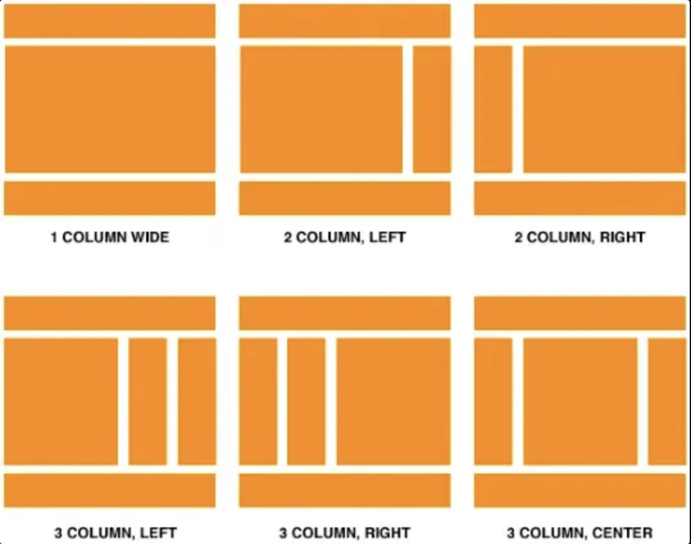
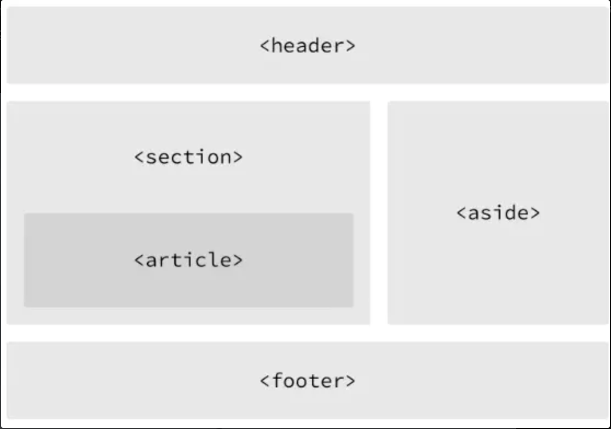
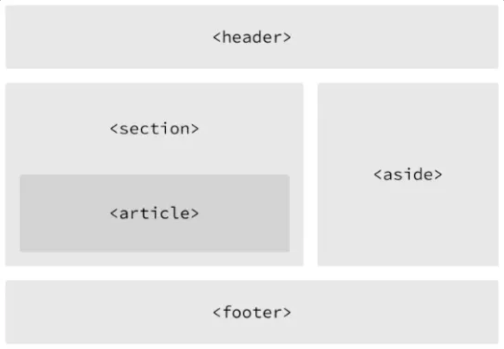

## HTML이란

- HTML: Hypertext Markup Language
⇒ 자료의 구조(웹페이지)를 표현하기 위한 언어
- 웹페이지의 내용과 구조를 담당하는 언어로써 HTML 태그를 통해 정보를 구조화하는 것
- 확장자: `.html`
- 항상 가장 먼저 열어질 파일로 index.html을 반드시 만들어줘야 함
- 앞으로 배울 내용은 HTML5

### 기본 템플릿과 구성

- HTML 파일 기본 템플릿(모든 html 파일은 이것부터 써야함)
    
    ```html
    <!DOCTYPE html>
    <html>
    <head>
      <meta charset="UTF-8">
      <title>Document</title>
    </head>
    <body>
      
    </body>
    </html>
    ```
    
- 템플릿 구성 알아보기
    - `< >` 열린 태그 `< />` 닫힌 태그 : HTML은 열린 태그가 있다면 반드시 같은 단어로 닫힌 태그가 있어야 함
    - `<!DOCTYPE html>` : 문서 형식을 HTML5로 지정
    - `<html> </html>` : 실질적인 HTML document의 시작과 끝을 나타냄
    - `<head> </head>` : document title, 외부 파일의 참조, 메타데이터 설정 등의 정보가 들어감
        - 이 정보는 브라우저에 표시되지 않음
    - `<body> </body>` : 웹 브라우저에 출력되는 모든 요소 (웹페이지에 단 하나만 존재)

### HTML의 핵심 - 요소 (Element)

```html
<p>HELLO WORLD</p>
```

- `<p>`: 시작 태그
- `HELLO WORLD`: 콘텐츠
- `</p>`: 종료 태그
- HTML 요소는 시작 태그, 종료 태그, 태그 사이 위치한 콘텐츠로 구성

- 중첩 요소
    - 요소를 다른 요소로 포함시키는 것을 의미
        
        ```html
        <body>
          <h1>안녕하세요</h1>
          <p>반갑습니다!</p>
        </body>
        ```
        
    > 중첩 요소를 작성할 때에는 들여쓰기를 적용하자.
    
- 빈 요소
    - 콘텐츠를 가질 수 없는 요소 → Attribute만을 가질 수 있다.
    ex) meta, link, br, hr, img, input …
        
        ```html
        <meta charset="utf-8">
        ```
        
    - Attribute란?
        
        요소의 성질, 특징을 정의하는 명세. 요소에 추가적인 정보를 제공해준다. 위 코드에서는 `charset=”utf-8”`
        
        - `src`: 어트리뷰트명
        - `“html.png”`: 어트리뷰트값
- 그로벌 어트리뷰트 [Global Attributes](https://www.w3.org/TR/2010/WD-html-markup-20101019/global-attributes.html)
    
    모든 HTML 요소가 공통으로 사용할 수 있는 어트리뷰트 (몇몇 요소 안 될 수 있지만 대부분 다 됨)
    
    | Attribute | Description |
    | --- | --- |
    | id | 유일한 식별자(id)를 요소에 지정, 중복 지정 불가 |
    | class | 스타일시트에 정의된 class를 요소에 지정, 중복 지정 가능 |
    | hidden | css의 hidden과는 다르게 의미상으로도 브라우저에 노출되지 않게 됨 |
    | lang | 지정된 요소의 언어를 지정, 검색엔진의 크롤링 시 웹페이지의 언어를 인식할 수 있게 됨 |
    | style | 요소에 인라인 스타일을 지정 |
    | tabindex | 사용자가 키보드로 페이지를 내비게이션 시 이동 순서를 지정 |
    | title | 요소에 관한 제목을 지정 |
- 주석
    - 주로 개발자에게 코드를 설명하기 위해 사용되며 브라우저는 주석을 화면에 표시하지 않음

### HTML 기본 태그 모음

- 웹페이지를 구성하는 태그
    - title: 문서의 제목으로 브라우저 탭에 표시
        - 예시 코드
            
            ```html
            <!DOCTYPE html>
            <html>
              <head>
                <meta charset="utf-8">
                <title>문서 제목</title>
              </head>
              <body>
                Lorem ipsum dolor sit amet, consectetur adipisicing elit, sed do eiusmod tempor incididunt ut labore et dolore magna aliqua.
              </body>
            </html>
            ```
            
    - style: HTML 문서를 위한 style 정보를 정의, css 코드가 작성되는 곳
        - 예시 코드
            
            ```html
            <!DOCTYPE html>
            <html>
              <head>
                <meta charset="utf-8">
                <title>문서 제목</title>
                <style>
                  body {
                    background-color: yellow;
                    color: blue;
                  }
                </style>
              </head>
              <body>
                Lorem ipsum dolor sit amet, consectetur adipisicing elit, sed do eiusmod tempor incididunt ut labore et dolore magna aliqua.
              </body>
            </html>
            ```
            
            
            
    - link: 외부 리소스(혹은 링크)와의 연결에 사용
        - 예시 코드
            
            ```html
            <!DOCTYPE html>
            <html>
              <head>
                <meta charset="utf-8">
                <title>문서 제목</title>
                <link rel="stylesheet" href="style.css"> // 이따 배우겠지만 이렇게 css 파일 불러와서 적용하는 것임
              </head>
              <body>
                Lorem ipsum dolor sit amet, consectetur adipisicing elit, sed do eiusmod tempor incididunt ut labore et dolore magna aliqua.
              </body>
            </html>
            ```
            
    - script: javascript를 작성할 때 사용
        - 직접 js 작성 예시 코드
            
            ```html
            <!DOCTYPE html>
            <html>
              <head>
                <meta charset="utf-8">
                <script>
                  document.addEventListener('click', function () {
                    alert('Clicked!');
                  });
                </script>
              </head>
              <body>
                Lorem ipsum dolor sit amet, consectetur adipisicing elit, sed do eiusmod tempor incididunt ut labore et dolore magna aliqua.
              </body>
            </html>
            ```
            
            실제 작동 보러 가기 https://codepen.io/znyymfpy-the-sans/pen/emYgOqm
            
        - src 어트리뷰트로 외부 js 파일 로드 예시 코드
            
            ```html
            <!DOCTYPE html>
            <html>
              <head>
                <meta charset="utf-8">
                <script src="main.js"></script> // 이렇게 내가 만든 main.js 파일을 불러와서 javascript 사용 가능
              </head>
              <body>
                Lorem ipsum dolor sit amet, consectetur adipisicing elit, sed do eiusmod tempor incididunt ut labore et dolore magna aliqua.
              </body>
            </html>
            ```
            
    - meta: description, keywords, author, 기타 메타데이터 정의에 사용 → 브라우저, 검색엔진 등에 의해 사용됨
        - 예시 코드
            
            ```html
            <!DOCTYPE html>
            <html>
              <head>
            		<meta charset="utf-8"> // 브라우저가 사용할 문자셋
            		<meta name="keywords" content="HTML, CSS, XML, XHTML, JavaScript"> // SEO(검색엔진 최적화)를 위해 검색엔진이 사용할 키워드 정의
            		<meta name="description" content="Web tutorials on HTML and CSS">
            		<meta name="author" content="John Doe">
            		<meta http-equiv="refresh" content="30"> // 웹페이지 30초마다 refresh
            	</head>
              <body>
                <p>안녕하세요</p>
                <p>Hello</p>
                <p>こんにちは</p>
                <p>你好</p>
                <p>שלום</p>
                <p>สวัสดี</p>
              </body>
            </html>
            ```
            
- 텍스트 관련 태그
    - `h1`, `h2`, `h3`, `h4`, `h5`, `h6` - Headings 제목을 나타낼 때 사용, 숫자가 작을 수록 중요한 제목을 의미, 글자 크기도 커짐
    - `strong` - 볼드체 지정, 의미론적(semantic) 중요성 O
    - `b` - 볼드체 지정, 의미론적(semantic) 중요성 X
    - `em` - emphasized 강조 & 중요한 텍스트 지정, italic체로 표현됨, 의미론적 중요성 O
    - `i` - italic체로 표현, 의미론적 중요성 X
    - `sub` - subscripted 아래에 쓰인 텍스트
    - `sup` - superscripted 위에 쓰인 텍스트
    - `p` - 단락, 문단을 지정
    - `br` - 강제 개행(line break) 지정, 빈 요소로 닫는 태그가 없음.
        - HTML에서는 여러 개의 공백을 입력해도 단 1개의 공백으로 처리, 공백을 삽입하는 방법은 `&nbsp` 를 사용하는 것
    - `pre` - 파일에 작성된 그대로 브라우저에 표시
    - `hr` - 수평줄을 삽입
    - `q` - 짧은 인용문 지정, 큰 따옴표로 보여질 것
    - `blockquote` - 긴 인용문 지정, 들여쓰기 가능
- 목록과 표 관련 태그
    - 목록 관련 태그
        - `ul` - 순서 없는 목록
        - `ol` - 순서 있는 목록
    - table 관련 태그
        
        
        
        - `table` - 표를 감싸는 태그
        - `tr` - 표 내부의 행
        - `th` - 표 내부의 제목 셀
        - `td` - 행 내부의 일반 셀
    - table attribute
        - `border` - 표 테두리 두께 지정(CSS border property를 사용하는 것이 더 나은 방법)
        - `rowspan` - 해당 셀이 점유하는 행의 수 지정
        - `colspan` - 해당 셀이 점유하는 열의 수 지정
- 이미지, 동영상, 음악 등 멀티미디어 지원 태그
    - `img` - 이미지 삽입할 때 사용
    - `img attribute`
        - `src` - 이미지 파일 경로
        - `alt` - 이미지 파일이 없을 경우 표시되는 문장
        - `width` - 이미지의 너비 (CSS에서 지정하는 것이 일반적)
        - `height` - 이미지의 높이 (CSS에서 지정하는 것이 일반적)
    - `img` 예시 코드
        
        ```html
        <!DOCTYPE html>
        <html>
          <body>
            
            
          </body>
        </html>
        ```
        
    - `audio` - HTML5에 새롭게 추가된 태그여서 IE8 이하엣는 사용 불가능
    - `audio attribute`
        - `src` - 음악 파일 경로
        - `preload` - 재생 전에 음악 파일을 모두 불러올 것인지 지정
        - `autoplay` - 음악 파일을 자동의 재생 개시할 것인지 지정
        - `loop` - 음악을 반복할 것인지 지정
        - `controls` - 음악 재생 도구를 표시할 것인지 지정, 재생 도구의 외관은 브라우저마다 차이가 있음.
    - `audio` 예시 코드
        
        ```html
        <!DOCTYPE html>
        <html>
          <body>
            <audio src="assets/audio/Kalimba.mp3" controls></audio>
          </body>
        </html>
        ```
        
    - 웹 브라우저 별로 지원하는 음악 파일 형식이 잘라 잘 찾아보고 쓰던지 source 태그로 해결
    - `source` 예시 코드
        
        ```html
        <!DOCTYPE html>
        <html>
          <body>
            <audio controls>
              <source src="assets/audio/Kalimba.mp3" type="audio/mpeg">
              <source src="assets/audio/Kalimba.ogg" type="audio/ogg">
            </audio>
          </body>
        </html>
        ```
        
    - `video` - HTML5 새롭게 추가됨, 파일 형식 차이 문제 발생할 수도 있어 source로 해결 가능
    - `video attribute`
        - `src` - 동영상 파일 경로
        - `poster` - 동영상 준비 중에 표시될 이미지 파일 경로
        - `preload` - 재생 전에 동영상 파일을 모두 불러올 것인지 지정
        - `autoplay` - 동영상 파일을 자동 재생 개시할 것인지 지정
        - `loop` - 동영상을 반복할 것인지 지정
        - `controls` - 동영상 재생 도구를 표시할 것인지 지정, 재생 도구의 외관은 브라우저마다 차이가 있음
        - `width` - 동영상의 너비를 지정
        - `height` - 동영상의 높이를 지정
    - `video`와 `source`를 사용한 예시 코드
        
        ```html
        <!DOCTYPE html>
        <html>
          <body>
            <video width="640" height="360" controls>
              <source src="assets/video/wildlife.mp4" type="video/mp4">
              <source src="assets/video/wildlife.webm" type="video/webm">
            </video>
          </body>
        </html>
        ```
        
- 사용자 커뮤니케이션을 위한 폼 태그
    - from - 사용자가 입력한 데이터를 수집하기 위해 사용
    - form attribute
        - action={URL} - 입력 데이터(form data)가 전송될 URL 지정
        - method={get / post} - 입력 데이터(form data) 전달 방식 지정
    
    > ❗ GET / POST는 HTTP 프로토콜을 이용해서 사용자 입력 데이터를 서버에 전달하는 방식
    [HTTP request method](https://developer.mozilla.org/ko/docs/Web/HTTP/Methods) 라고 함.
    > - GET - 서버에 데이터 조회를 요청하는 방식
    > - POST - 특정 데이터 생성을 요청하는 방식
    
    - form 태그는 input, textarea, button, select, checkbox, radio button, submit button 등 보통 입력 양식 태그를 포함하여 함께 사용
    - form 예시 코드
        
        ```html
        <!DOCTYPE html>
        <html>
          <body>
            <form action="http://jsonplaceholder.typicode.com/users" method="get">
              ID: <input type="text" name="id" value="1"><br>
              username: <input type="text" name="username" value="Bret"><br>
              <input type="submit" value="Submit">
            </form>
          </body>
        </html>
        ```
        
    
    - input - form 태그에서 가장 중요한 태그, 사용자로부터 데이터 입력을 받기 위해 사용
    - input에는 다양한 종류가 있는데, 이는 type 어트리뷰트 값에 의해 구분됨
    - type 어트리뷰트 값
        - button - 버튼 생성
        - checkbox - checkbox 생성
        - date - date 생성
        - file - 파일 선택 form 생성
        - password - password 입력 form 생성
        - radio - radio button 생성
        - submit - 제출 button 생성
    - input 예시 코드(타입별로 어떻게 바뀌는지 확인해보기)
        
        ```html
        <!DOCTYPE html>
        <html>
          <body>
            <h3>button</h3>
            <input type="button" value="Click me" onclick="alert('Hello world!')">
            <hr>
        
            <h3>checkbox</h3>
            <input type="checkbox" name="fruit1" value="apple" checked> 사과<br>
            <input type="checkbox" name="fruit2" value="grape"> 포도<br>
            <input type="checkbox" name="fruit3" value="peach"> 복숭아<br>
            <hr>
        
            <h3>color</h3>
            <input type="color" name="mycolor">
            <hr>
        
            <h3>date</h3>
            <input type="date" name="birthday">
            <hr>
        
            <h3>datetime</h3>
            <input type="datetime" name="birthdaytime">
            <hr>
        
            <h3>datetime-local</h3>
            <input type="datetime-local" name="birthdaytime">
            <hr>
        
            <h3>email</h3>
            <input type="email" name="useremail">
            <hr>
        
            <h3>file</h3>
            <input type="file" name="myfile">
            <hr>
        
            <h3>hidden</h3>
            <input type="hidden" name="country" value="Norway">
            hidden filed는 사용자에 표시되지 않는다.
            <hr>
        
            <h3>image</h3>
            <input type="image" src="img/img_submit.gif" alt="Submit" width="48" height="48">
            <hr>
        
            <h3>month</h3>
            <input type="month" name="birthdaymonth">
            <hr>
        
            <h3>number</h3>
            <input type="number" name="quantity" min="2" max="10" step="2" value="2">
            <hr>
        
            <h3>password</h3>
            <input type="password" name="pwd">
            <hr>
        
            <h3>radio</h3>
            <input type="radio" name="gender" value="male" checked> 남자<br>
            <input type="radio" name="gender" value="female"> 여자<br>
            <hr>
        
            <h3>range</h3>
            <input type="range" name="points" min="0" max="10" step="1" value="5">
            <hr>
        
            <h3>reset</h3>
            <input type="reset">
            <hr>
        
            <h3>search</h3>
            <input type="search" name="googlesearch">
            <hr>
        
            <h3>submit</h3>
            <input type="submit" value="Submit">
            <hr>
        
            <h3>tel</h3>
            <input type="tel" name="mytel">
            <hr>
        
            <h3>text</h3>
            <input type="text" name="myname">
            <hr>
        
            <h3>time</h3>
            <input type="time" name="mytime">
            <hr>
        
            <h3>url</h3>
            <input type="url" name="myurl">
            <hr>
        
            <h3>week</h3>
            <input type="week" name="week_year">
          </body>
        </html>
        ```
        
    
    - select - 복수 개의 리스트에서 복수 개의 아이템을 선택할 때 사용
    - tag
        - select - select form 생성
        - option - option 생성
        - optgroup - option을 그룹화한다
    - select 예시 코드
        
        ```html
        <!DOCTYPE html>
        <html>
          <body>
            <select name="cars1">
              <option value="volvo" selected>Volvo</option>
              <option value="saab" disabled>Saab</option>
              <option value="fiat">Fiat</option>
              <option value="audi">Audi</option>
            </select>
        
            <select name="cars2" size="4" multiple>
              <option value="volvo">Volvo</option>
              <option value="saab">Saab</option>
              <option value="fiat">Fiat</option>
              <option value="audi" selected>Audi</option>
            </select>
        
            <select name="cars3">
              <optgroup label="Swedish Cars">
                <option value="volvo">Volvo</option>
                <option value="saab">Saab</option>
              </optgroup>
              <optgroup label="German Cars" disabled>
                <option value="mercedes">Mercedes</option>
                <option value="audi">Audi</option>
              </optgroup>
            </select>
          </body>
        </html>
        ```
        
    
    - textarea - 여러 줄의 글자를 입력 받을 때 사용
    - textarea 예시 코드
        
        ```html
        <!DOCTYPE html>
        <html>
          <body>
            <textarea name="message" rows="10" cols="30">Write something here</textarea>
          </body>
        </html>
        ```
        
    
    - button - 클릭할 수 있는 버튼 생성
    - `<button></button>` vs `<input type=”button”>`
        - input 태그는 빈 태그
        - button 태그는 반드시 닫힌 태그 필요 → 버튼에 텍스트나 이미지 같은 콘텐츠 사용 가능
    - button 예시 코드
        
        ```html
        <!DOCTYPE html>
        <html>
          <body>
            <button type="button" onclick="alert('Hello World!')">Click Me!</button>
        
            <input type="button" value="Click Me!" onclick="alert('Hello world!')">
          </body>
        </html>
        ```
        
- 웹페이지 레이아웃을 구성하기 위한 공간 분할 태그
    
    
    
    웹페이지의 공간을 분할하는 레이아웃을 위해 주로 div 태그를 사용한다. 하지만, div는 의미론적으로(semantic) 어떠한 의미도 가지지 않아 좋은 방법은 아니다. 다음 태그들은 div에 의미론적을 추가한 태그라고 봐도 무방한 태그들이다.
    
    - tag
        
        
        
        - header - 헤더를 의미
        - nav - 내비게이션을 의미
        - aside - 사이드에 위치하는 공간을 의미
        - section - 본문의 여러 내용을 포함하는 공간을 의미
        - article - 본문의 주내용이 들어가는 공간을 의미
        - fotter - 푸터를 의미

### HTML 핵심 개념 중 하나인 Hyperlink

- 텍스트를 눌러 다른 웹사이트나 페이지로 이동할 수 있게끔 만들어주는 기능인 `<a>` 태그
- 예시 코드
    
    ```html
    <!DOCTYPE html>
    <html>
      <body>
        <a href="http://www.google.com">Visit google.com!</a>
      </body>
    </html>
    ```
    
- a attribute
    - href - 이동하고자 하는 파일의 위치(경로)를 값으로 받음
    - target - 링크를 클릭했을 때 어떻게 오픈할 지 지정
        - `_self` - 링크를 클릭했을 때 연결문서를 현재 윈도우에서 오픈(기본값)
        - `_blank` - 링크를 클릭했을 때 연결문서를 새로운 윈도우나 탭에서 오픈
    
    > ❗ 파일 경로란? - 파일 시스템에서 파일의 위치를 나타내는 방법
    > - 절대 경로
    >    - 현재 작업 디렉토리와 관계없이 특정 파일의 절대적인 위치
    >    - 루트 디렉터리 기준으로 파일 위치를 나타냄
    >    - ex) `/index.html` - `/` : 우리 프로젝트의 폴더 구조상 최상위 디렉토리
    >    - `ex) http://www.mysite.com/index.html`
    >    - `<a href="[http://www.google.com](http://www.google.com/)">URL</a>`
    >- 상대 경로
    >    - 현재 작업 디렉토리를 기준으로 특정 파일의 상대적인 위치
    >    - `ex) ./index.html`
    >        `./` - 작업 중인 파일의 위치한 디렉토리
    >    - `ex) ../dist/index.js`
    >        `../` - 작업 중인 파일의 부모 디렉토리
    >    - `<a href="../home.html>home이동</a>`
    
- 예시 코드
    
    ```html
    <!DOCTYPE html>
    <html>
      <body>
        <a href="http://www.google.com" target="_blank" rel="noopener noreferrer">Visit google.com!</a>
      </body>
    </html>
    ```
    

> ❗ `target=”_blank”` 로 외부 페이지를 오픈하는 경우, 이동한 외부 페이지에서 JS 코드를 사용해 악의적인 페이지로 리다이렉트할 수 있는 보안 취약점이 있기에 `rel=”noopener noreferrer”를` 추가해 공격에 대비할 것을 권장

### 시맨틱 태그란?

- 시맨틱 태그가 중요한 이유
    
    웹사이트는 검색 엔진에 노출되는 것이 굉장히 중요하다. SEO(검색엔진 최적화)를 위해 본인 웹사이트를 검색하기 알맞은 구조로 조정하기도 하는데, 최적화를 잘해주기 위해서는 웹사이트 정보가 잘 수집된다는 것이 전제로 깔려야 한다
    
    → 즉, 검색엔진이 HTML코드들로 해당 코드의 의미를 파악해야 해서 시맨틱 태그를 써야 한다.
    
- 자세한 예시를 들어보자
    
    ```html
    <font size="6"><b>Hello</b></font> // A
    <h1>Hello</h1> // B
    ```
    
    위 코드의 font와 h1 태그에 보이는 두 개의 Hello는 사람 눈에는 크기나 생김이 같아 보인다.
    
    하지만, A 코드에 사용된 태그들은 의미론적 중요성을 가지지 않는다. 즉, 제목이 아닌 단순한 font 태그일 뿐인 것이다.
    
    B 코드는 h1 태그를 사용함으로써 제목 태그 중 상위 레벨이라는 의미를 내포한다. 검색엔진은 해당 코드가 가장 중요한 제목 키워드라는 것을 알게 되는 것이다.
    
- 결론) semantice tag란
    
    브라우저, 검색엔진, 개발자 모두에게 콘텐츠의 의미를 명확히 설명하는 역할을 한다.
    
    
    
    - header - 헤더를 의미
    - nav - 내비게이션을 의미
    - aside - 사이드에 위치하는 공간을 의미
    - section - 본문의 여러 내용(article)을 포함하는 공간을 의미
    - article - 본문의 주내용이 들어가는 공간을 의미
    - footer - 푸터를 의미

### 웹 표준? 웹 접근성?

- 웹 표준
    - 브라우저마다 웹페이지가 다르게 보이는 현상을 방지하기 위해 표준화된 언어를 사용해 동일한 결과물을 보여주는 것을 웹 표준이라고 함
    - 즉, 어떤 운영체제나 브라우저에서든 동일한 콘텐츠를 볼 수 있도록 웹페이지를 만들 때 지켜야 하는 규칙
    - 웹 기술의 표준을 정의하는 공식 기관 [W3C](https://www.w3.org/standards)
- 웹 표준을 지키면 따라오는 장점
    - 운영 관리 용이
    - 검색 엔진 최적화
    - 웹 접근성 향상
- 웹 접근성
    - 누구에게나 동등한 기회 제공을 위해 웹사이트에서 제공하는 정보를 모두가 동일하게 이요할 수 있도록 보장하는 것
    - 즉, 누구나 신체적, 환경적 조건에 관계없이 인터넷을 통해 정보에 접근하고 이용할 수 있는지에 대한 정도
- 접근성을 높이는 방법
    
    ```html
    
    ```
    
    - 위 img의 alt 속성은 시각장애인 분들이 스크린리더를 활용할 때 alt에 적힌 내용을 듣게 됨
    
    ```html
    <div>MODAL</div> // ❌
    <dialog>MODAL</dialog> // ✅
    ```
    
    - modal이라는 것을 웹사이트가 인식하기 위해선 dialog처럼 모달을 위한 태그를 사용해야 함
        - dialog가 제공하는 웹 접근성 기능
            - 포커스 관리 - 모달이 열리면 포커스 자동 이동
            - 접근성 트랩 - 포커스 모달 안에 가두기
            - 모바일 네이티브 이벤트 구현 - 두 손가락 문지르기를 통한 모달 닫기 가능
        - dialog 사용법
            - Show() - 비모달식 대화상자 오픈 → 외부요소와 상호작용 O
            - ShowModal() - 모달식 대화상자 오픈 → 외부요소와 상호작용 X