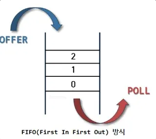
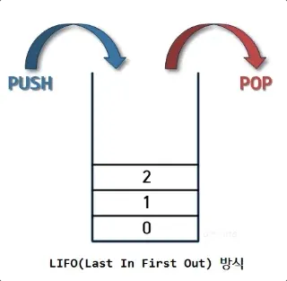

## 함수 표현식 vs 함수 선언식 vs 화살표 함수

- 함수 선언문
    
    ```jsx
    // 함수 선언문
    function 함수명() {
      // 함수 로직
    }
    
    function sum(a, b) {
      return a + b;
    }
    ```
    
- 함수 표현식(함수를 생성하고 변수에 값을 할당하듯 함수가 할당됨)
    
    ```jsx
    let sayHi = function() {
    	console.log('hi')
    }
    console.log(sayHi) //ƒ () {console.log('hi')} -> 함수 자체가 보임
    sayHi() // hi -> 함수가 실행됨(자바스크립트는 괄호가 있어야 함수가 실행됨)
    
    // 함수 복사도 가능
    function sayHi() {   // (1) 함수 생성
      console.log('hi')
    }
    
    let func = sayHi;    // (2) 함수 복사
    
    func(); // hi     // (3) 복사한 함수를 실행
    sayHi(); // hi    // (4) 본래 함수도 정상적으로 실행됩니다.
    
    // 함수 표현식 안에서도 종류가 있습니다.
    // 기명 함수 표현식 vs 익명 함수 표현식
    
    // 기명 함수 표현식(named function expression)
    var foo = function multiply(a, b) {
      return a * b;
    };
    
    // 익명 함수 표현식(anonymous function expression)
    var bar = function(a, b) {
      return a * b;
    };
    
    console.log(foo(10, 5)); // 50
    console.log(multiply(10, 5)); // Uncaught ReferenceError: multiply is not defined
    ```
    
- 콜백 함수
    - 콜백 함수란 함수를 값처럼 전달하는 것
    
    ```jsx
    // 콜백 함수를 위한 예시 함수
    // 함수에 질문을 하면, 사용자 답변에 따라 yes / no 를 출력하는 함수입니다.
    function ask(question, yes, no) {
      if (confirm(question)) yes()
      else no();
    }
    
    function showOk() {
      alert( "동의하셨습니다." );
    }
    
    function showCancel() {
      alert( "취소 버튼을 누르셨습니다." );
    }
    
    // 사용법: 함수 showOk와 showCancel가 ask 함수의 인수로 전달됨
    // 즉, 여기서 showOk, showCancel 가 콜백 함수 라고 불리는 친구들
    ask("동의하십니까?", showOk, showCancel);
    ```
    
- 함수 표현식과 함수 선언식의 차이점
    - 함수 표현식: 실제 실행 흐름이 해당 함수에 도달했을 때 함수가 생성
    → 즉, 코드 실행 흐름이 함수에 도달했을 때부터 해당 함수를 사용할 수 있음
    - 함수 선언문: 함수 선언문이 정의되기 전에도 호출 가능
        
        ```jsx
        // 예시
        
        // 함수 선언문
        // 아래 코드 실행해보면 함수 정의한 것보다 함수 호출한 것이 위에 있어도 정상 동작됨
        sayHelloToName('lisa') // Hello, lisa
        
        function sayHelloToName(name) {
          console.log( `Hello, ${name}` );
        }
        
        // 함수 표현식
        // 반면, 아래 코드는 함수 정의하기 전에 함수를 호출했을 때 아직 정의되지 않았기 때문에 에러남
        sayHelloToName2('lisa') // ReferenceError: sayHelloToName2 is not defined
        
        let sayHelloToName2 = function (name) {
          console.log( `Hello, ${name}` );
        }
        ```
        
- 화살표 함수
    - 함수 표현식보다 단순하고 간결한 문법으로 함수를 만들 수 있는 방법
    
    ```jsx
    // 함수 선언식
    function sum(a, b) {
    	return a + b
    }
    
    // 화살표 함수 ex 1
    const sum = (a, b) => {
    	return a + b
    }
    
    // 만약 return 문 1줄만 필요할 경우 중괄호 생략 가능
    const sum = (a, b) => a + b
    
    // 화살표 함수 ex 2
    const printHello = () => console.log('hello')
    
    printHello() // hello
    ```
    

## 객체 기본 문법

- 자바스크립트의 객체는 `키(key) + 값(value)` 로 구성된 프로퍼티들의 집합
- 선언하기
    
    ```jsx
    // 빈 객체를 만드는 법
    let user = new Object() // 객체 생성자 문법
    let user = {} // 객체 리터럴 문법 (권장)
    ```
    
    - 중괄호 {…}를 이용해 겍체를 선언하는 것 = 객체 리터럴(권장)
    - new 키워드와 함께 객체를 생성하고 초기화하는 함수 = 객체 생성자
- 프로퍼티값 넣고 삭제해보기
    
    ```jsx
    const user = {     // 객체
      name: "John",  // 키: "name",  값: "John"
      age: 30        // 키: "age", 값: 30
    };
    
    console.log(user) // { name: 'John', age: 30}
    console.log(user.name) // John -> 객체 안에 있는 특정 키의 값을 꺼내고 싶을 때
    
    user.name = 'Lisa'
    
    console.log(user.name) // Lisa
    console.log(user['name']) // Lisa
    
    delete user.age // 객체의 프로퍼티 삭제하기
    
    console.log(user) // {name: 'Lisa'}
    ```
    
- 생성자 함수로 객체 사용해보기
    
    ```jsx
    // 생성자 함수는 객체를 생성하기 위한 탬플릿(클래스)처럼 사용할 수 있어요
    // 생성자 함수 Person -> 생성자 함수는 대문자로 시작함
    function Person(name, gender) {
      this.name = name;
      this.gender = gender;
      this.sayHello = function(){
        console.log('Hi! My name is ' + this.name);
      };
    }
    
    // 인스턴스의 생성 -> person1, person2 를 인스턴스라고 합니다.
    var person1 = new Person('Lee', 'male');
    var person2 = new Person('Kim', 'female');
    
    console.log('person1: ', typeof person1); // person1:  object
    console.log('person2: ', typeof person2); // person2:  object
    console.log('person1: ', person1); // person1:  Person {name: 'Lee', gender: 'male', sayHello: ƒ}
    console.log('person2: ', person2); // person2:  Person {name: 'Kim', gender: 'female', sayHello: ƒ}
    
    person1.sayHello(); // Hi! My name is Lee
    person2.sayHello(); // Hi! My name is Kim
    ```
    
- 객체를 만들 때 단축 프로퍼티로 줄여쓸 수 있음
    
    ```jsx
    function createUserInfo(name, age) {
    	return {
    		name: name, // 이렇게 키, 값 이름이 변수의 이름과 동일할 때 사용할 수 있는 단축 프로퍼티
    		age: age
    	}
    }
    
    const user = createUserInfo("Lisa", 30)
    console.log(user)
    
    // 단축 프로퍼티로 수정해보면
    function createUserInfo(name, age) {
    	return {
    		name, // name: name 과 같은 의미 입니다.
    		age
    	}
    }
    
    const user = createUserInfo("Lisa", 30)
    console.log(user)
    ```
    
- `in` 연산자로 객체 프로퍼티 존재 여부를 확인할 수 있음
    
    ```jsx
    "key" in object
    
    // example
    const user = {name: "Lisa", age: 30}
    console.log("age" in user) // true
    console.log("city" in user) // false
    ```
    
- `for…in` 반복문은 객체의 모든 키를 순회할 수 있음
    
    ```jsx
    for (key in object) {
      // 각 프로퍼티 키(key)를 이용하여 본문(body)을 실행합니다.
    }
    
    let user = {
      name: "John",
      age: 30,
      isAdmin: true
    };
    
    for (let key in user) {
      // 키
      console.log( key );  // name, age, isAdmin
      // 키에 해당하는 값
      console.log( user[key] ); // John, 30, true
    }
    ```
    
- 객체 정렬 방식
    - 객체 프로퍼티(key)가 정수 프로퍼티이면 자동으로 정렬되고, 그 외의 프로퍼티는 객체에 추가한 순서 그대로 정렬
    
    ```jsx
    let codes = {
      "49": "독일",
      "41": "스위스",
      "44": "영국",
      "1": "미국"
    };
    
    for (let code in codes) {
      console.log(code); // 1, 41, 44, 49
    }
    
    let userInfos = {
      "lisa": "lisa",
      "john": "john",
      "bob": "bob",
      "mandoo": "mandoo"
    };
    
    for (let userInfo in userInfos) {
      console.log(userInfo); // lisa, john, bob, mandoo
    }
    
    // 만약, 숫자를 쓰고 싶은데 자동 정렬을 막고 싶다면 + 를 붙여 속임수를 쓰세요
    let codes = {
      "+49": "독일",
      "+41": "스위스",
      "+44": "영국",
      // ..,
      "+1": "미국"
    };
    
    for (let code in codes) {
      console.log( +code ); // 49, 41, 44, 1
    }
    ```
    
- 단항 연산자 `+`
    - JS에서는 숫자로 변환하는 연산자로도 사용
    
    ```jsx
    // 예시
    console.log(+"49"); // 49 (문자열 → 숫자)
    console.log(+"hello"); // NaN (숫자로 변환 불가능)
    console.log(+true); // 1
    console.log(+false); // 0
    
    // 그래서 우리 위 코드에서 + 연산자가 있기 때문에 문자열을 숫자로 변환하려고 시도하게 됩니다.
    // 즉, console.log( +"+49" ) 에서 "+49" 앞에 + 가 붙었으니
    // 해당 문자열을 숫자로 바꾸려고 시도하여 49 가 출력되는 것임
    
    ```
    

## 배열 기본 문법

- 순서가 있는 컬렉션
    
    ```jsx
    // 빈 배열은 이렇게 만들 수 있어요
    let arr = new Array()
    let arr = [] // 권장
    
    // 배열 선언할 때 초기값 넣어주고 시작하는 것 가능함
    let name = ['lisa', 'mandoo', 'john']
    
    // 자, 배열의 인덱스는 0부터 시작합니다.
    // 배열 내 특정 요소를 얻고 싶다면
    console.log(name[0]) // lisa
    console.log(name[1]) // mandoo
    console.log(name[2]) // john
    
    // 배열 내 특정 요소를 수정하고 싶다면
    name[2] = 'gimchi'
    
    console.log(name)
    
    // 새로운 요소를 배열에 추가하는 것도 가능
    name[3] = 'gogi'
    
    console.log(name)
    
    // 배열에 담긴 요소가 몇 개인지 알아내려면
    console.log(name.length)
    
    // 배열에 객체로 들어갈 수 있음 즉, 자료형에 제약X
    let arr = ['apple', 0, {name: 'lisa'}, function() {console.log(hi')}]
    
    console.log(arr[2].name)
    arr[3] // hi
    
    ```
    
- `Queue(큐)` : 배열을 사용해 만들 수 있는 자료구조
    
    
    
    - 큐에서 사용할 수 있는 주요 연산
        - `push` : 맨 끝에 요소를 추가
            
            ```jsx
            let fruits = ["사과"];
            
            fruits.push("오렌지", "배");
            
            // ["사과", "오렌지", "배"]
            alert( fruits );
            ```
            
        - `shift` : 제일 앞 요소를 꺼내 제거한 후, 남아있는 요소들 앞으로 밀어줌
            
            ```jsx
            let fruits = ["사과", "오렌지", "배"];
            
            alert( fruits.shift() ); // 배열에서 "사과"를 제거하고 제거된 요소를 얼럿창에 띄웁니다.
            
            alert( fruits ); // 오렌지,배
            ```
            
        - `unshift` : 배열 앞에 요소를 추가
            
            ```jsx
            // unshift 활용 에시
            let fruits = ["오렌지", "배"];
            
            fruits.unshift('사과');
            
            alert( fruits ); // 사과,오렌지,배
            ```
            
- `Stack(스택)` : 한쪽 끝에 요소를 더하거나 뺄 수 있게 해주는 자료구조
    
    
    
    - 스택에서 사용할 수 있는 주요 연산
        - `push` : 요소를 스택 끝에 집어 넣음
            
            ```jsx
            let fruits = ["사과", "오렌지"];
            
            fruits.push("배");
            
            alert( fruits ); // 사과,오렌지,배
            ```
            
        - `pop` : 스택 끝 요소를 추출
            
            ```jsx
            let fruits = ["사과", "오렌지", "배"];
            
            alert( fruits.pop() ); // 배열에서 "배"를 제거하고 제거된 요소를 얼럿창에 띄웁니다.
            
            alert( fruits ); // 사과,오렌지
            ```
            
- 배열의 내부 동작 원리
    
    ```jsx
    let fruits = ["바나나"]
    
    let arr = fruits; // 참조를 복사함(두 변수가 같은 객체를 참조)
    
    console.log( arr === fruits ); // true
    
    arr.push("배"); // 참조를 이용해 배열을 수정합니다.
    
    console.log( arr ); // 바나나,배 - 요소가 두 개가 되었습니다.
    console.log( fruits ); // 바나나,배 - 요소가 두 개가 되었습니다.
    ```
    
    - `arr` 에 `push` 를 했는데 `fruits` 에도 반영됨
    - 이는 배열이 `참조` 개념을 사용하기 때문
    - 당장은 간단하게 복사본을 만든 것이 아닌 `fruits` 를 그대로 `arr` 이 사용하고 있다고만 알자.

<aside>
💡

`push / pop`은 빠름

`shift / unshift`는 느림

</aside>

- 배열에 적용할 수 있는 순회 문법
    
    ```jsx
    let fruits = ["사과", "오렌지", "자두"];
    
    // 배열 요소를 대상으로 반복 작업을 수행
    // for..of 를 사용하면 현재 요소의 index는 얻을 수 없음, only 값만 얻을 수 있음
    for (let fruit of fruits) {
    	 console.log( fruit );
    }
    
    // ⚠️ for..in 도 사용은 가능하지만 객체에 최적화되어 있음
    // 되도록 배열에서는 사용하지 말자
    ```
    
- `length` 프로퍼티의 신기한 기능
    
    ```jsx
    let arr = [1, 2, 3, 4, 5];
    
    arr.length = 2; // 요소 2개만 남기고 잘라봅시다.
    alert( arr ); // [1, 2]
    
    arr.length = 5; // 본래 길이로 되돌려 봅시다.
    alert( arr[3] ); // undefined: 삭제된 기존 요소들이 복구되지 않습니다.
    ```
    
    - `length` 값을 수동으로 감소시키면 배열이 잘림
    - 증가시킬 경우에는 아무 일도 벌어지지 않음
- 다차원 배열도 가능
    
    ```jsx
    let matrix = [
      [1, 2, 3],
      [4, 5, 6],
      [7, 8, 9]
    ];
    
    console.log( matrix[1][1] ); // 5
    ```
    

## 고급 배열 메서드

- `splice(start, deleteCount, …items)`
    
    
    
    - 기존의 배열의 요소를 제거하고 그 위치에 새로운 요소를 추가
    - 배열 중간에 새로운 요소를 추가할 때도 사용
    - 가장 일반적인 사용은 배열에서 요소를 삭제할 때 사용
    - 원본 배열이 변경됨
    - `start`: 배열에서의 시작 위치. start 만을 지정하면 배열의 start부터 모든 요소를 제거한다.
    - `deleteCount`: 시작 위치(start)부터 제거할 요소의 수. deleteCount가 0인 경우, 아무런 요소도 제거되지 않음 (옵션)
    - `items`: 삭제한 위치에 추가될 요소들. 만약 아무런 요소도 지정하지 않을 경우, 삭제만 한다. (옵션)
    - 예시 코드
        
        ```jsx
        const items1 = [1, 2, 3, 4];
        
        // items[1]부터 2개의 요소를 제거하고 제거된 요소를 배열로 반환
        const res1 = items1.splice(1, 2);
        
        // splice를 쓰면 원본 배열이 변경된다.
        console.log(items1); // [ 1, 4 ]
        
        // 제거한 요소가 배열로 반환된다.
        console.log(res1);   // [ 2, 3 ]
        
        const items2 = [1, 2, 3, 4];
        
        // items[1]부터 모든 요소를 제거하고 제거된 요소를 배열로 반환
        const res2 = items2.splice(1);
        
        // 원본 배열이 변경된다.
        console.log(items2); // [ 1 ]
        
        // 제거한 요소가 배열로 반환된다.
        console.log(res2);   // [ 2, 3, 4 ]
        ```
        
    - `splice` 로 뽑아낸 부분은 return값으로 반환
    - 원본 배열은 뽑아낸 부분은 없는 부분만 존재
    - 예시 코드
        
        ```jsx
        // 요소 제거하고, 그 자리에 다른 요소를 추가한다면?
        const months = ["Jan", "March", "April", "June"];
        
        // deleteCount가 0이므로 하나도 삭제하지 않고, index 1 자리에 "Feb"를 추가하는 것임.
        months.splice(1, 0, "Feb");
        
        console.log(months); // Expected output: Array ["Jan", "Feb", "March", "April", "June"]
        
        // index 4번 요소부터 1개 지우고, 그 자리에 "May" 집어넣습니다.
        months.splice(4, 1, "May");
        
        console.log(months); // Expected output: Array ["Jan", "Feb", "March", "April", "May"]
        ```
        
- `slice(start, end)`
    - start 인덱스부터 end 인덱스까지(end 제외) 요소를 복사
    - 기존 배열은 변하지 않고, 새로운 배열을 반환
    - 예시 코드
        
        ```jsx
        const animals = ["ant", "bison", "camel", "duck", "elephant"];
        
        // end가 없으니 index 2번부터 끝까지 복사
        console.log(animals.slice(2)); // ["camel", "duck", "elephant"]
        
        // index2 부터 index4 직전인 index3 까지 복사
        console.log(animals.slice(2, 4)); // ["camel", "duck"]
        
        // 음수가 들어가면 뒤에서부터 2번째 있는 요소부터 끝가지 복사
        console.log(animals.slice(-2)); // ["duck", "elephant"]
        
        // 이 경우에는 index1 부터 뒤에서부터 2번째 요소 직전까지 복사
        console.log(animals.slice(1, -2)); // ['bison', 'camel']
        ```
        
- `concat()`
    - 두 개 이상의 배열을 병합하는 데 사용
    - 기존 배열은 변하지 않고, 새로운 배열을 반환
    - 예시 코드
        
        ```jsx
        const array1 = ["a", "b", "c"];
        const array2 = ["d", "e", "f"];
        const array3 = array1.concat(array2);
        
        console.log(array1); // ['a', 'b', 'c']
        console.log(array2); // ['d', 'e', 'f']
        console.log(array3); // ["a", "b", "c", "d", "e", "f"]
        
        // 3개의 배열을 연결할 수도 있음
        const num1 = [1, 2, 3];
        const num2 = [4, 5, 6];
        const num3 = [7, 8, 9];
        
        const numbers = num1.concat(num2, num3);
        
        console.log(numbers); // [1, 2, 3, 4, 5, 6, 7, 8, 9]
        
        // 값을 배열에 연결할 수도 있음
        const letters = ["a", "b", "c"];
        
        const alphaNumeric = letters.concat(1, [2, 3]);
        
        console.log(alphaNumeric); // ['a', 'b', 'c', 1, 2, 3]
        ```
        
- `forEach()`
    - 각 배열 요소에 대해 제공된 함수를 한 번씩 실행
    - 예시 코드
        
        ```jsx
        const array1 = ["a", "b", "c"];
        
        array1.forEach((element) => console.log(element));
        
        // Expected output: "a"
        // Expected output: "b"
        // Expected output: "c"
        
        // 만약, 중간에 빈 요소가 있다면 건너뜀
        const arraySparse = [1, 3, , 7];
        let numCallbackRuns = 0;
        
        arraySparse.forEach((element, index) => {
          console.log({element});
            console.log({index});
        });
        ```
        
- `includes(searchElement, fromIndex)`
    - 배열의 항목에 특정 값이 포함되어 있는지를 판단하여 적절히 `true/false`를 반환
    - `searchElement(필수)` : 찾을 값
    - `fronIndex(옵션)` : 검색을 시작할 0 기반 인덱스
    - 예시 코드
        
        ```jsx
        
        const array1 = [1, 2, 3];
        
        console.log(array1.includes(2));
        // Expected output: true
        
        const pets = ["cat", "dog", "bat"];
        
        console.log(pets.includes("cat"));
        // Expected output: true
        
        console.log(pets.includes("at"));
        // Expected output: false
        
        console.log([1, 2, 3].includes(3, 1)) // true
        console.log([1, 2, 3].includes(3, 2)) // true
        console.log([1, 2, 3].includes(3, 3)) // false
        ```
        
- `find()`
    - 제공된 배열에서 제공된 테스트 함수를 만족하는 첫 번째 요소를 반환
    - 테스트 함수를 만족하는 값이 없으면 `undefined` 반환
    - 주로 배열에 값이 존재하는지 찾아야할 경우 사용
    - 예시 코드
        
        ```jsx
        // 예시1
        const array1 = [5, 12, 8, 130, 44];
        
        // 10보다 큰 요소를 발견하면 그 요소를 반환하면서 반복문이 끝남
        const found = array1.find((element) => element > 10);
        
        console.log(found); // 12
        
        // 예시2
        const inventory = [
          { name: "apples", quantity: 2 },
          { name: "bananas", quantity: 0 },
          { name: "cherries", quantity: 5 },
        ];
        
        function isCherries(fruit) {
          return fruit.name === "cherries";
        }
        
        console.log(inventory.find(isCherries));
        // { name: 'cherries', quantity: 5 }
        
        ```
        
- `filter()`
    - 주어진 배열에서 제공된 함수에 의해 구현된 테스트를 통과한 요소들만 필터링하여 새로운 배열을 반환
    - 예시 코드
        
        ```jsx
        const words = ["spray", "elite", "exuberant", "destruction", "present"];
        
        const result = words.filter((word) => word.length > 6);
        
        console.log(result);
        // Expected output: Array ["exuberant", "destruction", "present"]
        ```
        
- `map(callbackFunc)`
    - 호출한 배열의 모든 요소에 주어진 함수를 호출한 결과를 채운 새로운 배열을 생성
    - `callbackFunc = (currentValue, index, array) => {}`
        - `currentValue` : 배열 내에서 처리할 현재 요소
        - `index` : 배열 내에서 처리할 현재 요소의 인덱스
        - `array` : map()을 호출한 배열
    - 예시 코드
        
        ```jsx
        const array1 = [1, 4, 9, 16];
        
        // Pass a function to map
        const map1 = array1.map((x) => x * 2);
        
        console.log(map1);
        // Expected output: Array [2, 8, 18, 32]
        
        // 배열 속 객체 재구성 가능
        const kvArray = [
          { key: 1, value: 10 },
          { key: 2, value: 20 },
          { key: 3, value: 30 },
        ];
        
        // currentValue가 객체여서 구조분해할당을 사용하여 직접적으로 객체 요소안의 키 값으로 접근 가능함
        const reformattedArray = kvArray.map(({ key, value }) => ({ [key]: value }));
        
        console.log(reformattedArray); // [{ 1: 10 }, { 2: 20 }, { 3: 30 }]
        console.log(kvArray);
        ```
        
- `reduce(callback, initialValue)`
    - 배열의 각 요소에 대해 주어진 리듀서 함수를 실행하고, 하나의 결과값을 반환
    - `callback` : 배열의 각 요소에 대해 실행할 함수
    - `callback : (accumulator, currentValue, currentIndex(option), array(option)) => {}`
        - `accumulator` : 콜백의 반환값을 누적, 콜백함수의 첫 번쨰 호출이기도 해서 initialValue가 있다면 initialValue값부터 시작
        - `currentValue` : 처리할 현재 요소
        - `currentIndex` : 처리할 현재 요소의 인덱스, initialValue 있다면 0부터, 없다면 1부터 시작함
        - `array` : reduce를 호출한 배열
        - `initialValue(옵션)` : 초기값
    - 예시 코드
        
        ```jsx
        // ex1
        const array1 = [1, 2, 3, 4];
        
        // 0 + 1 + 2 + 3 + 4
        const initialValue = 0;
        const sumWithInitial = array1.reduce(
          (accumulator, currentValue) => accumulator + currentValue,
          initialValue,
        );
        
        console.log(sumWithInitial);
        // Expected output: 10
        ```