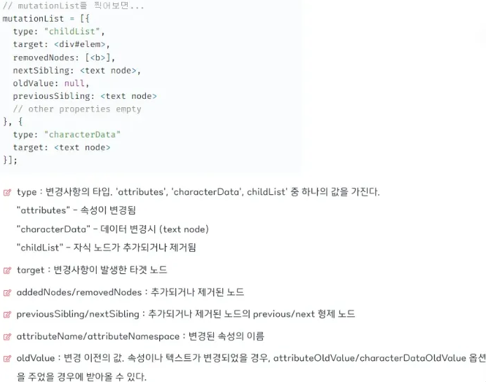

## 날짜와 시간을 나타내는 Date 객체

Date 객체로 날짜를 저장할 수 있고, 날짜 관련된 메소드도 사용할 수 있다.

- 새로운 Date 객체 생성하기
    
    ```jsx
    let now = new Date();
    console.log( now ); // 현재 날짜 및 시간이 출력됨
    ```
    
- 날짜를 정하여 Date 객체 생성하기(시간은 코드가 실해되는 시간)
    
    ```jsx
    let date = new Date("2017-01-26");
    alert(date);
    ```
    
- 날짜, 시간 모두 정하여 Date 객체 생성하기
    
    ```jsx
    let date = new Date(2011, 0, 1, 2, 3, 4, 567);
    alert( date ); // 2011년 1월 1일, 02시 03분 04.567초
    ```
    
    - `new Date(year, month, date, hours, minutes, seconds, ms)`
        - `year` 는 반드시 네 자리 숫자
        - `month`는 0(1월)부터 11(12월) 사이의 숫자여야 함
        - `date/hours/minutes/seconds/ms` 에 값이 없는 경우엔 0으로 처리
- Date 객체에서 날짜 구성 요소를 얻기 위해 사용할 수 있는 메서드
    - `getFullYear()` : 연도(네 자릿수) 반환
    - `getMonth()` : 월을 반환 (0 이상 11 이하, 0이 1월)
    - `getDate()` : 일을 반환 (1 이상 31 이하)
    - `getHours(), getMinutes(), getSeconds(), getMilliseconds()` : 시, 분, 초, 밀리초를 반환
    - `getDay()` : 요일을 나타내는 숫자 반환 (0 - 일, 1 - 월 … 6 - 토)
    - `getTime()` : 주어진 일시와 1970년 1월 1일 00시 00분 00초 사이의 간격(밀리초 단위)인 타임스탬프를 반환
- Date 객체에서 날짜 구성 요소를 설정하기 위해 사용할 수 있는 메서드
    - [`setFullYear(year, [month], [date])`](https://developer.mozilla.org/ko/docs/Web/JavaScript/Reference/Global_Objects/Date/setFullYear)
    - [`setMonth(month, [date])`](https://developer.mozilla.org/ko/docs/Web/JavaScript/Reference/Global_Objects/Date/setMonth)
    - [`setDate(date)`](https://developer.mozilla.org/ko/docs/Web/JavaScript/Reference/Global_Objects/Date/setDate)
    - [`setHours(hour, [min], [sec], [ms])`](https://developer.mozilla.org/ko/docs/Web/JavaScript/Reference/Global_Objects/Date/setHours)
    - [`setMinutes(min, [sec], [ms])`](https://developer.mozilla.org/ko/docs/Web/JavaScript/Reference/Global_Objects/Date/setMinutes)
    - [`setSeconds(sec, [ms])`](https://developer.mozilla.org/ko/docs/Web/JavaScript/Reference/Global_Objects/Date/setSeconds)
    - [`setMilliseconds(ms)`](https://developer.mozilla.org/ko/docs/Web/JavaScript/Reference/Global_Objects/Date/setMilliseconds)
    - [`setTime(milliseconds)`](https://developer.mozilla.org/ko/docs/Web/JavaScript/Reference/Global_Objects/Date/setTime) (1970년 1월 1일 00:00:00 UTC부터 밀리초 이후를 나타내는 날짜를 설정)
- Date 메서드 예시
    
    ```jsx
    // Date 메서드 예시
    const birthday = new Date("August 19, 1975 23:15:30");
    const date1 = birthday.getDate();
    
    console.log(date1); // Expected output: 19
    
    const day1 = birthday.getDay();
    // Sunday - Saturday : 0 - 6
    
    console.log(day1); // Expected output: 2 => 화요일
    
    const birthday2 = new Date("March 13, 08 04:20");
    
    console.log(birthday2.getMinutes()); // Expected output: 20
    
    // setDate()
    let theBigDay = new Date(1962, 6, 7); // 1962-07-07
    theBigDay.setDate(24); // 1962-07-24
    theBigDay.setDate(32); // 1962-08-01 -> 7/31에서 +1일하면 8/1일
    theBigDay.setDate(22); // 1962-08-22
    
    // setHours()
    let theBigDay = new Date();
    theBigDay.setHours(7);
    console.log(theBigDay)
    ```
    

## Math 메서드 알아보기 (수학을 위한 메서드)

- `Math.abs()` : 인수의 절댓값을 반환
    
    ```jsx
    Math.abs(-1);       // 1
    Math.abs('-1');     // 1
    Math.abs('');       // 0
    Math.abs([]);       // 0
    Math.abs(null);     // 0
    Math.abs(undefined);// NaN
    ```
    
- `Math.round()` : 인수의 소수점 이하를 반올림한 정수를 반환
    
    ```jsx
    Math.round(1.2);  // 1
    Math.round(1.5);  // 2
    Math.round(1.8);  // 2
    Math.round(-1.3); // -1
    Math.round(-1.6); // -2
    Math.round(1);    // 1
    Math.round();     // NaN
    ```
    
- `Math.ceil()` : 소수점 이하를 올림한 정수를 반환
    
    ```jsx
    Math.ceil(1.4);  // 2
    Math.ceil(1.6);  // 2
    Math.ceil(-1.4); // -1
    Math.ceil(-1.6); // -1
    Math.ceil(1);    // 1
    Math.ceil();     // NaN
    ```
    
- `Math.floor()` : 양수인 경우 소수점 이하를 버리고, 음수인 경우 소수점 이하 버리고 -1을 한 정수를 반환
    
    ```jsx
    Math.floor(1.9);  // 1
    Math.floor(9.1);  // 9
    Math.floor(-1.9); // -2
    Math.floor(-9.1); // -10
    Math.floor(1);    // 1
    Math.floor();     // NaN
    ```
    
- `Math.sqrt()` : 제곱근 반환
    
    ```jsx
    Math.sqrt(9);  // 3
    Math.sqrt(-9); // NaN
    Math.sqrt(2);  // 1.414213562373095
    Math.sqrt(1);  // 1
    Math.sqrt(0);  // 0
    Math.sqrt();   // NaN
    ```
    
- `Math.random()` : 0~1 미만의 임의의 부동 소수점을 반환(0은 포함, 1은 미포함)
    
    ```jsx
    Math.random();
    const random = Math.floor((Math.random() * 10) + 1) // 1 ~ 10 사이의 랜덤 정수 얻기
    console.log(random)
    ```
    
- `Math.pow()` : 첫 번째 인수를 밑, 두 번째 인수를 지수로 계산하여 거듭제곱을 반환
    
    ```jsx
    Math.pow(2, 8);  // 256
    Math.pow(2, -1); // 0.5
    
    // 거듭제곱 연산자로 대체 가능
    2 ** 8 // 256
    ```
    
- `Math.max()` : 받은 인수 중에서 가장 큰 수를 반환, 인수 갯수 제한 없음
    
    ```jsx
    Math.max(1, 2, 3); // 3
    
    // spread operation을 사용하여 배열을 인수로 넣을 수 있음
    // ES6 문법
    const arr = [1, 2, 3];
    Math.max(...arr); // 3
    [...rest] = [1,2,4]; // rest = [1,2,4]
    Math.max(...rest); //4
    ```
    
- `Math.min()` : 받은 인수 중에서 가장 작은 수를 반환
    
    ```jsx
    Math.min(1, 2, 3); // 1
    
    // spread operation을 사용하여 배열을 인수로 넣을 수 있음
    // ES6 문법
    const numbers = [5, 6, 2, 3, 7];
    Math.min(...numbers); // 1
    ```
    

## 다양한 Observer APIs

- `Mutation Observer`
    
    DOM 트리의 변경을 감지하여, 변경이 발생하면 콜백을 호출한다.
    
    개발 하다보면 동적으로 페이지를 구성할 때 페이지의 변경 여부를 실시간으로 확인해야 하는 경우가 있는데, 예를 들면, DOM 엘리먼트를 추가/삭제하는 경우 그 변화를 감지해야 할 수 있겠다.
    
    그 때 사용할 수 있는 인스턴스이다.
    
    - 함께 사용하는 메서드
        - `disconnect()` : `observe()` 를 호출하기 전까지 `MutationObserver` 인스턴스가 더 이상의 알림을 수신하지 않도록 설정
        - `observe()` : 주어진 설정과 일치하는 DOM 변경이 발생했을 때 `MutationObserver` 인스턴스가 자신의 콜백으로 알림을 수신하도록 설정
    - 기본 사용 문법
        1. 주기적으로 감지할 대상 요소 선정
            
            ```jsx
            const target = document.getElementById('id');
            ```
            
        2. 옵저버 콜백 생성
            
            ```jsx
            const callback = (mutationList, observer) => {
              console.log(mutationList);
            };
            ```
            
        3. 옵저버 인스턴스 생성
            
            ```jsx
            // 타겟에 변화가 일어나면 콜백함수를 실행하게 된다.
            const observer = new MutationObserver(callback);
            ```
            
        4. DOM의 어떤 부분을 감시할지 옵션 설정
            
            ```jsx
            const config = { 
                attributes: true, // 속성 변화 할때 감지
                childList: true, // 자식노드 추가/제거 감지
                characterData: true // 데이터 변경전 내용 기록
            };
            ```
            
        5. 감시 시작
            
            ```jsx
            observer.observe(target, config);
            ```
            
        6. 감시 중지
            
            ```jsx
            observer.disconnect();
            ```
            
    
    콜백을 조금 더 살펴보자
    
    - `mutationList` : 변경 사항을 표현하는 객체 형태의 배열을 받음
    - `observer` : 옵저버 객체 자신을 받을 수 있음
        
        ```jsx
        const callback = (mutationList, observer) => {
          console.log(mutationList);
        };
        ```
        
        
        
    - 옵저버 config에 들어갈 수 있는 옵션들
        - `childList` : 자식 노드에 발생하는 변경사항
        - `subtree` : 하위 모든 노드들의 변경사항
        - `attributes` : 해당 노드의 attribute 속성
        - `attributeFilter` : 추적을 원하는 attribute name들을 배열 형태로도 전달 가능
        - `characterData` : node.data에서 발생하는 변경사항 (text content)
        - `attributeOldValue` : true이면 변경되기 이전과 이후의 attribute value를 콜백에서 모두 전달받을 수 있다. false인 경우 새로운 value만 콜백에 전달된다.
        - `characterDataOldValue` : true이면 변경되기 이전과 이후의 node.data를 콜백에서 모두 전달받을 수 있다. false인 경우 새로운 값만 콜백에 전달된다.
    - 예시 코드
        
        ```jsx
        <!DOCTYPE html>
        <html lang="en">
        <head>
          <meta charset="UTF-8">
          <meta name="viewport" content="width=device-width, initial-scale=1.0">
          <title>Mutation Observer Example</title>
          <style>
            #observed {
              width: 200px;
              height: 200px;
              background-color: lightblue;
              margin: 20px;
              padding: 10px;
            }
          </style>
        </head>
        <body>
          <div id="observed">Watch me change!</div>
          <button id="changeButton">Change Content</button>
        
          <script>
            // 'observed'라는 id를 가진 요소를 선택하여 targetNode 변수에 저장
            const targetNode = document.getElementById('observed');
            // 'changeButton'이라는 id를 가진 버튼 요소를 선택하여 changeButton 변수에 저장
            const changeButton = document.getElementById('changeButton');
        
            // MutationObserver가 감지할 변경 사항을 설정 (속성, 자식 노드, 서브트리 변경 감지)
            const config = { attributes: true, childList: true, subtree: true };
        
            // 변경 사항이 발생했을 때 호출될 콜백 함수 정의
            const callback = function(mutationsList, observer) {
              // 변경 사항 목록을 순회하며 각 변경 사항에 대해 처리
              for(let mutation of mutationsList) {
                // 자식 노드가 추가되거나 제거된 경우
                if (mutation.type === 'childList') {
                  alert('A child node has been added or removed.');
                }
                // 속성이 변경된 경우
                else if (mutation.type === 'attributes') {
                  alert('The ' + mutation.attributeName + ' attribute was modified.');
                }
              }
            };
        
            // MutationObserver 인스턴스를 생성하고 콜백 함수를 전달
            const observer = new MutationObserver(callback);
        
            // targetNode에 대해 설정된 config 옵션으로 MutationObserver를 시작
            observer.observe(targetNode, config);
        
            // changeButton 클릭 시 실행될 이벤트 리스너 추가
            changeButton.addEventListener('click', () => {
              // targetNode의 텍스트 내용을 변경
              targetNode.textContent = "Content has been changed!";
              // targetNode의 배경색을 변경
              targetNode.style.backgroundColor = "lightcoral";
            });
          </script>
        </body>
        </html></html>
        ```
        
- `Resize Observer`
    
    `MutationObserver` 와 비슷하게, ResizeObserver는 DOM 객체의 크기 변화를 감지한다. 정확히는 element의 border box, content box, SVGelement의 bounding box의 변화를 감지한다.
    
    - 예시 코드
        
        ```jsx
        <!DOCTYPE html>
        <html lang="en">
        <head>
          <meta charset="UTF-8">
          <meta name="viewport" content="width=device-width, initial-scale=1.0">
          <title>Resize Observer Example</title>
          <style>
            #resizable {
              width: 200px;
              height: 200px;
              background-color: lightblue;
              resize: both;
              overflow: auto;
            }
          </style>
        </head>
        <body>
          <div id="resizable">크기를 조절해보세요!</div>
          <script>
            // resizable 요소를 선택합니다.
            const resizableElement = document.getElementById('resizable');
        
            // ResizeObserver 인스턴스를 생성합니다.
            const resizeObserver = new ResizeObserver(entries => {
              // entries는 관찰 중인 요소들의 배열입니다.
              for (let entry of entries) {
                // 요소의 새로운 크기를 가져옵니다.
                const { width, height } = entry.contentRect;
                // 콘솔에 새로운 크기를 출력합니다.
                console.log(`새로운 크기: ${width}px x ${height}px`);
              }
            });
        
            // resizable 요소를 관찰 대상으로 설정합니다.
            resizeObserver.observe(resizableElement);
          </script>
        </body>
        </html></html>
        ```
        
    
    `resize observer` 콜백 함수는 설정한 요소의 크기가 변경될 때마다 인스턴스의 배열과 observer 자신을 파라미터로 받을 수 있다.
    
    - `ResizeObserverEntry` 인스턴스의 배열에 포함되는 속성들
        - `contentRect(legacy)` : 관찰 대상의 사각형 정보(DOMRectReadOnly)
        - `target(legacy)` : 관찰 대상 요소(Element)
        - `contentBoxSize` : 관찰 대상의 content-box(content) 크기
        - `borderBoxSize` : 관찰 대상의 border-box(content + padding + border) 크기
- `Intersection Observer`
    
    루트 요소와 타겟 교차점을 관찰하고, 타겟 요소가 루트 요소와 교차하는지 아닌지를 구별하는 기능을 제공한다. (보통 무한 스크롤을 구현할 때 많이 사용한다. scroll 이벤트와 다르게 비동기적으로 실행되어 성능 상 유리하기 때문이다.)
    
    - 예시 코드
        
        ```jsx
        let options = {
        	root: document.querySelector('#scrollArea'),
        	rootMargin: '0px',
          threshold: 1.0
        }
        
        // options에 따라 인스턴스 생성
        let observer = new IntersectionObserver(callback, options);
        
        // 타겟 요소 관찰 시작
        let target = document.querySelector('#listItem');
        observer.observe(target);
        ```
        
    - 함께 사용할 수 있는 메서드
        - `IntersectionObserver.observe(targetElement)` : 타겟 요소에 대한 관찰을 시작
        - `IntersectionObserver.unobserve(targetElement)` : 타겟 요소에 대한 관찰을 중지
            - 관찰의 목적이 이루어져 굳이 계속 관찰을 할 필요가 없는 경우 사용
        - `IntersectionObserver.disconnect()` : 인스턴스의 타겟 요소들에 대한 모든 관찰을 중지
    - options에 들어가는 옵션들
        - `root` : 타겟 요소의 가시성을 확인할 때 사용되는 루트 요소
            - 이것은 타겟 요소보다 상위 요소, **즉 요소의 조상 요소이어야 함**
            - 설정하지 않거나 `root` 값을 `null` 로 주었을 때 기본 값으로 **`브라우저 뷰포트`**가 설정
        - `rootMargin` : `margin` 을 주어 **루트 요소의 범위를 확장할 수 있음**
            - 즉 확장된 영역 안에 타겟 요소가 들어가면 가시성에 변화가 생김
            - `CSS` 의 `margin` 과 유사하게 `top`, `right`, `bottom`, `left` 의 `margin` 정도를 각각 설정할 수 있음. (기본 값은 0이며 따로 설정 시 **단위를 꼭 입력해야함.)**
        - `threshold` : 콜백이 실행될 타겟 요소의 가시성 퍼센티지를 나타내는 숫자
            - 단일 숫자 및 숫자 배열이 들어갈 수 있음
            - 즉, 요소의 `top`, `bottom` 이 노출된 순간만 콜백을 실행할 수 있는 것이 아니라 어**느정도 타겟 요소가 보여졌는 지에 따라서도 콜백을 호출할 수 있음.**
            - 예를 들어 요소가 50%만큼 보여졌을 때 탐지하고 싶다면 단일 숫자 값 `0.5` 를 설정하면 됨
            - 혹은 25% 단위로 가시성이 **변경될 때마다** 콜백이 실행되게 하고 싶다면 
            `[0, 0.25, 0.5, 0.75, 1]` 을 설정하면 됨.
    - 예시 코드
        
        ```jsx
        <!DOCTYPE html>
        <html lang="en">
        <head>
          <meta charset="UTF-8">
          <meta name="viewport" content="width=device-width, initial-scale=1.0">
          <title>Intersection Observer Example</title>
          <style>
            .box {
              width: 100px;
              height: 100px;
              margin: 50px;
              background-color: lightblue;
            }
            .hidden {
              opacity: 0;
            }
            .visible {
              opacity: 1;
              transition: opacity 1s;
            }
          </style>
        </head>
        <body>
          <div class="box hidden"></div>
          <div class="box hidden"></div>
          <div class="box hidden"></div>
          <div class="box hidden"></div>
          <div class="box hidden"></div>
          <div class="box hidden"></div>
          <div class="box hidden"></div>
        
          <script>
            // Intersection Observer를 생성합니다.
            const observer = new IntersectionObserver((entries, observer) => {
              // 각 entry에 대해 반복합니다.
              entries.forEach(entry => {
                // entry가 교차 상태인지 확인합니다.
                // 교차 상태란 요소가 뷰포트(사용자가 보고 있는 화면 영역)와 겹치는 상태를 의미
                if (entry.isIntersecting) {
                  // 교차 상태라면 visible 클래스를 추가합니다.
                  entry.target.classList.add('visible');
                  // 이미 visible 붙은 친구들은 화면에 나타나기 때문에 더 감지할 필요 없음
                  // unobserve()를 통해 더 이상 관찰하지 않습니다.
                  observer.unobserve(entry.target);
                }
              });
            });
        
            // 모든 .box 요소를 선택합니다.
            const boxes = document.querySelectorAll('.box');
            // 각 .box 요소에 대해 반복합니다.
            boxes.forEach(box => {
              // 각 .box 요소를 관찰합니다.
              observer.observe(box);
            });
          </script>
        </body>
        </html></html>
        ```