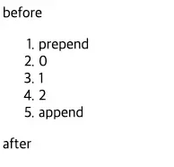
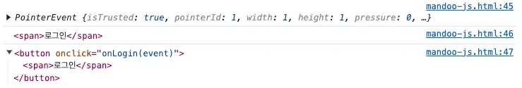

## DOM 요소 검색하기 (feat. 속성과 프로퍼티 조작하기)

- DOM이란?
    - Document Object Model의 약자로 HTML, XML 문서의 프로그래밍 interface
    - DOM은 문서의 구조화된 표현을 제공하며 프로그래밍 언어가 DOM 구조에 접근할 수 있는 방법을 제공하여 그들이 문서 구조, 스타일, 내용 등을 변경할 수 있게 도움
- DOM에 접근하기
    
    ```jsx
    document.body -> <body> 요소에 해당하는 DOM 을 선택한다.
    document.head -> <head> 요소에 해당하는 DOM 을 선택한다.
    
    // HTML 구조
    <html>
      <head>...</head> // head는 body의 이전 형제 노트
      <body>...</body> // body는 head의 다음 형제 노드
    </html>
    
    // 이렇게 이전 형제 노드를 선택하고 싶을 때
    document.body.previousSiling
    
    // 다음 형제 노드를 선택하고 싶을 때
    document.head.nextSibling
    ```
    
- 특정 요소에 접근하는 `getElement*, querySelecter*`
    - `getElement*`
        
        ```jsx
        // id 를 사용해 요소 검색하기
        document.getElementById(id);
        
        // 이런 html 이 있다고 가정
        <html>
          <head>
            <title>getElementById 예제</title>
          </head>
          <body>
            <p id="para">어떤 글</p>
            <button onclick="changeColor('blue');">blue</button>
            <button onclick="changeColor('red');">red</button>
          </body>
        </html>
        
        // id = para 인 요소를 선택하고 싶을 때
        document.getElementById('para');
        
        // 위를 이용하여 DOM 조작하는 함수를 만들어보면
        function changeColor(newColor) {
          var elem = document.getElementById("para");
          elem.style.color = newColor;
        }
        
        // ⚠️ 단, 주의사항! 무조건 document 객체에서만 접근 가능
        // 아래 코드를 실행하면 에러 발생
        <!DOCTYPE html>
        <html>
          <head>
            <meta charset="UTF-8" />
            <title>Document</title>
          </head>
          <body>
            <div id="parent-id">
              <p>hello word1</p>
              <p id="test1">hello word2</p>
              <p>hello word3</p>
              <p>hello word4</p>
            </div>
            <script>
              var parentDOM = document.getElementById("parent-id");
              console.log(parentDOM); // <div id="parent-id">...</div>
              var test1 = parentDOM.getElementById("test1");
              console.log(test1); // TypeError: parentDOM.getElementById is not a function...
            </script>
          </body>
        </html>
        ```
        
        - 기타 `getElementsBy~` 메서드 소개(잘 안 쓰임)
            - `elem.getElementsByTagName(tag)` : 주어진 태그에 해당하는 요소를 찾고, 대응하는 요소를 담은 컬렉션을 반환. 매개변수 tag에 "*"이 들어가면, '모든 태그’가 검색
            - elem.getElementsByClassName(className) – class 속성값을 기준으로 요소를 찾고, 대응하는 요소를 담은 컬렉션을 반환합니다.
            - document.getElementsByName(name) – 아주 드물게 쓰이는 메서드로, 문서 전체를 대상으로 검색을 수행합니다. 검색 기준은 name 속성값이고, 이 메서드 역시 검색 결과를 담은 컬렉션을 반환합니다.
    - `querySelector` , `querySelectorAll`
        - `querySelector()`
            - 제공한 선택자 또는 선택자 뭉치와 일치하는 문서 내 ‘첫 번째 요소’를 반환
            - 일치하는 요소 없으면 null 반환
        - `querySelectorAll()` : 지정된 셀렉터 그룹에 일치하는 document element 리스트를 나타내는 NodeList를 반환
        - 예시 코드
            
            ```jsx
            // myclass 라는 클래스를 사용하는 첫 번째 요소를 반환함.
            var el = document.querySelector(".myclass");
            
            // 더 복잡한 선택자도 가능
            var el = document.querySelector("div.user-panel.main input[name=login]");
            
            elementList = parentNode.querySelectorAll(selectors);
            
            // document 에서 모든 P 엘리먼트의 NodeList 를 얻으려면 :
            var matches = document.querySelectorAll("p");
            
            // id가 test인 컨테이너 안에 위치하는, class가 highlighted인 div 안에 있는 p 엘리먼트의 리스트를 얻는다.
            var container = document.querySelector("#test");
            var matches = container.querySelectorAll("div.highlighted > p");
            
            ```
            
    - `getElementsBy*` vs `querySelectorAll()`
        - `getElementsBy~` 는 살아있는 컬렉션을 반환 → 문서에 변경이 있을 때마다 자동 갱신되어 최신 상태를 유지
            
            ```jsx
            <div>첫 번째 div</div>
            
            <script>
              let divs = document.getElementsByTagName('div');
              alert(divs.length); // 1
            </script>
            
            <div>두 번째 div</div>
            
            <script>
              alert(divs.length); // 2
            </script>
            ```
            
        - `querySelectorAll()` 는 정적인 컬렉션을 반환 → 한 번 확정되면 더는 늘어나지 않음
            
            ```jsx
            <div>첫 번째 div</div>
            
            <script>
              let divs = document.querySelectorAll('div');
              alert(divs.length); // 1
            </script>
            
            // 문서에 새로운 div가 추가되었지만
            <div>두 번째 div</div>
            
            // 여기서 여전히 1을 반환하고 새로운 div를 반영하지 못하고 있다.
            <script>
              alert(divs.length); // 1
            </script>
            ```
            
- `console.log()` vs `console.dir()`
    - `console.log` : 요소의 DOM 트리를 그대로 출력(`console.log(document.body)`)
    - `console.dir` : 요소를 DOM 객체처럼 취급하여 출력, 즉 프로퍼티를 확인하기 쉽다는 장점이 있음(`console.dir(document.body)` )
- `innerHTML` 로 내용 조작해보기
    - `innerHTML` : 요소(element) 내에 포함된 HTML 또는 XML 마크업을 가져오거나 설정
        
        ```jsx
        // 아래 코드를 실행시켜 문자열 형태로 받아오고, 수정해보자.
        
        <!DOCTYPE html>
        <html>
          <head>
            <meta charset="UTF-8" />
            <title>Document</title>
          </head>
          <body>
            <p>p 태그</p>
            <div>div 태그</div>
        
        		// 이 부분까지 문자열로 보여주지만 실행되지는 않음.
            <script>
              alert(document.body.innerHTML); // 내용 읽기
              document.body.innerHTML = "새로운 BODY!"; // 교체
            </script>
          </body>
        </html>
        
        ```
        
        ```jsx
        // ex2
        
        <!DOCTYPE html>
        <html>
          <head>
            <meta charset="UTF-8" />
            <title>Document</title>
          </head>
          <body>
            <div id="elem1"></div>
        
            <script>
              const elem1 = document.getElementById("elem1");
              elem1.innerHTML = "<h1>Hello World</h1>";
            </script>
          </body>
        </html>
        
        ```
        
        >❗`innerHTML` 로 조작하는 것은 보안 위험이 있으므로 되도록 사용하지 않는 것이 좋다. script 자체에 넣는 것은 위처럼 실행되지 않지만 우회해서 실행시킬 수 있기 때문이다.
        
- HTML 속성에 접근하는 방법
    - `elem.hasAttribute(name)` : 속성 존재 여부 확인
    - `elem.getAttribute(name)` : 속성값을 가져옴
    - `elem.setAttribute(name, value)` : 속성값을 변경
    - `elem.removeAttribute(name)` : 속성값을 지움
    - 예시 코드
        
        ```jsx
        <body something="non-standard">
          <script>
            console.log(document.body.getAttribute('something')); // 비표준 속성에 접근
          </script>
        </body>
        
        // 만약 id값이 있다면 그걸로 바로 속성 접근
        <!DOCTYPE html>
        <html>
          <head>
            <meta charset="UTF-8" />
            <title>Document</title>
          </head>
          <body>
            <div id="em" about="Elephant"></div>
        
            <script>
              alert(em.getAttribute("About")); // (1) 'Elephant', 속성 읽기
        
              em.setAttribute("Test", 123); // (2) 속성 추가하기
        
              alert(em.outerHTML); // (3) 추가된 속성 확인하기
        
              for (let attr of em.attributes) {
                // (4) 속성 전체 나열하기
                alert(`${attr.name} = ${attr.value}`);
              }
            </script>
          </body>
        </html>
        
        // 속성값을 이용해서 innerHTML을 추가할 수도 있음
        
        // 이름(name) 정보를 보여주는 div라고 표시
        <div show-info="name"></div>
        // 나이(age) 정보를 보여주는 div라고 표시
        <div show-info="age"></div>
        
        <script>
          // 표시한 요소를 찾고, 그 자리에 원하는 정보를 보여주는 코드
          let user = {
            name: "Pete",
            age: 25
          };
        
          for(let div of document.querySelectorAll('[show-info]')) {
            // 원하는 정보를 필드 값에 입력해 줌
            let field = div.getAttribute('show-info');
            div.innerHTML = user[field]; // Pete가 'name'에, 25가 'age'에 삽입됨
          }
        </script>
        
        ```
        
- `data-` 로 시작하는 속성
    
    `data-` 의 속성 전체는 개발자가 용도에 맞게 사용하도록 별도록 예약됨. `dataset` 프로퍼티를 사용하면 `data-` 로 설정한 속성에 접근할 수 있음
    
    - 예시 코드
        
        ```jsx
        // data- 속성은 커스텀 데이터를 안전하고 유효하게 전달해줌
        // 단, 읽기 뿐 아니라 수정도 가능하기 때문에 유의해야 함.
        <body data-about="Elephants">
        <script>
          alert(document.body.dataset.about); // Elephants
        </script>
        ```
        

## DOM 생성 & 수정 & 삽입

- 요소 생성하는 2가지 방법
    1. 노드를 사용해서 만들기
        
        ```jsx
        let div = document.createElement('div');
        let textNode = document.createTextNode('안녕하세요.');
        ```
        
    2. innerHTML 사용하기
        
        ```jsx
        // <div> 요소 만들기
        let div = document.createElement('div');
        
        // 만든 요소의 클래스를 'alert'로 설정
        div.className = "alert";
        
        // 내용 채워넣기
        div.innerHTML = "<strong>안녕하세요!</strong> 중요 메시지를 확인하셨습니다.";
        ```
        
- 위 생성한 요소에 요소를 삽입하기
    
    ```jsx
    <!DOCTYPE html>
    <html>
      <head>
        <meta charset="UTF-8" />
        <title>Document</title>
      </head>
      <style>
        .alert {
          padding: 15px;
          border: 1px solid #d6e9c6;
          border-radius: 4px;
          color: #3c763d;
          background-color: #dff0d8;
        }
      </style>
    
      <body>
        <script>
    	    // body 안의 script 태그에서 요소 생성 합니다.
          let div = document.createElement("div");
          div.className = "alert";
          div.innerHTML =
            "<strong>안녕하세요!</strong> 중요 메시지를 확인하셨습니다.";
    			
    			// append()를 사용하여 body 에 새로 만든 요소를 삽입합니다.
          document.body.append(div);
        </script>
      </body>
    </html>
    ```
    
- 요소 삽입하는 다른 메서드
    - `node.append(노드나 문자열)` : 노드나 문자열을 node 끝에 삽입
    - `node.prepend(노드나 문자열)` : 노드나 문자열을 node 맨 앞에 삽입
    - `node.before(노드나 문자열)` : 노드나 문자열을 node 이전에 삽입
    - `node.after(노드나 문자열)` : 노드나 문자열을 node 다음에 삽입
    - 예시 코드
        
        ```html
        <!DOCTYPE html>
        <html>
          <head>
            <meta charset="UTF-8" />
            <title>Document</title>
          </head>
        
          <body>
            <ol id="ol">
              <li>0</li>
              <li>1</li>
              <li>2</li>
            </ol>
        
            <script>
              ol.before("before"); // <ol> 앞에 문자열 'before'를 삽입함
              ol.after("after"); // <ol> 뒤에 문자열 'after를 삽입함
        
              let liFirst = document.createElement("li");
              liFirst.innerHTML = "prepend";
              ol.prepend(liFirst); // <ol>의 첫 항목으로 liFirst를 삽입함
        
              let liLast = document.createElement("li");
              liLast.innerHTML = "append";
              ol.append(liLast); // <ol>의 마지막 항목으로 liLast를 삽입함
            </script>
          </body>
        </html>
        ```
        
    - 예상 결과
        
        
        

## DOM 스타일 & 클래스 추가하기

- `className` & `classList`
    - `className` : 특정 엘리먼트의 클래스 속성 값을 가져오거나 설정할 수 있음
        
        ```javascript
        // ex1
        let elm = document.getElementById("item");
        
        if (elm.className === "active") {
          elm.className = "inactive";
        } else {
          elm.className = "active";
        }
        
        // ex2
        <body class="main page">
          <script>
            alert(document.body.className); // main page
          </script>
        </body>
        ```
        
    - `classList` : 요소의 클래스 속성을 반환
        
        ```javascript
        // classList와 함께 사용 가능한 메서드
        
        // ✅ 아래 스크립트 복사해서 하나씩 실행하여 콘솔 확인
        const div = document.createElement("div");
        div.className = "foo";
        
        console.log(div.outerHTML);
        
        // add(string) - 지정한 클래스 값을 추가한다. 만약 이미 있다면 무시한다
        div.classList.add("anotherclass");
        
        console.log(div.outerHTML);
        
        // remove(string) - 지정한 클래스 값을 제거한다
        div.classList.remove("foo");
        
        console.log(div.outerHTML);
        
        // toggle(string) - 클래스가 존재하면 제거하고 false 반환, 존재하지 않으면 추가하고 true 반환
        div.classList.toggle("visible"); // 없으니까 추가하고 true 반환
        
        // contains(string) - 지정한 클래스 값이 요소의 class 속성에 존재하는지 확인한다
        console.log(div.classList.contains("visible"));
        
        div.classList.toggle("visible"); // 있으니까 제거하고 false 반환
        
        console.log(div.classList.contains("visible"));
        
        console.log(div.outerHTML);
        
        // replace(oldClass, newClass) - 존재하는 클래스를 새로운 클래스로 교체한다
        div.classList.replace("anotherclass", "newanotherclass");
        
        console.log(div.outerHTML);
        ```
        
- 요소에 스타일 추가하기
    - style 속성값으로 스타일을 추가할 수 있음
    - 여러 단어로 이어 만든 프로퍼티는 카멜케이스로 사용
        - ex) `background-color` → `elem.style.backgroundColor`
            
            ```javascript
            // 예시
            document.body.style.backgroundColor = 'pink'
            document.body.style.display = "none";
            ```
            
    - 자바스크립트로 스타일 값 설정할 때에는 단위를 반드시 붙여야 함
        
        ```javascript
        // ⚠️ 주의 사항
        // 자바스크립트로 스타일 값 설정할 때는 단위를 반드시 붙여줘야 합니다.
        <body>
          <script>
            // 동작하지 않음
            document.body.style.margin = 20;
            alert(document.body.style.margin); // '' (값이 제대로 할당되지 않았기 때문에 빈 문자열이 출력됩니다.)
        
            // CSS 단위(px)를 추가. 제대로 작동
            document.body.style.margin = '20px';
            alert(document.body.style.margin); // 20px
        
            alert(document.body.style.marginTop); // 20px
            alert(document.body.style.marginLeft); // 20px
          </script>
        </body>
        ```
        
- `innerHTML` vs `innerText` vs `textContent`
    
    ```javascript
    <!DOCTYPE html>
    <html>
      <head>
        <meta charset="UTF-8" />
        <title>Document</title>
      </head>
    
      <body>
        <div id="content">
          HELLO GUYS!
          <span style="display: none">innerText만 나를 볼 수 없음!</span>
        </div>
    
        <script>
          const content = document.getElementById("content");
    
          console.log(content.innerHTML);
          // html 전체를 다 가져옴
    
          // HELLO GUYS!
          // <span style="display: none">innerText만 나를 볼 수 없음!</span>
    
          console.log(content.innerText);
          // 사용자에게 보여지는 텍스트만 가져옴
          // 숨겨진 텍스트는 사용자에게 보여지지 않기 때문에 안녕~만 가져옴
    
          // HELLO GUYS!
    
          console.log(content.textContent);
          // 숨겨진 텍스트까지 포함해서 텍스트값을 모두 다 가져옴
    
          // HELLO GUYS!
          // innerText만 나를 볼 수 없음!
        </script>
      </body>
    </html>
    ```
    

## 브라우저 이벤트 소개

- 마우스 이벤트
    - `click` : 요소 위에서 마우스 왼쪽 버튼을 눌렀을 때(터치스크린이 있는 장치에선 탭했을 때) 발생
    - `contextmenu` : 요소 위에서 마우스 오른쪽 버튼을 눌렀을 때 발생
    - `mouseover` , `mouseout` : 마우스 커서를 요소 위로 움직였을 때, 커서가 요소 밖으로 움직였을 때 발생
    - `mousedwon` 과 `mouseup` : 요소 위에서 마우스 왼쪽 버튼을 누르고 있을 때, 마우스 버튼을 뗄 때 발생
    - `mousemove` : 마우스를 움직일 때 발생
- 폼 요소 이벤트
    - `submit` : 사용자가 `<form>` 을 제출할 때 발생
    - `focus` : 사용자가 `<input>` 과 같은 요소에 포커스할 때 발생
- 키보드 이벤트
    - `keydown` 과 `keyup` : 사용자가 키보드 버튼을 누르거나 뗄 때 발생
- 문서 이벤트
    - `DOMContentLoaded` : HTML이 전부 로드 및 처리되어 DOM 생성이 완료되었을 때 발생
- CSS 이벤트
    - `transitionend` : CSS 애니메이션이 종료되었을 때 발생
- 이벤트 핸들러란?
    
    이벤트에 반응하기 위해 이벤트가 발생했을 때 실행되는 함수를 핸들러(handler)라고 함. 즉, 핸들러는 사용자의 행동에 어떻게 반응할지를 JavaScript로 표현한 것
    
    - `on<event>` 속성을 추가해 핸들러를 할당할 수 있음
        
        ```javascript
        // HTML 자체에 onclick 으로 클릭 이벤트의 핸들러를 할당한 것임.
        <input value="클릭해 주세요." onclick="alert('클릭!')" type="button"/>
        
        // 혹은 바로 스크립트에서 사용 가능
        <input id="elem" type="button" value="클릭해 주세요."/>
        <script>
          elem.onclick = function() {
            alert('감사합니다.');
          };
        </script>
        
        // 이미 존재하는 함수를 직접 핸들러에 할당하기
        function sayThanks() {
          alert('감사합니다!');
        }
        
        // 올바른 방법
        button.onclick = sayThanks;
        
        // 틀린 방법
        // sayThanks() 같이 괄호를 덧붙이는 것은 함수를 호출하겠다는 것을 의미
        // 즉, sayThanks()를 프로퍼티에 할당하면 함수 호출의 결과값이 할당
        button.onclick = sayThanks();
        ```
        
- `addEventListener`
    - HTML 속성과 DOM 프로퍼티를 이용한 이벤트 핸들러 할당 방식엔 복수의 핸들러를 할당할 수 없다는 단점이 존재
        
        ```javascript
        // 버튼 클릭했을 때 두 개의 이벤트를 따로 따로 보여주고 싶은데
        input.onclick = function () { alert(1) }
        input.onclick = function () { alert(2) } // 이전 핸들러를 덮어씀
        ```
        
    - 위 문제를 해결하기 위해 `addEventListener` 와 `removeEventListener` 를 사용하는 것
        
        ```javascript
        // ex1
        <!DOCTYPE html>
        <html>
          <head>
            <meta charset="UTF-8" />
            <title>Document</title>
          </head>
        
          <body>
            <table id="outside">
              <tr>
                <td id="t1">one</td>
              </tr>
              <tr>
                <td id="t2">two</td>
              </tr>
            </table>
        
            <script>
        	    // t2의 콘텐츠를 바꾸는 함수
        	    // t2의 콘텐츠가 three 이면 two 로, two 면 three 로 바꾸는 함수
              function modifyText() {
                const t2 = document.getElementById("t2");
                if (t2.firstChild.nodeValue == "three") {
                  t2.firstChild.nodeValue = "two";
                } else {
                  t2.firstChild.nodeValue = "three";
                }
              }
        
              // 표에 이벤트 수신기 추가
              const el = document.getElementById("outside");
              el.addEventListener("click", modifyText, false);
            </script>
          </body>
        </html>
        
        // ex2
        <!DOCTYPE html>
        <html lang="en">
          <head>
            <meta charset="UTF-8" />
            <meta name="viewport" content="width=device-width, initial-scale=1.0" />
            <title>Document</title>
          </head>
          <body>
            <input />
        
            <script>
              const input = document.querySelector("input");
        
              input.addEventListener("input", (e) => alert(e.target.value));
            </script>
          </body>
        </html>
        
        // ex3
        // 하나의 input 에 여러개의 이벤트를 할당할 수도 있다는 것!
        <input id="elem" type="button" value="클릭해 주세요."/>
        
        <script>
          function handler1() {
            alert('감사합니다!');
          };
        
          function handler2() {
            alert('다시 한번 감사합니다!');
          }
        
          elem.onclick = () => alert("안녕하세요.");
          elem.addEventListener("click", handler1); // 감사합니다!
          elem.addEventListener("click", handler2); // 다시 한번 감사합니다!
        </script>
        ```
        
        ```javascript
        // removeEventListener 로 삭제는 동일한 함수만 할 수 있음
        // 이렇게 이벤트 핸들러로 지정할 함수를 변수에 저장해둬야 원하는대로 함수 삭제 가능
        function handler() {
          alert( '감사합니다!' );
        }
        
        input.addEventListener("click", handler);
        // ....
        input.removeEventListener("click", handler);
        
        // 만약, 이렇게 이벤트를 삭제한다면 원하는대로 삭제되지 않음
        // 사람에엔 똑같은 함수이지만 실제로 자바스크립트 입장에서는 같은 함수가 아니기 때문
        elem.addEventListener( "click" , () => alert('감사합니다!'));
        // ....
        elem.removeEventListener( "click", () => alert('감사합니다!'));
        ```
        
        - `removeEventListener` 정상 작동 하는 테스트 코드
            
            ```javascript
            <!DOCTYPE html>
            <html lang="en">
              <head>
                <meta charset="UTF-8" />
                <meta name="viewport" content="width=device-width, initial-scale=1.0" />
                <title>Document</title>
              </head>
              <body>
                <input />
            
                <script>
                  const input = document.querySelector("input");
                  const handler = () => alert("감사합니다!");
                  input.addEventListener("click", handler);
                  input.removeEventListener("click", handler);
                </script>
              </body>
            </html>
            
            ```
            
        - `removeEventListener` 정상 작동 안하는 테스트 코드
            
            ```javascript
            <!DOCTYPE html>
            <html lang="en">
              <head>
                <meta charset="UTF-8" />
                <meta name="viewport" content="width=device-width, initial-scale=1.0" />
                <title>Document</title>
              </head>
              <body>
                <input />
            
                <script>
                  const input = document.querySelector("input");
                  input.addEventListener("click", () => alert("감사합니다!"));
                  input.removeEventListener("click", () => alert("감사합니다!"));
                </script>
              </body>
            </html>
            
            ```
            
- 아래 코드와 같이 이벤트 핸들러를 통해 이벤트 객체를 얻을 수 있음
    
    ```jsx
    // 아래 코드를 실행시켜서 콘솔을 확인
    <input type="button" onclick="console.log(event)" value="이벤트 타입" />
    ```
    
- `event.target` vs `event.currentTarget`
    
    ```jsx
    // 둘이 같은 값을 반환할 때가 많아서 차이점을 헷갈리는 경우 많음
    // target : 실제 이벤트가 발생하는 요소
    // currentTarget : 이벤트 리스너가 달린 요소
    
    <!DOCTYPE html>
    <html lang="en">
      <head>
        <meta charset="UTF-8" />
        <meta name="viewport" content="width=device-width, initial-scale=1.0" />
    
        <title>Document</title>
      </head>
      <body>
        <li>
          <button onclick="onLogin(event)">
            <span>로그인</span>
          </button>
        </li>
        
        <script>
          const onLogin = (event) => {
            console.log(event);
            console.log(event.target);
            console.log(event.currentTarget);
          };
        </script>
      </body>
    </html>
    ```
    
    - 출력 결과를 보니, `event.target` 는 내가 실제로 클릭한 요소(즉, 이벤트 핸들러가 붙은 자식 요소)가 출력되고, `event.currentTarget` 는 이벤트 핸들러가 할당된 요소가 출력
        
        
        

## `setTimeout()` vs `setInterval()`

- `setTimeout(function, delay)` : 함수나 지정된 코드 조각을 한 번 실행하는 타이머를 설정
    - `function` : `delay`가 만료된 뒤 실행할 함수
    - `delay` : 주어진 함수 또는 코드가 실행하기 전 기다릴 밀리초 단위 시간(생략 또는 0 지정하면 즉시 실행)
    - 예시 코드 1
        
        ```jsx
        // 1000 ms = 1 s 
        setTimeout(() => {
          console.log("1초 지연."); // 즉, 1초 뒤에 실행됨
        }, 1000);
        ```
        
    - 예시 코드 2
        
        ```jsx
        // ex1
        setTimeout(() => {
          console.log("첫 번째 메시지"); // 5초 뒤 실행됨
        }, 5000);
        setTimeout(() => {
          console.log("두 번째 메시지"); // 3초 뒤 실행됨
        }, 3000);
        setTimeout(() => { 
          console.log("세 번째 메시지"); // 1초 뒤 실행됨
        }, 1000);
        
        // 콘솔 출력:
        // 세 번째 메시지
        // 두 번째 메시지
        // 첫 번째 메시지
        ```
        
        - 가장 상단의 setTimeout이 5초 뒤에 실행된다고 해서 정지되는 것은 아님.
        - 5초를 대기하는 동안 2번째 3초 대기하는 `setTimeout`이 실행되고, 또 대기하는 동안 다음 함수도 실행(이를 비동기 함수라고 함)
    - `setTimeout(함수, 0)`이 정말 “즉시” 실행 될까?
        
        ```jsx
        function foo() {
          console.log("foo 호출");
        }
        
        // 브라우저는 얘가 어떤 delay 시간을 가질지 몰라서 일단 setTimeout만나면 대기실에 넣음
        setTimeout(foo, 0); 
        
        // 대기실에 들어가면 다음 코드는 일단 실행. 즉, 얘부터 콘솔에 찍히는 이유
        console.log("setTimeout 완료");
        
        // 콘솔 출력:
        // setTimeout 완료
        // foo 호출
        ```
        
    - 특정 상황에 타이머를 취소하는 법 - `clearTimeout()`
        
        ```jsx
        <!DOCTYPE html>
        <html lang="en">
          <head>
            <meta charset="UTF-8" />
            <meta name="viewport" content="width=device-width, initial-scale=1.0" />
            <title>Document</title>
          </head>
          <body>
            <button onclick="delayedMessage();">2초 뒤 메시지 표시</button>
            <button onclick="clearMessage();">메시지가 나타나기 전에 취소</button>
        
            <div id="output"></div>
        
            <script>
        	    // 🌟 타이머를 취소하려면 반드시 타이머를 변수에 담아줘야 합니다.
              let timeoutID;
        
              function setOutput(outputContent) {
                document.querySelector("#output").textContent = outputContent;
              }
        
              function delayedMessage() {
                setOutput("");
                timeoutID = setTimeout(setOutput, 2 * 1000, "너무 느려요!");
              }
        
              function clearMessage() {
        	      // clearTimeout(여기에 타이머 변수를 넣어줘야 합니다.)
                clearTimeout(timeoutID);
              }
            </script>
          </body>
        </html>
        
        ```
        
- `setInterval(func, delay, arg01, arg02, ..., arg0N)`
    - 고정된 시간마다 함수를 반복적으로 호출하거나 코드를 실행
    - `func` : `delay` 마다 실행되는 함수
    - `delay` : 밀리초 단위로 코드 실행 시간 단위
    - `arg0 ... argN` : 타이머가 만려되면 func 에서 지정한 함수로 전달되는 추가 인수임
    - 
    - 예시 코드
        
        ```jsx
        // intervalID 로 선언한 변수에 setInterval() 호출로 생성된 타이머를 식별하는
        // 0이 아닌 숫자가 반환되어 담김
        const intervalID = setInterval(myCallback, 1000, "Parameter 1", "Parameter 2");
        
        // a = "Parameter 1"
        // b = "Parameter 2"
        function myCallback(a, b) {
          // 여기에 코드를 작성하세요
          // 매개변수는 순전히 선택적입니다.
          console.log(a);
          console.log(b);
        }
        
        // 5초 뒤에 setInterval 타이머를 삭제하여 초기화시켜줍니다.
        setTimeout(() => clearInterval(intervalID), 5000)
        ```
