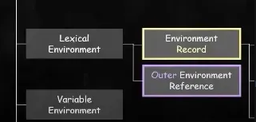
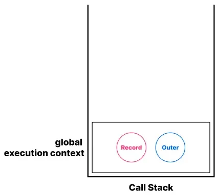
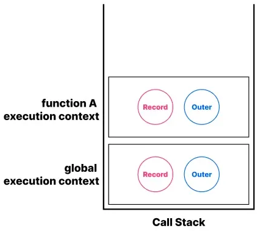
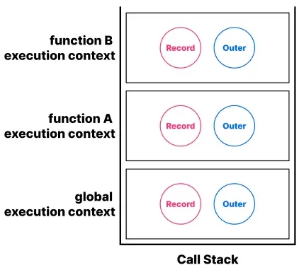
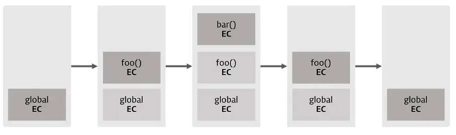
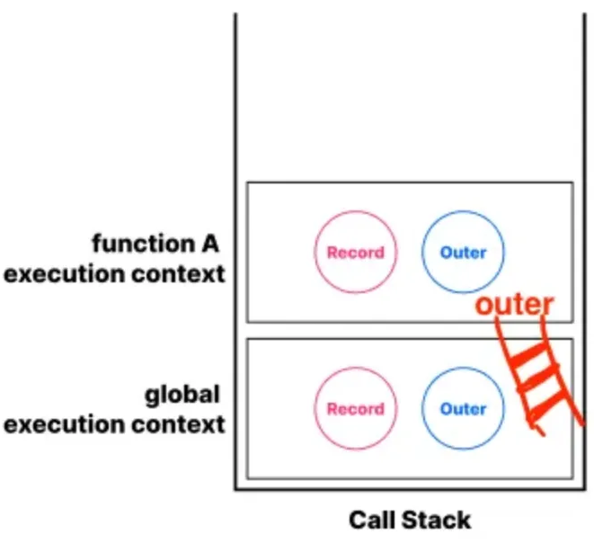
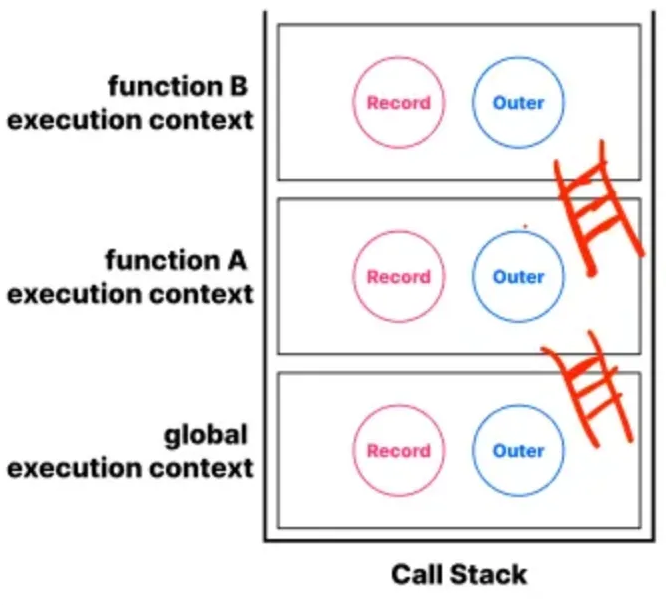
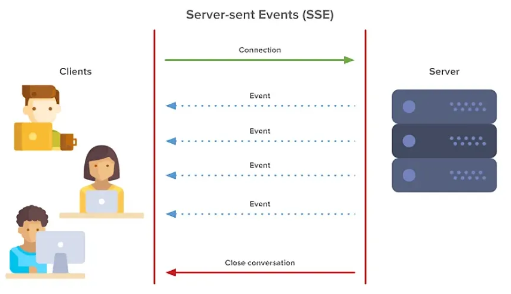

## 이벤트 버블링 & 캡쳐링

예시 코드를 먼저 보자.

아래 코드를 실행해보면 이벤트 핸들러는 `div`에 있는데 `em`, `code` 태그를 클릭해도 동작한다.

```jsx
<div onclick="alert('div에 할당한 핸들러!')">
  <em><code>EM</code>을 클릭했는데도 <code>DIV</code>에 할당한 핸들러가 동작합니다.</em>
</div>
```

이 때 필요한 개념이 버블링과 캡쳐링이다.

- 버블링 bubbling
    
    한 요소에 이벤트가 발생하면, 이 요소에 할당된 핸들러가 동작하고, 이어서 부모 요소의 핸들러가 동작한다.
    
    가장 최상단의 조상 요소를 만날 때까지 이 과정이 반복되면서 요소 각각에 할당된 핸들러가 동작한다.
    
    코드를 실행시켜보자.
    
    아래 코드는 `form` > `div` > `p` 의 중첩된 구조인데 요소 각각에 클릭 이벤트 핸들러가 할당되어 있다.
    
    ```jsx
    <style>
      body * {
        margin: 10px;
        border: 1px solid blue;
      }
    </style>
    
    <form onclick="alert('form')">FORM
      <div onclick="alert('div')">DIV
        <p onclick="alert('p')">P</p>
      </div>
    </form>
    ```
    
    위 코드에서 `p` 코드를 클릭하면 다음과 같은 순서대로 벌어진다.
    
    1. `<p>` 에 할당된 `onClick` 핸들러가 동작
    2. 바깥의 `<div>` 에 할당된 핸들러가 동작
    3. 그 바깥의 `<form>` 에 할당된 핸들러가 동작
    4. `document` 객체를 만날 때까지, 각 요소에 할당된 `onClick` 핸들러가 동작
    
    위 흐름이 바로 이벤트 버블링이다.
    
    거의 모든 이벤트는 버블링된다고 보면 된다.
    
    그럼 버블링을 막을 수는 없을까?
    
    핸들러에게 이벤트를 완전히 처리 후 버블링을 중단하도록 명령할 수 있다.
    
    그 명령어는 `event.stopPropagation()` 이다.
    
    ```jsx
    <body onclick="alert(`버블링은 여기까지 도달하지 못합니다.`)">
      <button onclick="event.stopPropagation()">클릭해 주세요.</button>
    </body>
    ```
    
    하지만 꼭 필요한 경우를 제외하고는 버블링을 막지 않는 것이 좋다.
    
- 캡처링 capturing
    
    자주 쓰이지는 않지만 개념은 알아두자.
    
    캡처링은 이벤트가 하위 요소로 전파되는 단계다.
    
    캡처링 단계를 이용해야 하는 경우는 흔치 않기에, 캡처링에 관한 코드를 발견하는 일은 거의 없을 것이다.
    
    그럼에도 캡처링을 써야하는 상황이라면 `addEventListener` 의 `capture` 옵션을 `true` 로 설정해주면 된다.
    
    기본값은 `false` 로 버블링 단계에서 동작한다.
    
    ```jsx
    elem.addEventListener(..., {capture: true})
    // 아니면, 아래 같이 {capture: true} 대신, true를 써줘도 됩니다.
    elem.addEventListener(..., true)
    ```
    
    - 캡처링 예시 코드
        
        ```jsx
        <style>
          body * {
            margin: 10px;
            border: 1px solid blue;
          }
        </style>
        
        <form>FORM
          <div>DIV
            <p>P</p>
          </div>
        </form>
        
        <script>
          for(let elem of document.querySelectorAll('*')) {
            elem.addEventListener("click", e => alert(`캡쳐링: ${elem.tagName}`), true);
            elem.addEventListener("click", e => alert(`버블링: ${elem.tagName}`));
          }
        </script>
        ```
        
        위 코드에서 `<p>` 를 클릭하면 다음과 같은 순서로 이벤트가 전달된다.
        
        1. `HTML`→ `BODY` → `FORM` → `DIV` (캡처링 단계, 첫 번째 리스너)
        2. `P` (타깃 단계, 캡쳐링과 버블링 둘 다에 리스너를 설정했기에 두 번 호출)
        3. `DIV` → `FORM` → `BODY` → `HTML` (버블링 단계, 두 번쨰 리스너)

## 이벤트 위임

많은 요소에 각각 이벤트를 붙이는 대신, 부모 요소 하나에만 이벤트를 붙여 처리하는 방법이다.

위에서 본 버블링과 캡처링을 활용하면 이벤트 위임이라는 강력한 이벤트 핸들링 패턴을 구현할 수 있다.

- 이벤트 위임 전 예시 코드
    
    ```jsx
    <!DOCTYPE html>
    <html lang="en">
      <head>
        <meta charset="UTF-8" />
        <meta name="viewport" content="width=device-width, initial-scale=1.0" />
        <title>Document</title>
        <style>
          li {
            font-size: 20px;
            cursor: pointer;
          }
    
          .completed {
            text-decoration: line-through;
          }
        </style>
      </head>
    
      <body>
        <ul id="todo-list">
          <li>할일 1</li>
          <li>할일 2</li>
          <li>할일 3</li>
        </ul>
    
        <script>
          const lis = document.querySelectorAll("li");
    
          lis.forEach((li) => {
            li.addEventListener("click", function (event) {
              event.target.classList.toggle("completed");
            });
          });
        </script>
      </body>
    </html>
    ```
    
- 이벤트 위임 적용 후 예시 코드
    
    ```jsx
    const todoList = document.getElementById('todo-list');
    
    todoList.addEventListener('click', function(event) {
        // 클릭된 요소가 li인 경우에만 처리
        if (event.target.tagName === 'LI') {
            event.target.classList.toggle('completed');
        }
    });
    ```
    

## 실행 컨텍스트 Execution Context

실행 컨텍스트는 `scope`, `hoisting`, `this`, `function`, `closure` 등의 동작 원리를 담고 있는 JS의 핵심 원리다.

즉, 실행할 코드에 제공할 환경 정보들을 모아놓은 객체인 것이다.

사실 실행 가능한 코드를 형상화하고 구분하는 굉장히 추상적인 개념이다.

실행 컨텍스트의 구조 중에서 Environment Record, Outer Environment Reference를 알아보자.



- Environment Record(환경 레코드): 식별자와 식별자에 바인딩된 값을 기록해두는 객체
- Outer Environment Reference(외부 환경 참조): 바깥 Lexical Environment를 가리킴
- Lexical Environment(렉시컬 환경, 정적 환경): 환경 레코드와 외부 환경 참조를 합친 것

자바스크립트 call stack부터 다시 기억해보면서 실행 컨텍스트가 어떻게 담기는지 알아보자.

자바스크립트 엔진은 코드가 실행되면 call stack이라는 곳에 전역 실행 컨텍스트를 먼저 담는다.

만약, 전역에서 함수 A를 호출하면 그 위에 함수 A의 실행 컨텍스트를 담게 되는 것이다.

이어 함수 A에서 함수 B를 호출하면 또 B의 실행 컨텍스트를 담는다.

다음 그림 순서대로 쌓이는 것이다.







함수 B의 실행이 끝나면 B의 실행 컨텍스트는 사라지고, 함수 A의 실행이 끝나면 A의 실행 컨텍스트도 사라지고,

마지막으로 더 이상 실행할 코드가 없다면 전역 실행 컨텍스트도 사라진다.

예시 코드로 보자.

- 예시 코드
    
    ```jsx
    var x = 'xxx';
    
    function foo () {
      var y = 'yyy';
    
      function bar () {
        var z = 'zzz';
        console.log(x + y + z);
      }
      bar();
    }
    foo();
    ```
    

위 코드를 실행하면 다음과 같이 실행 컨텍스트가 담길 것이다.

 <br /> 출처: [https://inpa.tistory.com/entry/JS-📚-실행-컨텍스트](https://inpa.tistory.com/entry/JS-%F0%9F%93%9A-%EC%8B%A4%ED%96%89-%EC%BB%A8%ED%85%8D%EC%8A%A4%ED%8A%B8)

이제 실행 컨텍스트에서 호이스팅을 사용해서 어떻게 변수를 저장하는지 알아보자.

```jsx
console.log(name) // undefined
var name = 'mandoo'
console.log(name) // mandoo
```

여기서 `name` 변수는 호이스팅 되면서 `undefined` 로 초기화가 된다고 했다.

자바스크립트 엔진이 변수 같은 정보를 실행 컨텍스트 어딘가에 미리 기록해두는 것이다.

이 때 기록해두는 곳이 바로 Record (Environment Record, 환경 레코드)이다.

- Record
    
    ```jsx
    console.log(name) // undefined
    var name = 'mandoo'
    console.log(name) // mandoo
    ```
    
    위 코드를 가지고 변수 호이스팅 과정을 통해 실행 컨텍스트의 Record에 어떻게 저장되는지 순서대로 알아보자.
    
    1. 생성 단계
        
        실행 컨텍스트를 생성하고, 선언문만 실행해서 Environment Record에 미리 기록
        
        위 코드에서는
        
        - 전역 실행 컨텍스트가 생성되고 `name` 선언문만 실행해서 Record에 기록
        - 이 때 `var` 키워드로 선언했기에 `undefined` 까지 함께 초기화
    2. 실행 단계
        
        이어서 선언문 외에 나머지 코드를 순차적으로 실행
        
        이 때 Environment Record에 기록해둔 정보를 참조하거나 업데이트
        
        위 코드에서는
        
        - Record에 기록된 `name` 에 할당된 `undefined` 를 참조해 콘솔을 찍고
        - 이후 변수에 `mandoo` 가 할당되며 Record의 정보를 업데이트하고
        - 다음 콘솔에서 `name` 에 할당된 mandoo를 참조해 콘솔을 찍게 됨
- outer
    
    ```jsx
    let mandoo = false
    
    function goToNextContext() {
    	let mandoo = true
    	
    	console.log(mandoo)
    }
    
    goToNextContext()
    ```
    
    
    
    위 코드에서 어떻게 동작하는지 실행 컨텍스트로 이해해보자.
    
    1. 전역 실행 컨텍스트에 `mandoo` 라는 변수가 `false` 로 저장될 것이고, `goTonextContext` 함수도 저장
    2. `goToNextContext()` 함수가 호출되면서 `goToNextContext` 함수 실행 컨텍스트가 생성
    3. `goToNextContext` 함수 실행 컨텍스트에 `mandoo = true` 라는 값을 저장
    4. `console.log(mandoo)` 를 실행하면 가장 상단의 실행 컨텍스트인 `goToNextContext` 함수 실행 컨텍스트에서 `mandoo` 라는 변수를 찾을 것
    5. 해당 변수를 찾았기에 `true` 를 제대로 출력 
    6. `goToNextContext` 함수가 종료되면서 해당 실행 컨텍스트는 사라짐
    7. 더 이상 실행할 코드가 없기 때문에 전역 실행 컨텍스트도 사라짐
    
    다른 코드로 한 번 더 살펴보자
    
    ```jsx
    let mandoo = false
    
    function funcA() {
    	let mandoo = true
    	
    	console.log(mandoo)
    	
    	function funcB() {
    		let name = 'lisa'
    		
    		console.log(name)
    		console.log(mandoo)
    		console.log(pizza)
    	}
    	
    	funcB()
    }
    
    funcA()
    ```
    
    출력 결과를 예상해보자. outer를 사용한다면 true, lisa, true ,ReferenceError가 나올 것이다.
    
    이런 결과가 어떻게 나오는지 사진으로 알아보자.
    
    
    
    1. 코드가 실행되면서 전역 실행 컨텍스트 생성
    2. `mandoo` 변수가 선언되고, `funcA`가 선언문으로 만들어져 함수 통째로 호이스팅
    3. 코드가 실행되면서 `mandoo` 변수에 `false`값이 할당
    4. `funcA` 함수가 호출되면서 `funcA` 실행 컨텍스트 생성
    5. `funcA` 실행 컨텍스트에 `mandoo` 변수가 선언되고, `funcB`가 선언문으로 만들어져 함수 통째로 `funcA` 실행 컨텍스트의 상단으로 호이스팅
    6. `funcA` 실행 컨텍스트에 `mandoo` 변수에 값이 할당되고, 콘솔이 실행되어 값이 찍힘
    7. `funcB`가 호출되면서 `funcB` 실행 컨텍스트가 생성
    8. `funcB`도 생성단계를 마치고 실행 단계에서 콘솔을 출력
    9. `name` 변수는 `funcB` 실행 컨텍스트 즉 `funcB`의 Record에 저장되어 있기에 값을 바로 찾음
    10. mandoo 변수는 funcB 실행 컨텍스트에 없으니 outer 사다리를 타고 바깥 Lexical Environment로 이동해 해당 Record에서 mandoo 변수를 찾음
    11. 바로 바깥 Lexical Environment에서 변수 `mandoo`를 찾았기에 `funcA` 환경 레코드에 저장된 `mandoo`의 값인 `true`를 출력
    12. `pizza`라는 변수는 outer를 통해 전역 실행 컨텍스트까지 갔음에도 찾지 못해 에러가 발생
    
    이런 식으로 outer를 통해 전역 변수까지 함수 내에서 사용할 수 있는 것이다.
    

## 클로저 Closure

클로저는 함수형 프로그래밍 언어에서 사용되는 중요한 특성이기에 잘 알아두는 것이 좋다.

- MDN 왈:
클로저는 함수와 그 함수가 선언됐을 때의 렉시컬 환경과의 조합이다.

아래 코드로 조금 더 자세히 이해해보자.

```jsx
function outerFunc() {
  var x = 10;
  var innerFunc = function () { console.log(x); };
  innerFunc();
}

outerFunc(); // 10
```

함수 `outerFunc` 내에서 내부함수 `innerFunc` 가 선언되고 호출되었다.

이 때, 내부함수 `innerFunc` 는 자신을 포함하고 있는 외부함수 `outerFunc` 의 변수 `x`에 접근할 수 있다.

이는 함수 `innerFunc` 가 함수 `outerFunc` 의 내부에 선언되었기 때문이다.

스코프의 개념으로 바라보자면 `innerFunc` 함수의 상위 스코프는 `outerFunc` 함수인 것이다.

함수 `innerFunc` 가 함수 `outerFunc` 의 내부에 선언된 내부함수이므로 함수 `innerFunc` 는 자신이 속한 렉시컬 스코프(전역, 함수 `outerFunc`, 자신의 스코프)를 참조할 수 있다.

- 실행 컨텍스트의 관점에서 좀 더 살펴보자.
    
    내부 함수 `innerFunc` 이 호출되면 `innerFunc` 의 실행 컨텍스트가 실행 컨텍스트 스택에 쌓이고, 이 때 변수 객체, 스코프 체인, `this` 에 바인딩할 객체가 결정되는데, 스코프 체인에 다음과 같은 객체들이 바인딩된다.
    
    1. 전역 스코프를 가리키는 전역 객체
    2. 함수 `outerFunc` 의 스코프를 가리키는 함수 `outerFunc` 의 활성 객체
    3. 함수 자신(`innerFunc`)의 스코프를 가리키는 활성 객체
    
    여기서 스코프 체인이 바인딩한 객체가 바로 “렉시컬 스코프의 실체”이다.
    
    이 스코프 체인을 통해 `innerFunc` 는 자신을 포함하는 외부 함수 `outerFunc` 의 변수에 접근할 수 있던 것 (만약 찾고자 하는 변수가 `outerFunc` 에도 없다면 전역 객체까지 찾아봄)
    
- 코드를 살짝 변경하여 살펴보자.
    
    ```jsx
    function outerFunc() {
      var x = 10;
      var innerFunc = function () { console.log(x); };
      return innerFunc;
    }
    
    /**
     *  함수 outerFunc를 호출하면 내부 함수 innerFunc가 반환
     *  그리고 함수 outerFunc의 실행 컨텍스트는 소멸
     */
    var inner = outerFunc();
    inner(); // 10
    ```
    
    지금까지 배운 내용 대로라면 `outerFunc` 함수가 호출되고 나면 콜스택(= 실행 컨텍스트 스택)에서 사라지며 함수의 생을 마감하게 된다.
    
    즉, 함수 안에 선언된 변수나 함수 등 정보도 함께 사라지는 것
    
    inner이라는 함수를 호출했다는 것은 죽은 함수의 x를 찾았다는 것이다.
    
    이미 life-cycle이 종료되어 실행 컨텍스트 스택에서 제거된 함수 `outerFunc` 의 지역 변수 `x` 를 어떻게 가져왔을까?
    
    이 특별한 일은 클로저 덕분에 가능한 것이다.
    
    자신을 포함하고 있는 외부함수보다 내부함수가 더 오래 유지되는 경우, 외부 함수에서 내부함수가 호출되더라도 외부 함수의 지역변수에 접근할 수 있는데, 이러한 함수를 클로저라고 부른다.
    
    그럼 MDN의 말을 이렇게 뜯어볼 수 있다.
    
    - 클로저는 함수와 그 함수가 선언됐을 때의 렉시컬 환경의 조합이다.
        - 함수 = 반환된 내부 함수
        - 그 함수가 선언됐을 때의 렉시컬 환경 = 내부 함수가 선언됐을 때의 스코프
    
    다시 정리해보자면, 클로저는 반환된 내부 함수가 자신이 선언됐을 때의 환경(렉시컬 환경)인 스코프를 기억하여 자신이 선언됐을 때의 환경 밖에서 호출되어도 그 환경에 접근할 수 있는 함수를 말한다는 것
    
    여기서 `outerFunc` 함수의 변수 `x` 를 자유 변수라고 부른다.
    
    이 때, 내부 함수가 외부 함수에 있는 변수의 복사본이 아닌 실제 변수에 접근해야 외부 함수가 유지된다.
    

## 클로저 활용

클로저는 자신이 생성될 때의 환경을 기억해야 하므로 메모리 차원에서 손해를 볼 수 있긴 하다.

하지만 클로저는 자바스크립트의 강력한 기능으로 이를 적극적으로 사용해야 한다.

- 클로저의 장점
    1. 전역 변수 사용을 최소화 할 수 있다.
    2. 데이터 보존이 가능하다.
    3. 모듈화를 통한 코드 재사용이 편리하다.
    4. 정보 접근 제한(캡슐화) 할 수 있다.
- 클로저가 유용하게 사용되는 상황
    1. 현재 상태를 기억하고 변경된 최신 상태를 유지할 때
        
        ```jsx
        function outerFn() {
          let x = 10;
          function innerFn(y) { // innerFn 함수는 클로저다.
        	  console.log(`x: ${x}, y: ${y}`)
            return x = x + y;
          }
          return innerFn;
        }
        let a = outerFn(); // 외부함수 호출은 한번만. 이제 a 변수는 innerFn 함수를 참조한다.
        a(5); // 15;
        a(5); // 20;
        a(5); // 25;
        ```
        
        a는 `innerFn` 함수이다.
        
        여기서 `x`는 `outerFn` 의 지역 변수이다.
        
        `innerFn` 에서 자신의 상위 스코프인 `outerFn` 의 변수를 사용하고 있기에 `outerFn` 은 소멸되지 않는다.
        
        그래서 `x` 라는 지역 변수도 같이 살아있어 참조하고 업데이트가 가능한 것이다.
        
    2. 전역 변수를 최소화(억제)할 때
        
        먼저 전역 변수를 사용해 카운터를 구현해보자.
        
        ```jsx
        <!DOCTYPE html>
        <html>
        <body>
          <p>전역 변수를 사용한 Counting</p>
          <button id="inclease">+</button>
          <p id="count">0</p>
          <script>
            var incleaseBtn = document.getElementById('inclease');
            var count = document.getElementById('count');
        
            // 카운트 상태를 유지하기 위한 전역 변수
            var counter = 0;
        
            function increase() {
              return ++counter;
            }
        
            incleaseBtn.onclick = function () {
              count.innerHTML = increase();
            };
          </script>
        </body>
        </html>
        ```
        
        위 코드는 잘 동작하지만, 전역 변수로 `counter`를 조작하고 있기에 의도치 않은 오류를 발생시킬 가능성을 내포하고 있는 코드다.
        
        `increase` 함수가 호출되기 직전에 전역 변수 `counter` 의 값이 반드시 0이어야 제대로 동작하는데, 전역 변수인 만큼 누구나 접근하고 변경할 수 있다.
        
        즉, 의도치 않게 값이 변경될 수 있다는 것이다. << 오류로 이어짐
        
        따라서 변수 `counter` 는 `increase` 함수에서 관리하는 것이 바람직하므로 그렇게 코드를 수정해보자.
        
        ```jsx
        <!DOCTYPE html>
        <html>
        <body>
          <p>지역 변수를 사용한 Counting</p>
          <button id="inclease">+</button>
          <p id="count">0</p>
          <script>
            var incleaseBtn = document.getElementById('inclease');
            var count = document.getElementById('count');
        
            function increase() {
              // 카운트 상태를 유지하기 위한 지역 변수
              var counter = 0;
              return ++counter;
            }
        
            incleaseBtn.onclick = function () {
              count.innerHTML = increase();
            };
          </script>
        </body>
        </html>
        ```
        
        이렇게 의도치 않은 상태 변경은 함수 안에 `counter` 변수를 넣어서 방지했다.
        
        하지만 `increase` 함수가 호출될 때마다 `counter`가 0으로 초기화되면서 1에서 더 이상 올라가지 않는다. << 변경된 이전 상태를 기억하지 못함.
        
        이 때 사용하면 좋은 것이 바로 클로저
        
        ```jsx
        <!DOCTYPE html>
        <html>
          <body>
          <p>클로저를 사용한 Counting</p>
          <button id="inclease">+</button>
          <p id="count">0</p>
          <script>
            var incleaseBtn = document.getElementById('inclease');
            var count = document.getElementById('count');
        
        		// ()() 는 즉시 실행 함수입니다.
            var increase = (function () {
              // 카운트 상태를 유지하기 위한 자유 변수
              var counter = 0;
              // 클로저를 반환
              return function () {
                return ++counter;
              };
            }());
        
            incleaseBtn.onclick = function () {
              count.innerHTML = increase();
            };
          </script>
        </body>
        </html>
        ```
        
        이렇게 클로저를 사용해 전역변수의 사용을 최소화할 수 있는 것이다.
        
        위 코드를 실행하면 즉시 실행 함수가 호출되며 변수 `increase` 에는 함수 `function () {return ++counter;};` 가 할당된다.
        
        즉시 실행 함수는 호출된 이후 소멸된다.
        
        하지만 즉시 실행 함수가 반환한 함수 `function () { return ++counter;};` 는 변수 `increase` 에 할당되어 `increase` 버튼을 클릭하면 클릭 이벤트 핸들러 내부에서 호출된다.
        
        이 때, 클로저인 `function () { return ++counter; };` 이 함수는 자신이 선언됐을 때의 렉시컬 환경인 즉시 실행 함수의 스코프에 있던 지역 변수 `counter` 를 기억할 것이다.
        
        따라서 즉시 실행 함수의 변수 `counter` 에 접근할 수 있고, 변수 `counter` 는 자신을 참조하는 함수인 `function () {return ++counter;};` 이 함수가 사라질 때까지 유지된다.
        
        즉시 실행 함수는 한 번만 실행되므로 변수 `counter` 가 초기화될 일은 없을 것이다.
        
    3. 함수형 프로그래밍을 사용할 때
        
        불변성을 지향하는 함수형 프로그래밍에서 side effect를 최대한 억제하여 오류를 피하고 프로그램의 안정성을 높이기 위해 클로저가 적극적으로 사용된다.
        
        아래는 함수형 프로그래밍에서 클로저를 활용하는 간단한 예제이다.
        
        ```jsx
        // 함수를 인자로 전달받고 함수를 반환하는 고차 함수
        // 이 함수가 반환하는 함수는 클로저로서 카운트 상태를 유지하기 위한 자유 변수 counter을 기억한다.
        function makeCounter(predicate) {
          // 카운트 상태를 유지하기 위한 자유 변수
          let counter = 0;
          // 클로저를 반환
          return function () {
            counter = predicate(counter);
            return counter;
          };
        }
        
        // 보조 함수
        function increase(n) {
          return ++n;
        }
        
        // 보조 함수
        function decrease(n) {
          return --n;
        }
        
        // 함수로 함수를 생성한다.
        // makeCounter 함수는 보조 함수를 인자로 전달받아 함수를 반환한다
        const increaser = makeCounter(increase);
        console.log(increaser()); // 1
        console.log(increaser()); // 2
        
        // increaser 함수와는 별개의 독립된 렉시컬 환경을 갖기 때문에 카운터 상태가 연동하지 않는다.
        const decreaser = makeCounter(decrease);
        console.log(decreaser()); // -1
        console.log(decreaser()); // -2
        ```
        
        함수 `makeCounter` 가 반환하는 함수는 자신이 생성됐을 때의 렉시컬 환경인 함수 `makeCounter` 의 스코프에 속한 변수 `counter` 을 기억하는 클로저이다.
        
        이 때 주의해야 할 것은 함수 `makeCounter` 를 호출해 함수를 반환할 때 반환된 함수는 자신만의 독립된 렉시컬 환경을 갖는다는 것이다.
        
        이는 함수를 호출하면 그 때마다 새로운 렉시컬 환경이 생성되기 때문이다.
        
        즉, 변수 `increaser` 와 변수 `decreaser` 에 할당된 함수는 각각 자신만의 독립된 렉시컬 환경을 갖기 때문에 카운트를 유지하기 위한 자유 변수 `counter` 를 공유하지 않아 카운터의 증감이 연동하지 않는 것이다.
        
    4. 정보를 은닉하고 싶을 때
        
        ```jsx
        function Counter() {
          // 카운트를 유지하기 위한 자유 변수
          var counter = 0;
        
          // 클로저
          this.increase = function () {
            return ++counter;
          };
        
          // 클로저
          this.decrease = function () {
            return --counter;
          };
        }
        
        const counter = new Counter();
        
        console.log(counter.increase()); // 1
        console.log(counter.decrease()); // 0
        ```
        
        위 코드를 보면 Class 문법이랑 비슷하게 생긴 것을 느낄 수 있다.
        
        단지 `function` 키워드로 생성자 함수를 만든 것이다.
        
        생성자 함수 `Counter` 는 `increase`, `decrease` 메소드를 갖는 인스턴스를 생성한다.
        
        이 메서드들은 모두 자신이 생성됐을 때의 렉시컬 환경인 생성자 함수 `Counter` 의 스코프에 속한 변수 `counter` 를 기억하는 클로저이며 렉시컬 환경을 공유하게 된다.
        
        생성자 함수가 생성한 객체의 메서드는 객체의 프로퍼티에만 접근할 수 있는 것이 아니며, 자신이 기억하는 렉시컬 환경의 변수에도 접근할 수 있다.
        
        이 때 생성자 함수 `Counter` 의 변수 `counter` 는 말 그대로 변수다.
        
        변수 `counter` 가 `this` 에 바인딩된 프로퍼티라면 생성자 함수 `Counter` 가 생성한 인스턴스를 통해 외부에서 접근이 가능한 `public` 프로퍼티가 되지만 생성자 함수 `Counter` 내에서 선언된 변수 `counter` 는 생성자 함수 `Counter` 외부에서 접근할 수 없다.
        
        쉽게 말 해 `counter` 는 변수이기에 외부에서 이 변수에 접근할 방법이 없다.
        
        하지만 생성자 함수 `Counter` 가 생성한 인스턴스의 메서드인 `increase`, `decrease` 는 클로저이기에 자신이 생성됐을 때의 렉시컬 환경인 생성자 함수 `Counter` 의 변수 `counter` 에 접근할 수 있다.
        
        이러한 클로저의 특징을 사용해 클래스 기반 언어의 `private` 키워드를 흉내낼 수 있는 것이다.
        
        - 정보를 은닉화하는 클로저의 예제 두 개
            1. `_name`이라는 변수를 은닉화하여 외부에서 접근을 막으며 `new` 키워드로 만들어진 인스턴스를 통해 `*` 부분의 클로저 함수가 실행되면서 `_name` 에 접근 가능
                
                ```jsx
                function hello(name) {
                  let _name = name;
                  // *
                  return function () { 
                    console.log('Hello, ' + _name);
                  };
                }
                
                let a = new hello('영서');
                let b = new hello('아름');
                
                a() //Hello, 영서
                b() //Hello, 아름
                
                console.log(name) // ReferenceError: _name is not defined
                ```
                
            2. `temp` 라는 변수를 은닉화하여 외부에서 접근을 막으며 `a` 함수가 사라져도 `temp` 라는 변수에 접근할 수 있게 됨
                
                ```jsx
                function a(){
                  let temp = 'a' 
                  
                  return temp;
                } 
                
                const result = a()
                console.log(result); // a 를 잘 출력하게 되죠
                
                console.log(temp) // error: temp is not defined
                ```
                

## Web Socket

WebSocket 객체는 WebSocket 서버 연결의 생성과 관리 및 연결을 통한 데이터 송수신 API를 제공한다.

즉, 웹 소켓을 사용하면 서버와 브라우저 간 연결을 유지한 상태로 데이터를 교환할 수 있다.

이러한 특징 때문에 웹소켓은 온라인 게임이나 주식 트레이딩 시스템 같이 데이터 교환이 지속적으로 이뤄져야 하는 서비스에 아주 적합하다.

간단한 사용법을 보자면, 웹 소켓 커넥션을 만들기 위해 `new` 키워드를 사용하여 호출하면 된다.

이 때 ws라는 특수 프로토콜을 사용해야 한다.

```jsx
let socket = new WebSocket("ws://javascript.info")
```

여기에 통신 프로토콜로 `ws` 말고 `wss://` 라는 프로토콜도 있는데, 두 프로토콜의 관계는 HTTP와 HTTPS의 관계와 유사하다. 

`wss://` 는 보안 이외에도 신뢰성(reliability) 측면에서 ws보다 좀 더 신뢰할만한 프로토콜이다.

`ws://` 를 사용해 데이터를 전송하면 데이터가 암호화되어있지 않은 채로 전송되기 때문에 데이터가 그대로 노출된다.

하지만 아주 오래된 프락시 서버는 웹소켓이 무엇인지 몰라서 ‘이상한’ 헤더가 붙은 요청이 들어왔다고 판단하고 연결을 끊어버린다.

반면 `wss://` 는 TSL(전송 계층 보안(Transport Layer Security))이라는 보안 계층을 통과해 전달되므로 송신자 측에서 데이터가 암호화되고, 복호화는 수신자 측에서 이뤄지게 된다.

따라서 데이터가 담긴 패킷이 암호화된 상태로 프락시 서버를 통과하므로 프락시 서버는 패킷 내부를 볼 수 없게 된다.

이런 과정을 통해 소켓이 정상적으로 만들어지면 아래 네 개의 이벤트를 사용할 수 있게 된다.

- `open` : 커넥션이 제대로 만들어졌을 때 발생
- `message` : 데이터를 수신하였을 때 발생
- `error` : 에러가 생겼을 때 발생
- `close` : 커넥션이 종료되었을 때 발생

간단한 예시코드를 통해 찍먹해보자.

아래 코드를 실행해 데모 버전으로 직접 서버에 데이터를 전송해보고자 한다.

```jsx
<!DOCTYPE html>
<html>
  <body>
    <input id="socketInput" type="text" />
    <button id="sendBtn">send</button>

    <script>
      const sendBtn = document.getElementById("sendBtn");
      const socketInput = document.getElementById("socketInput");

      let socket = new WebSocket(
        "wss://javascript.info/article/websocket/demo/hello"
      );

      socket.onopen = function (e) {
        alert("[open] 커넥션이 만들어졌습니다.");
        alert("데이터를 서버에 전송해봅시다.");
        // socket.send("My name is Bora");
      };

      socket.onmessage = function (event) {
        alert(`[message] 서버로부터 전송받은 데이터: ${event.data}`);
      };

      socket.onclose = function (event) {
        if (event.wasClean) {
          alert(
            `[close] 커넥션이 정상적으로 종료되었습니다(code=${event.code} reason=${event.reason})`
          );
        } else {
          // 예시: 프로세스가 죽거나 네트워크에 장애가 있는 경우
          // event.code가 1006이 됩니다.
          alert("[close] 커넥션이 죽었습니다.");
        }
      };

      socket.onerror = function (error) {
        alert(`[error]`);
      };

      sendBtn.addEventListener("click", function () {
        const message = socketInput.value;
        if (message) {
          socket.send(message);
          alert(`메시지를 전송했습니다: ${message}`);
        } else {
          alert("메시지를 입력해주세요.");
        }
      });
    </script>
  </body>
</html>

```

이제 사용법을 익혀봤으니 좀 더 자세히 알아보자.

`new Websocket(url)` 을 호출해 소켓을 생성하면 즉시 연결이 시작된다.

커넥션이 유지되는 동안, 브라우저는 (헤더를 사용해) 서버에 “웹소켓을 지원하나?”라고 물어본다.

이에 서버가 ok하면 서버-브라우저간 통신은 HTTP가 아닌 웹소켓 프로토콜을 사용해 진행된다.

만약, 데이터 전송량이 상단한 앱을 개발하고 있다고 하고, 시골에 있는 유저가 이 앱을 사용한다고 생각해보자.

이럴 때 유저가 계속해서 `socekt.send()` 를 통해 데이터 전송하기 버튼을 마구 누르게 되면 바로바로 전송되지 않고 네트워크 연결이 안좋을 때에는 메모리에 쌓여 있다가(버퍼), 네트워크 속도가 데이터를 송싱한기에 충분할 때만 송신이 될 것이다.

이 때, `socket.bufferedAmound` 프로퍼티는 송신 대기 중인 현재 시점에서 얼마나 많은 바이트가 메모리에 쌓여 있는지 정보를 담고 있다.

따라서 `socket.bufferedAmount` 프로퍼티 값을 확인하면 소켓을 전송해 사용할 수 있는지 아닌지를 판단할 수 있게 되는 것이다.

- 예시 코드: 100ms마다 소켓을 확인해 쌓여있는 바이트가 없는 경우에만 데이터를 추가 전송
    
    ```jsx
    setInterval(() => {
      if (socket.bufferedAmount == 0) {
        socket.send(moreData());
      }
    }, 100);
    ```
    

## SSE (Serever-Sent Events)

SSE는 서버의 데이터를 실시간으로, 지속적으로 스트리밍하는 기술이다.

이 녀석은 웹소켓과 거의 동일하게 동작하는데 다른 점은 서버로 이벤트를 보낼 수 없다는 점이다.

클라이언트 측 코드는 들어오는 이벤트를 처리하는 부분에서 웹소켓과 거의 동일하게 동작한다.

하지만 SSE는 단방향 연결이기에 클라이언트에서 서버로 이벤트를 보낼 수 는 없다.



SSE는 그럼 언제 사용될까? 주로 클라이언트가 수신만 받으면 될 때 사용된다.(단방향 통신이 필요한 경우) 예를 들어,

- 암호 화폐 또는 주가 피드 구독
- 뉴스 업데이트 또는 알림 받기
- 인스타그램 팔로우 요청 받기
- 구독한 채널의 새로운 영상 업로드 알림을 받을 때

SSE 특징 중 하나가 바로 서버 연결이 끊기면 자동으로 재접속 시도를 한다는 것이다.

연결이 뜮어지면 EventSource가 오류 이벤트를 발생시키고 자동으로 다시 연결을 시도한다.

그래서 우리 클라이언트 측에서 SSE를 어떻게 구현하면 되는가?

기본적으로 브라우저는 SSE를 쉽게 사용할 수 있도록 EventSource API를 제공한다.

서버에서 업데이트된 내용이 푸시되면 `onmessage` 함수가 실행된다.

이벤트를 전달 받기 위해서 서버로 접속을 시작하려면 우선, 이벤트를 생성하는 서버측 스크립트를 URI로 지정하여 새로운 `EventSource` 객체를 생성한다.

이벤트를 생성하는 스크립트가 다른 도메인에 있다면 URI와 옵션으로 `withCredentials` 을 지정해준다

```jsx
const evtSource = new EventSource("//api.example.com/ssedemo.php", { withCredentials: true } );

// 서버로부터 데이터가 오면
eventSource.addEventListener('message', function(e) {
  console.log(e.data);
});

// connection되면
eventSource.addEventListener('open', function(e) {
  // Connection was opened.
});

// error 나면
eventSource.addEventListener('error', function(e) {
  if (e.readyState == EventSource.CLOSED) {
    // Connection was closed.
  }
});
```