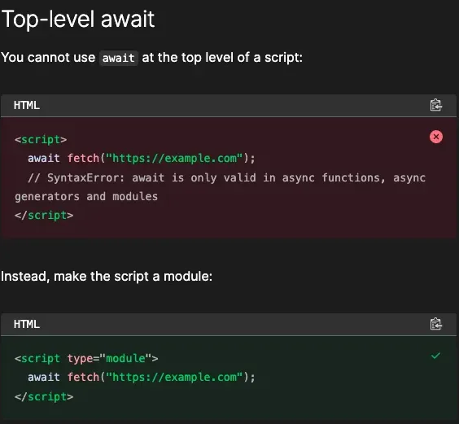
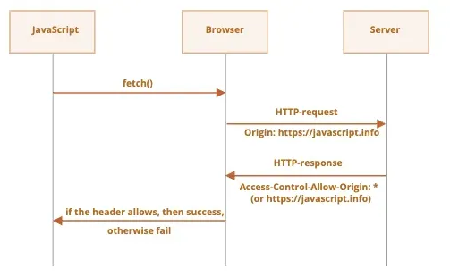

## `async` / `await`

Promise Chaining은 다 좋은데 `then()` 의 콜백함수 안에서만 데이터를 활용할 수 있다는 점이 불편하다.

또한, `then()` 도 지나치게 길어지면 콜백 지옥과 다를 바 없이 꽤나 고통스럽다.

```jsx
fetch('https://example.com/api')
  .then(response => response.json())
  .then(data => fetch(`https://example.com/api/${data.id}`))
  .then(response => response.json())
  .then(data => fetch(`https://example.com/api/${data.id}/details`))
  .then(response => response.json())
  .then(data => console.log(data))
  .catch(error => console.error(error));
```

이런 단점을 해결하기 위해 `async` , `await` 라는 새로운 문법이 등장했다. `Promise` 로직을 더 쉽고 간결해주는 특징이 있다.

위 promise hell을 `async`/`await` 로 해결해보자.

```jsx
async function getData() {
    const response = await fetch('https://example.com/api');
    const data = await response.json();
    const response2 = await fetch(`https://example.com/api/${data.id}`);
    const data2 = await response2.json();
    const response3 = await fetch(`https://example.com/api/${data.id}/details`);
    const data3 = await response3.json();
    console.log(data3);
}

getData();
```

위 코드보다 훨씬 가독성이 좋아진 모습을 볼 수 있다.

단, 주의할 점은 `async`/`await` 는 `Promise` 를 대체하기 위한 기능이 아니다.

내부적으로는 `Promise` 를 사용해서 비동기 처리를 하지만, 코드 작성 부분을 우리 개발자가 유지보수하기 편하게 보이는 문법을 다르게 해준 것 뿐이다.

- `async`/`await` 작성법
    
    `function` 앞에 `async` 를 붙이고, 비동기 처리되어야하는 부분에 `await` 만 붙이면 끝이다.
    
    Promise chaining으로 작성된 코드를 바꿔보도록 하자.
    
    - 바꾸기 전
        
        ```jsx
        fetch("https://jsonplaceholder.typicode.com/posts")
        	.then((response) => {
        		return response.json();
        	})
        	.then((data) => {
        		console.log(data)
        	})
        ```
        
    - 바꾸는 과정
        1. `.then` 을 날리고 `await` 를 앞에 붙인다.
            
            ```jsx
            await fetch("https://jsonplaceholder.typicode.com/posts")
            ```
            
        2. `.then` 의 콜백함수 파라미터에 들어가는 데이터를 변수로 받는다.
            
            ```jsx
            const response = await fetch("https://jsonplaceholder.typicode.com/posts")
            ```
            
        3. `.then` 을 날리고 이전의 `return`에 있는 코드 앞에 await를 붙인다.
        4. 다음 `.then` 의 콜백함수 파라미터에 들어가는 데이터를 변수로 받는다.
            
            ```jsx
            const data = await response.json();
            ```
            
    - 결과
        
        ```jsx
        **const response = await fetch("https://jsonplaceholder.typicode.com/posts");
        const data = await response.json();**
        ```
        
    
    예제 하나 더 살펴보도록 하자. `Promise` 객체 반환 함수 `delay` 가 있다. 이것을 활용해보자.
    
    ```jsx
    function delay(ms) {
      return new Promise(resolve => {
        setTimeout(() => {
          console.log(`${ms} 밀리초가 지났습니다.`);
          resolve()
        }, ms);
      });
    }
    ```
    
    - 기존 `Promise.then()` 방식
        
        ```jsx
        function main() {
          delay(1000)
              .then(() => {
                return delay(2000);
              })
              .then(() => {
                return Promise.resolve('끝');
              })
              .then(result => {
                console.log(result);
              });
        }
        
        main();
        ```
        
    - `async`/`await` 방식
        
        ```jsx
        async function main() {
          await delay(1000);
          await delay(2000);
          const result = await Promise.resolve('끝');
          console.log(result);
        }
        
        main();
        ```
        
        비동기적 접근방식을 동기적으로 작성할 수 있게 해주어 코드가 간결해지고 가독성이 높아졌다.
        

`async` 키워드를 어렵게 생각하지 말자.

그냥 `await` 를 사용하기 위한 선언문 정도로만 이해하자.

```jsx
// ✅ 함수 선언식
async function func1() {
    const res = await fetch(url); // 요청을 기다림
    const data = await res.json(); // 응답을 JSON으로 파싱
}
func1();

// ✅ 함수 표현식
const func2 = async () => {
    const res = await fetch(url); // 요청을 기다림
    const data = await res.json(); // 응답을 JSON으로 파싱
}
func2();
```

그리고 `async` 키워드를 붙인 `function` 에서는 값을 `return` 하면 `Promise` 객체가 반환된다.

일부러 값을 `return` 하지 않아도 자동으로 `return undefined` 로 처리되고 이를 Promise 객체로 감싸 반환된다.

```jsx
async function func1() {
  return 1;
}

const data = func1();
console.log(data); // 프로미스 객체가 반환
```

`async` 함수에서도 `Promise` 의 정적 메서드 사용 가능

```jsx
async function resolveP() {
  return Promise.resolve(2);
}

async function rejectP() {
  return Promise.reject(2);
}

console.log(resolveP())
console.log(rejectP())
```

`throw` 를 통해 `reject` 상태를 반환하는 것도 가능하다.

```jsx
async function errorFunc() {
    throw new Error("프로미스 reject 발생시킴");
}
console.log(errorFunc())
```

`await` 사용법도 알아보자.

```jsx
async function func() {
    const res = await fetch(url); // 요청을 기다림
    const data = await res.json(); // 응답을 JSON으로 파싱
    // data 처리
    console.log(data);
}
func();
```

`await` 는 `Promise` 처리가 끝날 때까지 기다린다.

즉, 비동기 처리가 완료될 때까지 코드 실행을 일시 중지하고 wait하는 것이다.

좀 더 자세히 알아보자면,

```jsx
async function getData() {
  const response = await fetch('https://jsonplaceholder.typicode.com/users/1');
  const data = await response.json();
  console.log(data):
}
```

1. `async` 함수에서 비동기 함수 `fetch()` 를 호출하고 `await` 키워드로 처리
2. `fetch()` 처리가 진행되는 동안 코드 실행을 일시 중지하고, 완료될 때까지 대기
3. `Promise` 가 처리되면 결과값을 반환하여 `response` 변수에 할당
4. `response.json()` 를 호출하여 반환된 `Promise` 를 다시 `await` 로 처리
5. 코드 실행 일시 중지
6. 데이터가 성공적으로 가져와지면 최종 결과값을 반환해 `data` 변수에 할당

이런 식으로 `await`는 `Promise`를 처리하고 결과를 반환하는데, 비동기적 작업을 동기적으로 처리할 수 있게 된다

## `async` / `await` 의 함정

비동기 프로그래밍은 병렬적으로 수행할 수 있도록 하는 웹 개발의 필수 부분이다.

하지만 남바랗면 성능 문제가 발생할 수 있다.

`await` 는 `Promise` 가 해결될 때까지 함수 실행을 일시 중지하는데, 병렬적으로 처리할 수 있는 작업을 억지로 동기적으로 처리하게 함으로써 로직을 처리하는 시간이 늘어나는 문제가 발생할 수 있다.

그에 따라, 최적화하는 방법을 알아둘 필요가 있다.

다음 코드에서, 일반적인 `Promise` 를 사용했을 때 `getApple` 과 `getBanana` 는 멀티로 작업이진행되어 두 개의 결과가 1초 내외로 가져와질 것이다.

```jsx
function getApple(){
  return new Promise( (resolve, reject) => {
    setTimeout(() => resolve("apple"), 1000);
  })
}

function getBanana(){
  return new Promise( (resolve, reject) => {
    setTimeout(() => resolve("banana"), 1000);
  })
}
```

이는 화살표 함수를 사용했을 때 동작은 동일하다.

다음 코드의 동작 순서는 `getApple`의 결과값이 나와야, `getBanana` 가 실행될 것이다.

하지만 두 함수는 전혀 연관이 없다. 어떤 데이터가 먼저 나오든 상관이 없단 뜻이다.

그런데 `async` / `await` 를 통해 총 2초 내외로 시간이 늘어난다.

위 방법의 로직이 10분 걸렸다면 아래 코드는 20분 걸릴 수도 있다는 뜻이 된다.

```jsx
async function getFruites(){
  let a = await getApple(); 
  let b = await getBanana(); 
  console.log(`${a} and ${b}`);
}

getFruites();
```

이렇게 동기적으로 실행되는 코드를 남발하면 실행 시간이 늘어나게 된다.

이걸 병렬 처리하고 싶다면 미리 함수를 동기/논블록킹으로 실행하고 그 결과 `Promise` 값을 `await` 를 통해 받는 것이 좋다.

```jsx
async function getFruites(){

  let getApplePromise = getApple(); // async함수를 미리 논블록킹으로 실행한다. 
  let getBananaPromise = getBanana(); // async함수를 미리 논블록킹으로 실행한다. 
  
  // 이렇게 하면 각각 백단에서 독립적으로 거의 동시에 실행되게 된다.
  console.log(getApplePromise)
  console.log(getBananaPromise)
  
  let a = await getApplePromise; // 위에서 받은 프로미스객체 결과 변수를 await을 통해 꺼낸다.
  let b = await getBananaPromise; // 위에서 받은 프로미스객체 결과 변수를 await을 통해 꺼낸다.
  
  console.log(`${a} and ${b}`); 
}
getFruites()
```

본래라면 1초+1초 를 기다려야 하는데, 위에서 1초기다리는 함수를 바로 연속으로 비동기로 불려왔기 때문에, 대충 1.01초만 기다리면 처리된다.

다른 방법도 있는데, 그건 `Promise.all()` 를 사용하는 방법이다.

배열 인자의 각 `Promise` 비동기 함수들이 전부 resolve되어야 결과값을 `return` 받기에, 각각 비동기 논블록킹 방식으로 실행되어 시간을 단축할 수 있다.

```jsx
async function getFruites(){
  console.time();
  
  // 구조 분해로 각 프로미스 리턴값들을 변수에 담는다.
  let [ a, b ] = await Promise.all([getApple(), getBanana()]); 
  console.log(`${a} and ${b}`);
  
  console.timeEnd();
}

getFruites();
```

## `Top-level await`

여지껏 `await` 키워드를 사용하기 위해 무조건 `async` 함수를 만들어 감싸주었다.

위 방식을 개발자들이 참 귀찮아했다.

그래서 추가된 것이 `Top-level await` 이다.

`async` 함수나 모듈 외부에서도 `await` 키워드를 사용할 수 있게 해주는 편리한 기능이다.

이 기능은 ES2022에 추가된 최신 기술로 최신 브라우저에서 지원된다.

```jsx
const res = await fetch(url); // 요청을 기다림
const data = await res.json(); // 응답을 JSON으로 파싱
console.log(data);
```

근데 막상 써보면 브라우저에 에러가 발생한다 ;;

```jsx
SyntaxError: await is only valid in async functions and the top level bodies of modules
```

`await` 를 쓸거면 `async` 함수 안에서 쓰던지, 아니면 modules 모듈의 최상위 바디에 적어라

라고 하는 것인데, 이 내용은 공식문서에도 나와있다.



즉, `await`를 사용하는 `script` 의 type을 module로 설정해주면 해결되는 문제

```jsx
<script defer type="module" src="./index.js"></script>
```

## Error Handling

- 에러 객체(Error Object)
    
    에러 데이터를 담는 특별한 객체다.
    
    `throw` 문과 함께 에러 객체가 실행되면 프로그램이 멈춘다.
    
    - 기본 에러 객체 사용하기
        
        ```jsx
        const error = new Error('뭔가 잘못됐어요!');
        console.log(error.message); // "뭔가 잘못됐어요!"
        console.log(error.name);    // "Error"
        ```
        
    - 다양한 종류의 에러
        
        ```jsx
        const typeError = new TypeError('숫자가 아닙니다!');
        const rangeError = new RangeError('범위를 벗어났어요!');
        const syntaxError = new SyntaxError('문법이 잘못됐어요!');
        ```
        
    - 커스텀 에러 만들고 사용해보기
        
        ```jsx
        class 장보기에러 extends Error {
            constructor(message) {
                super(message);
                this.name = '장보기에러';
                this.date = new Date();
            }
        }
        
        const 에러 = new 장보기에러('계란을 깼어요!');
        console.log(에러.name);    // "장보기에러"
        console.log(에러.message); // "계란을 깼어요!"
        console.log(에러.date);    // 현재 날짜와 시간
        ```
        
- `try…catch` 문
    
    하지만 위처럼 에러가 났을 때 프로그램이 죽는 것은 말도 안된다.
    
    오류가 터져도 프로그램이 죽는 것을 방지하려면 `try…catch` 문을 사용한다.
    
    스크립트 죽는 것을 방지하고, 에러를 잡아서 무언가 할 수 있게 해주는 문법이다.
    
    `try…catch` 기본 문법은 아래와 같다.
    
    ```jsx
    try {
    	// 1. 먼저 여기의 코드가 실행됨
      // 코드...
      // 2. try문에서 에러가 있다면 try 안 코드 실행 중단하고 catch로 넘어감
      // 3. 에러가 없다면 try안의 마지막 줄까지 실행되고 catch는 건너뜀
    
    } catch (err) {
    
    	// 4. 에러가 나서 여기로 넘어왔다면 catch문 코드 실행되어 에러 핸들링
      // 에러 핸들링 코드...
    
    }
    ```
    
    `try…catch` 는 동기적으로 동작한다.
    
    ```jsx
    try {
      setTimeout(function() {
        noSuchVariable; // 스크립트는 여기서 죽습니다.
      }, 1000);
    } catch (e) {
      alert( "작동 멈춤" );
    }
    ```
    
    위 코드에서 `setTimeout`에 넘겨진 익명 함수 `function() {noSuchVariable;}` 는 엔진이 `try…catch` 를 떠난 다음에야 실행되기에 이 함수에서 발생한 에러는 여기서 잡을 수 없다.
    
    이 함수의 에러를 잡고 싶다면 `try…catch` 를 함수 내부에 구현해야 한다.
    
    ```jsx
    setTimeout(function() {
      try {
        noSuchVariable; // 이제 try..catch에서 에러를 핸들링 할 수 있습니다!
      } catch {
        alert( "에러를 잡았습니다!" );
      }
    }, 1000);
    ```
    
    `catch` 문에서 에러 객체도 받을 수 있다.
    
    에러가 발생하면 JS는 에러 상세 내용이 담긴 객체를 생성하고 이 객체를 `catch` 블록의 인수로 전달하게 된다.
    
    ```jsx
    try {
      // ...
    } catch(err) { // <-- '에러 객체', err 대신 다른 이름으로도 쓸 수 있음
      // ...
    }
    ```
    
    내장 에러 객체는 다음과 같은 주요 프로퍼티를 가진다.
    
    - name: 에러 이름
    - message: 에러 상세 내용을 담고 있는 메시지
    - stack: (비표준 프로퍼티) 현재 호출 스택. 에러를 유발한 중첩 호출들의 순서 정보를 가진 문자열로 디버깅 목적으로 사용
    
    위 프로퍼티는 `console.log`로 직접 보는 것이 도움된다.
    
    예시로 한 번 에러를 핸들링해보자.
    
    만약 `fetch` 내의 주소를 바꿔 에러가 발생할 때, 사용자는 문제가 발생했다는 것을 바로 알 수 있게 된다.
    
    ```jsx
    <!DOCTYPE html>
    <html lang="en">
    
    <head>
    	<meta charset="UTF-8">
    	<meta name="viewport" content="width=device-width, initial-scale=1.0">
    	<title>Document</title>
    	<link rel="stylesheet" href="index.css">
    </head>
    
    <body>
    	<div class="todo-list">
    	</div>
    
    	<script src="script.js"></script>
    </body>
    
    </html>
    ```
    
    ```jsx
    // script.js
    const getTodoList = async () => {
      try {
        const response = await fetch(
    	    // 아래 주소를 일부러 틀리게 변경해보세요.
          "https://jsonplaceholder.typicode.com/todos/1"
        );
        const json = await response.json();
        const todoList = document.querySelector(".todo-list");
    
        todoList.innerHTML = `
        <div class="todo-item">
          <h2>내용: ${json.title}</h2>
          <p>완료 여부: ${json.completed ? "완료" : "미완료"}</p>
        </div>
        `;
      } catch (error) {
    	  // 에러가 나면 여기 코드가 실행됩니다. 에러를 잡고 무언가 할 수 있죠
        const body = document.querySelector("body");
        body.innerHTML = `
        <h4>에러가 발생했어요! 잠시 후에 다시 도전해보세요!</h4>
        `;
      }
    };
    
    getTodoList();
    
    ```
    
    `async`/`await` 비동기 처리에 대한 에러 처리를 위한 `try…catch`문 사용법
    
    ```jsx
    async function func() {
        try {
            const res = await fetch(url); // 요청을 기다림
            const data = await res.json(); // 응답을 JSON으로 파싱
            // data 처리
            console.log(data);
        } catch (err) {
            // 에러 처리
            console.error(err);
        }
    }
    func();
    ```
    
    실무에서 사용되는 방식으로 한 번 살펴보자.
    
    - 예제 1
        
        데이터는 API로부터 데이터를 가져오고 JSON으로 변환해서 사용된다.
        
        이 때 JSON 형식이 잘못되었다면 `JSON.parse()` 는 에러를 만들면서 스크립트가 죽을 것이다.
        
        이를 해결하는 `try…catch` 문을 살펴보자
        
        ```jsx
        let json = '{"name":"John", "age": 30}'; // 서버로부터 전달받은 데이터
        
        let user = JSON.parse(json); // 전달받은 문자열을 자바스크립트 객체로 변환
        
        // 문자열 형태로 전달받은 user가 프로퍼티를 가진 객체가 됨
        alert( user.name ); // John
        alert( user.age );  // 30
        
        // ✅ 이럴때 try...catch를 사용해 에러의 원인을 파악하며 그냥 죽게 냅두지 않음
        let json = "{ bad json }";
        
        try {
        
          let user = JSON.parse(json); // <-- 여기서 에러가 발생하므로
          console.log( user.name ); // 이 코드는 동작하지 않음
        
        } catch (e) {
          // 에러가 발생하면 제어 흐름이 catch 문으로 넘어옴.
          console.log( "데이터에 에러가 있어 재요청을 시도합니다." );
          // 이제 실무라면 여기서 데이터 재요청하는 코드가 들어갈 것
          // 또, 여기에 새로운 API 요청보내기, 유저에게 대안 제안하기, 등 구체적인 일을 할 수 있음
          console.log( e.name );
          console.log( e.message );
        }
        ```
        
- `finallay` 블록
    
    `finally` 는 에러가 발생하든 말든 무조건 실행되는 부분이다. 뒷정리 느낌
    
    예를 들어, 시작 전 로딩 중을 표시하고 성공하든 실패하든 로딩 중 표시를 없앨 때 필요할 듯 하다.
    
    ```jsx
    const getTodoList = async () => {
      const todoList = document.querySelector(".todo-list");
      todoList.innerHTML = '<div class="loading">로딩 중...</div>';
      try {
        const response = await fetch(
          "https://jsonplaceholder.typicode.com/todos/1"
        );
        const json = await response.json();
    
        todoList.innerHTML = `
        <div class="todo-item">
          <h2>내용: ${json.title}</h2>
          <p>완료 여부: ${json.completed ? "완료" : "미완료"}</p>
        </div>
        `;
      } catch (error) {
        const body = document.querySelector("body");
        body.innerHTML = `
        <h4>에러가 발생했어요! 잠시 후에 다시 도전해보세요!</h4>
        `;
      } finally {
        // 로딩 표시 제거 또는 다른 정리 작업 수행
        const loadingElement = document.querySelector(".loading");
        if (loadingElement) {
          loadingElement.remove();
        }
        console.log("데이터 요청 완료!");
      }
    };
    
    getTodoList();
    ```
    
    즉, `finally` 블럭은 다음과 같은 상황에서 실행된다.
    
    - 에러가 없으면 `try` 실행이 끝난 후
    - 에러가 있으면 `catch` 실행이 끝난 후
    
    `try` 에서 값을 반환해도 `finally` 는 실행된다.
    
    ```jsx
    try {
       ... 코드를 실행 ...
    } catch(e) {
       ... 에러 핸들링 ...
    } finally {
       ... 항상 실행 ...
    }
    ```
    

## CORS

- CORS란?
    
    Cross-Origin Resource Sharing의 준말로, 웹 브라우저에서 보안상의 이유로 서로 다른 출처 간의 요청을 제한하는 정책이다.
    
    이 정책은 웹 보안을 강화하기 위해 Same-Origin Policy(SOP, 동일 출처 정책)에 의해 만들어졌다.
    
    여기서 또 SOP란 브라우저에서 기본적으로 다른 출처의 리소스 요청을 차단하는 것이다.
    
    출처(Origin)은 프로토콜 + 도메인 + 포트조합으로 결정된다.
    
    - 같은 출처 vs 다른 출처 예제
        
        
        | **요청 출처** | **서버 출처** | **동일 출처 여부** |
        | --- | --- | --- |
        | http://example.com | http://example.com | ✅ 동일 출처 |
        | http://example.com:3000 | http://example.com | ❌ 다른 출처 (포트 다름) |
        | https://example.com | http://example.com | ❌ 다른 출처 (프로토콜 다름) |
        | http://example.com | http://another.com | ❌ 다른 출처 (도메인 다름) |
- CORS는 그럼 언제 나옴?
    
    웹 프론트엔드 개발자가 API를 호출할 때, 백엔드 서버가 다른 출처에 있다면 CORS 정책에 의해 차단될 수 있다.
    
    즉, `fetch` 요청을 보내게 될 사이트가 현재 접속 사이트와 다르다면 실패한다는 것이다.
    
    ```jsx
    try {
      await fetch('http://example.com');
    } catch(err) {
      alert(err); // TypeError: Failed to fetch
    }
    ```
    
- 그래서 CORS는 왜 존재하는거임?
    
    CORS는 악의를 가진 해커로부터 인터넷을 보호하기 위해 만들어졌다.
    
    자꾸 이상한 코드를 몰래 심으려고 하기 때문이다.
    
    그걸 막기 위해 SOP 정책이 존재하는 것이다.
    
    그렇게 자바스크립트에서 처음 네트워크 요청 메서드가 등장했을 때엔 크로스 오리진 요청이 불가능했다.
    
    하지만 결국 크로스 오리진 요청을 허용하기로 결정한다.
    
    대신 크로스 오리진 요청은 서버에서 명시적으로 크로스 오리진 요청을 ‘허가’ 했다는 것을 아렬주는 특별한 헤더를 전송받았을 때만 가능하도록 제약을 걸게 된다.
    
- Cross-Origin 요청은 크게 두 종류로 구분
    - 안전한 요청: 아래 두 가지를 모두 충족
        - 안전한 메서드 (GET, POST, HEAD)를 사용한 요청
        - 안전한 헤더 (아래 목록)일 경우
            - `Accept`
            - `Accept-Language`
            - `Content-Language`
            - 값이 `application/x-www-form-urlencoded` 이나 
            `multipart/form-data`, `text/plain`인 `Content-Type`
    - 그 외의 요청: 위 조건을 충족하지 않는 요청
        - `PUT` 메서드를 사용하거나 헤더에 `API-Key` 가 명시된 요청의 경우

이렇게 JS를 사용해 안전하지 않은 요청을 보낼 수 있게 되자, 브라우저는 안전하지 않은 요청을 서버에 전송하기 전에 ‘preflight’ 요청을 먼저 전송해 ‘서버가 크로스 오리진 요청을 받을 준비가되었는지를 확인’한다.

즉 `PUT`, `DELETE` 같은 안전하지 않은 요청은 API 요청을 보내도 되는지부터 확인받는 preflight를 진행하는 것이다.

이 때, 서버에서 크로스 오리진 요청은 허용하지 않는다는 정보를 담은 헤더를 브라우저에서 응답하면 안전하지 않은 요청으로 서버에 전송되지 않는다.

크로스 오리진 요청을 보낼 경우 브라우저는 항상 `Origin` 이라는 헤더를 요청에 추가한다.

서버는 요청 헤더에 있는 `Origin` 을 검사하고, 요청을 받아들이기로 동의한 상태라면 특별한 헤더 `Access-Control-Allow-Origin` 를 응답에 추가한다.

이 때, 응답 헤더 `Access-Control-Allow-Origin`에 `오리진 정보`나 `*`이 들어있으면 응답은 성공하고 그렇지 않으면 응답이 실패하게 된다.



서버에서 크로스 오리진 요청을 허용한 경우, preflight 요청에 대한 응답은 아래와 같이 올 것이다.

```jsx
200 OK
Content-Type:text/html; charset=UTF-8
Access-Control-Allow-Origin: https://javascript.info
```

- 실무에서 CORS를 만나는 경우
    1. **프론트엔드(React, Vue, Angular)에서 API 호출 시**
        
        프론트엔드에서 백엔드 API 서버에 데이터를 요청할 때, 두 서버의 출처가 다르면 CORS 오류가 발생
        
    2. **CDN에서 리소스를 가져올 때**
        
        웹사이트에서 외부의 CDN에서 폰트, 이미지, 스크립트를 로드할 때 CORS 제한이 걸릴 수 있음
        
    3. **S3, CloudFront 등 클라우드 스토리지 사용 시**
        
        Amazon S3 같은 클라우드 서비스에서 정적 리소스를 요청할 때도 CORS 설정이 필요
        
    4. **OAuth 로그인, API Gateway 사용 시**
        
        Google, Facebook 로그인 또는 API Gateway를 거친 API 호출에서 CORS 이슈를 자주 마주함.
        
- CORS 해결법
    1. 서버에서 CORS 허용 헤더 추가하기
        
        백엔드에서 CORS를 허용하도록 설정하는 것이 가장 일반적인 방법
        
        - 예제: Node.js (Express)에서 CORS 설정
            
            ```jsx
            const express = require("express");
            const cors = require("cors");
            const app = express();
            
            app.use(cors()); // 모든 출처 허용
            
            app.get("/data", (req, res) => {
              res.json({ message: "CORS 해결됨!" });
            });
            
            app.listen(5000, () => console.log("서버 실행 중!"));
            ```
            
        - `cors()` 를 사용하면 모든 출처에서 요청을 허용할 수 있다. 하지만 보안상 특정 출처만 허용하는 것이 더 안전하다.
            
            ```jsx
            app.use(cors({ origin: "http://localhost:3000" })); // 특정 출처만 허용
            ```
            
    2. 프록시 서버 사용하기
        
        프론트엔드 개발 중이라 백엔드 설정을 바꿀 수 없다면, 프록시 서버를 사용해 CORS를 우회할 수 있다.
        
        - React 개발 서버에서 프록시 설정하기
            1. package.json에 프록시 추가
                
                ```jsx
                "proxy": "https://api.example.com"
                ```
                
            2. API 호출 변경
                
                ```jsx
                fetch("/data")
                  .then(response => response.json())
                  .then(data => console.log(data));
                ```
                

## Web Storage로 브라우저에 데이터 저장하기

- `localStorage` (영구적)
    
    해당 스토리지는 브라우저를 껐다 켜도 데이터가 남아있다.
    
    - 유효기간 없음
    - JS를 사용해야 데이터를 지울 수 있음
    - 저장 공간이 가장 큼
    - 사용법
        
        ```jsx
        // 키에 데이터 쓰기
        localStorage.setItem("key", value);
        
        // 키로 부터 데이터 읽기
        localStorage.getItem("key");
        
        // 키의 데이터 삭제
        localStorage.removeItem("key");
        
        // 모든 키의 데이터 삭제
        localStorage.clear();
        
        // 저장된 키/값 쌍의 개수
        localStorage.length
        ```
        
    - 사용 예시
        1. 저장하기
            
            ```jsx
            localStorage.setItem('username', '김철수');
            localStorage.setItem('preferences', JSON.stringify({
                theme: 'dark',
                fontSize: 16
            }));
            ```
            
        2. 가져오기
            
            ```jsx
            const username = localStorage.getItem('username');
            const preferences = JSON.parse(localStorage.getItem('preferences'));
            
            console.log(username);
            console.log(preferences);
            ```
            
        3. 삭제하기
            
            ```jsx
            localStorage.removeItem('username');  // 특정 항목 삭제
            localStorage.clear();   
            ```
            
- `sessionStorage`
    
    해당 스토리지는 페이지 세션이 유지되는 동안만 제공된다.
    
    - 브라우저 혹은 탭이 닫히면 데이터 사라짐
    - 데이터를 절대 서버로 전송하지 않음
    - 저장 공간이 쿠키보다 큼
    - 사용법
        1. 저장하기
            
            ```jsx
            sessionStorage.setItem("username", "김철수");
            sessionStorage.setItem("isLoggedIn", "true");
            sessionStorage.setItem(
              "userPrefs",
              JSON.stringify({
                theme: "dark",
                language: "ko",
              })
            );
            ```
            
        2. 가져오기
            
            ```jsx
            const username = sessionStorage.getItem("username");
            const isLoggedIn = sessionStorage.getItem("isLoggedIn");
            const userPrefs = JSON.parse(sessionStorage.getItem("userPrefs"));
            
            console.log(username);
            console.log(isLoggedIn);
            console.log(userPrefs);
            ```
            
        3. 특정 데이터 삭제하기
            
            ```jsx
            sessionStorage.removeItem("username");
            ```
            
        4. 모든 데이터 삭제하기
            
            ```jsx
            sessionStorage.clear();
            ```
            
- 웹 스토리지를 사용할 때 주의해야 하는 부분
    
    오직 문자형 데이터 타입만 지원한다는 것이다.
    
    예를 들어, 아래 코드처럼 숫자형 데이터를 로컬 스토리지에 쓰고, 다시 읽어보면 본래 숫자가 아닌 문자가 나오는 것을 볼 수 있다.
    
    ```jsx
    localStorage.setItem("num", 1);
    
    const numResult = localStorage.getItem("num");
    
    console.log(numResult); // '1'
    console.log(typeof numResult); // string -> 분명 숫자를 넣었지만 문자열로 나옴
    ```
    
    그래서 객체를 저장할 때 주의해야 한다. 그냥 저장하면 객체를 원하는 형태로 저장할 수 없다.
    
    가장 많이 사용하는 방법은 `JSON.stringfy()` / `JSON.parse()` 를 사용해 JSON 형태로 데이터를 읽고 쓰는 것이다.
    
    ```jsx
    localStorage.setItem("obj", { a: 1, b: 2 });
    
    const obj = localStorage.getItem("obj");
    
    console.log(obj);
    console.log(typeof obj);
    
    localStorage.setItem("json", JSON.stringify({ a: 1, b: 2 }));
    
    const justGetItem = localStorage.getItem("json");
    console.log(justGetItem);
    console.log(typeof justGetItem);
    
    const json = JSON.parse(localStorage.getItem("json"));
    
    console.log(json);
    console.log(typeof json);
    ```