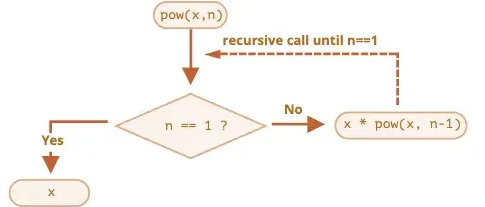
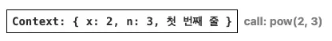
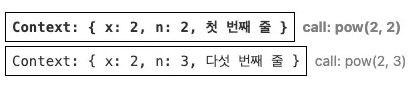
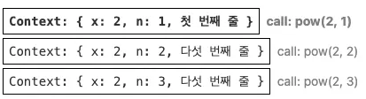
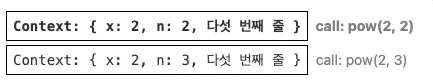
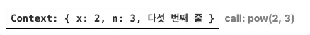

## 재귀(recursion) 함수

재귀는 큰 목표 작업 하나를 동일하면서 간단한 작업 여러 개로 나눌 수 있을 때 유용한 프로그래밍 패턴이다.

목표 작업을 간단한 동작 하나와 목표 작업을 변형한 작업으로 단순화시킬 수 있을 때도 재귀를 사용할 수 있고, 특정 자료구조를 다뤄야 할 때에도 재귀가 사용된다.

문제를 해결하다 보면 함수에서 다른 함수를 호출해야 할 때가 있다.

이 때 함수가 자기 자신을 호출할 수도 있는데, 이를 재귀라고 한다.

간단한 예시로 재귀에 대해 알아보자.

`x` 를 `n` 제곱해주는 함수 `pow(x, n)` 를 만들어보겠다.

- 구현 방법 1: 반복적인 사고
    
    ```jsx
    function pow(x, n) {
      let result = 1;
    
      // 반복문을 돌면서 x를 n번 곱함
      for (let i = 0; i < n; i++) {
        result *= x;
      }
    
      return result;
    }
    
    alert( pow(2, 3) ); // 8
    ```
    
- 구현 방법 2: 재귀적인 사고
    
    ```jsx
    function pow(x, n) {
      if (n == 1) {
        return x;
      } else {
        return x * pow(x, n - 1);
      }
    }
    
    alert( pow(2, 3) ); // 8
    ```
    

여기서 구현 방법 2, 재귀적인 사고로 문제를 해결했을 때를 좀 분석해보자면

- `n == 1` 일 때: 모든 절차가 간단해진다. 겨로가값을 즉시 도출한다. 이를 재귀의 베이스라고 한다.
- `n == 1` 이 아닐 때: `pow(x, n)` 은 `x * pow(x, n - 1)` 으로 표현할 수 있다. 즉 재귀 단계는 `n == 1` 이 될 때까지 재귀적으로 자신을 호출하는 것이다.

재귀를 사용해 문제를 해결하면 아래와 같은 순서로 이루어질 것이다.



예) `pow(2, 4)` 를 계산하려면 아래와 같은 재귀 단계가 차례대로 이행됨

1. `pow(2, 4) = 2 * pow(2, 3)`
2. `pow(2, 3) = 2 * pow(2, 2)`
3. `pow(2, 2) = 2 * pow(2, 1)`
4. `pow(2, 1) = 2`

실행 컨텍스트 스택에 쌓이는 순서와 소멸하는 순서를 생각하면 그리 어려운 개념은 아니다.

1. `pow (2, 3)`를 호출하는 순간, 실행 컨텍스트엔 변수 `x = 2, n = 3`이 저장되고, 
실행 흐름은 함수의 첫 번째 줄에 위치합니다.
    
    
    
2. 이어서 `pow (2, 2)` 가 호출되면서 실행 컨텍스트 스택에 또다시 pow 함수 실행 컨텍스트가 쌓입니다.
    
    
    
3. 이어서 `pow (2, 1)` 가 호출되면서 실행 컨텍스트 스택에 또다시 pow 함수 실행 컨텍스트가 쌓입니다.
    
    
    
4. 이후 `pow (2, 1)` 이 실행되면서 n == 1 조건을 만족시키면서 더이상 중첩  호출이 없습니다.
즉, `pow (2, 1)` 함수는 종료되어 `2` 를 반환하고, 소멸 합니다.
    
    
    
5. `pow (2, 2)` 의 실행이 다시 시작됩니다. 서브 호출 `pow (2, 1)` 의 결과를 알고 있으므로, 
쉽게 `2 * 2(pow(2, 2) 의 결과값)` 를 계산해 `4` 를 반환하고, 소멸 합니다.
    
    
    
6. 마지막 컨텍스트가 실행되면서 `8` 이라는 결과를 반환하고 소멸합니다.

위 예시의 재귀 깊이는 3이다.

재귀 깊이는 스택에 들어가는 실행 컨텍스트 수의 최댓값과 같다.

실행 컨텍스트는 메모리를 차지하므로 재귀를 사용할 땐 메모리 요구사항에 유의해야 한다.

`n` 을 늘리면 `n` 이 줄어들 때마다 만들어지는 `n` 개의 실행 컨텍스트가 저장될 메모리 공간이 필요하기 때문이다.

물론 메모리 절약을 위해서는 반복문 기반 코드가 더 좋긴 하다.

하지만 재귀를 사용하는 이유는 코드가 짧아지며 가독성이 좋아지고, 유지 보수에 이점이 있기 때문이다.

즉, 이제는 메모리 걱정을 크게 안해도 되는 시대이기에 결국 필요한 것은 가독성 좋고 유지보수하기 좋은 코드라는 것이다.

## 재귀적 순회 (recursive traversal)

예시 코드를 먼저 보자. 아래는 한 회사의 임직원을 나타낸 객체다.

```jsx
// 회사에 2개의 부서가 있음 sales/development
// development 부서는 하위 부서로 sites/internals 라는 부서를 갖고 있음
let company = {
  sales: [{
    name: 'John',
    salary: 1000
  }, {
    name: 'Alice',
    salary: 1600
  }],
  development: {
    sites: [{
      name: 'Peter',
      salary: 2000
    }, {
      name: 'Alex',
      salary: 1800
    }],

    internals: [{
      name: 'Jack',
      salary: 1300
    }]
  }
};
```

여기서 모든 임직원의 급여를 더한 값을 구해야 한다고 해보자.

구조가 `sales`는 배열이고, `development` 는 객체 안에 배열이기에 그냥 반복문을 돌리기에는 어렵다.

중첩 반복문을 돌릴 바에야 재귀를 이용해보자.

위 객체에서는 두 가지 경우로 나눠 생각할 수 있다.

1. 임직원 배열을 가진 ‘단순한’ 부서 - 간단한 반복문으로 급여 합계를 구할 수 있다.
2. `N` 개의 하위 부서가 있는 객체 - 각 하위 부서에 속한 입직원의 급여 합계를 얻기 위해 `N` 번의 재귀 호출을 하고, 최종적으로 모든 하위부서 임직원으 급여를 더함.

배열을 사용하는 첫 번째 경우는 아주 간단한 경우이기에 이를 재귀의 베이스로 사용하자.

그리고 객체를 사용하는 두 번째 경우가 재귀 단계가 될 수 있을 것이다.

```jsx
let company = { // 동일한 객체(간결성을 위해 줄바꿈을 없애서 약간 압축함)
  sales: [{name: 'John', salary: 1000}, {name: 'Alice', salary: 1600 }],
  development: {
    sites: [{name: 'Peter', salary: 2000}, {name: 'Alex', salary: 1800 }],
    internals: [{name: 'Jack', salary: 1300}]
  }
};

// 급여 합계를 구해주는 함수
function sumSalaries(department) {
  if (Array.isArray(department)) { // 첫 번째 경우
    return department.reduce((prev, current) => prev + current.salary, 0); // 배열의 요소를 합함
  } else { // 두 번째 경우
    let sum = 0;
    for (let subdep of Object.values(department)) {
	    console.log("subdep : ",subdep);
      sum += sumSalaries(subdep); // 재귀 호출로 각 하위 부서 임직원의 급여 총합을 구함
    }
    return sum;
  }
}

alert(sumSalaries(company)); // 7700
```

1. `sumSalaries(company)` 가 실행되면서 콜스택에 쌓임.
2. `company` 는 객체이기에 두 번째 경우인 else 부분 코드가 실행
3. `Object.values(department)` 는 객체 프로퍼티의 값이 담긴 배열을 반환
4. `for…of` 문을 통해 첫 번째 배열 요소인 sales 의 값으로 들어간 배열이 `subdep` 에 담김
5. `sum += sumSalaries(subdep);` 코드를 만나며 `sumSalaries(subdep)` 이 호출되며 콜스택 담김
6. 넘어간 `subdep` 은 배열 `[{name: 'John', salary: 1000}, {name: 'Alice', salary: 1600 }]` 
따라서 첫 번째 경우에 해당하므로 `reduce` 가 계산되어 반환되고, 해당 실행 컨텍스트는 사라짐.
7. 이어서 `development` 의 값으로 들어간 객체가 `subdep` 에 담김
8. 또다시 `sumSalaries(subdep);` 가 호출되며 콜스택에 담기고 실행
9. `subdep` 가 객체이므로 다시 두 번째 경우 부분 코드가 실행
10. `Object.values(department)` 를 통해 `sites`, `internals` 의 값이 배열로 담겨 반환
11. 첫 번째 `subdep` 으로 `sites` 의 값인 배열이 들어가게 되며 `sumSalaries(subdep)` 이 호출
12. 넘어간 `subdep` 은 배열이므로 첫 번째 경우로 계산되어 반환되고 해당 실행 컨텍스트는 사라짐
13. 두 번째 `subdep` 으로 `internals` 의 값인 배열이 들어가게 되며 `sumSalaries(subdep)` 이 호출
14. 넘어간 `subdep` 은 배열이므로 첫 번째 경우로 계산되어 반환되고 해당 실행 컨텍스트는 사라짐
15. 더이상 계산할 코드가 없으므로 `sum` 을 반환하고 함수가 종료

## SPA(Single Page Application)

단일 페이지 애플리케이션은 모던 웹의 패러다임이다.

link tag를 사용하는 전통적인 화면 전환 방식은 새로운 페이지 요청마다 정적 리소스가 다운되고 전체 페이지를 다시 렌더링하는 방식을 사용하므로 새로고침이 빈번하게 발생되어 사용성이 좋지 않다.

또, 변경이 필요없는 부분까지 포함하여 전체 페이지를 갱신하므로 비효율적이다.

반면, SPA는 기본적으로 웹 애플리케이션에 필요한 모든 정적 리소스를 최초 접근 시 단 한 번만 다운한다.

이후 새로운 페이지 요청 시, 페이지 갱신에 필요한 데이터만을 JSON으로 전달받아 페이지를 갱신하므로 전체적인 트래픽을 감소시킬 수 있고, 전체 페이지를 다시 렌더링하지 않고 변경되는 부분만을 갱신하므로 새로고침이 발생하지 않아 네이티브 앱과 유사한 사용자 경험을 제공할 수 있게 된다.

SPA의 핵심 가치는 사용자 경험(UX) 향상에 있으며 부가적으로 애플리케이션 속도의 향상도 기대할 수 있어 모바일 퍼스트(Mobile First) 전략에 부합하다.

하지만 SPA 또한 당연히 구조적인 단점을 가지고 있다.

- 초기 구동 속도가 상대적으로 느리다.
    
    SPA는 웹 애플리케이션에 필요한 모든 정적 리소스를 최초 접근 시 단 한 번 다운하기에 초기 구동 속도가 상대적으로 느리게 보인다. 
    
    하지만 SPA는 웹페이지보다는 애플리케이션에 적합한 기술이므로 트래픽 감소와 속도, 사용성, 반응성의 향상 등의 장점을 생각한다면 결정적인 단점이라고 할 수 없다.
    
- SEO 이슈
    
    SPA는 일반적으로 자바스크립트 기반 비동기 모델의 클라이언트 사이드 렌더링 방식으로 동작한다.
    
    클라이언트 사이드 렌더링(CSR)은 일반적으로 데이터 패치 요청을 통해 서버로부터 데이터를 응답 받아 화면을 동적으로 생성하는데 이 때 브라우저의 주소창의 URL이 변경되지 않는다.
    
    이는 사용자 방문 history를 관리할 수 없음을 의미하며 SEO 이슈의 발생 원인이기도 하다.
    
    그래도 Angular나 React 등의 SPA 프레임워크는 서버 사이드 렌더링(SSR)을 지원하는 기능이 이미 존재하고 있고 크롬 등의 모던 브라우저는 SPA의 SEO 문제를 해결하고 있는 것으로 알려져 있다.