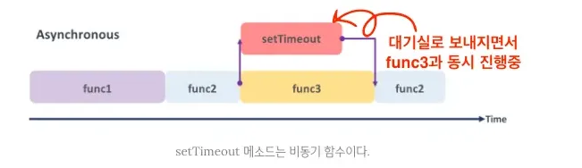

## 동기와 비동기

 <br />
출처 : https://poiemaweb.com/js-async

- 동기식 처리 모델: 직렬적으로 태스크를 수행함. 즉, 순차적 실행되어 어떤 작업을 수행 중이면 다음 작업은 대기
    
    아래 이미지처럼 서버에서 데이터를 가져오고, 그 데이터를 이용해 화면에 보여주는 작업을 서버에 데이터를 요청하고 데이터가 응답될 때까지 이후 테스트들은 작업이 중단된다.
    
    순서대로 실행되어야하기 때문이다.
    
    
    
    - 동기식 처리 예시 코드 : 콘솔에 순차적으로 출력
        
        ```jsx
        function func1() {
          console.log('func1');
          func2();
        }
        
        function func2() {
          console.log('func2');
          func3();
        }
        
        function func3() {
          console.log('func3');
        }
        
        func1();
        ```
        
    
    자바스크립트는 싱글 스레드 언어로 한 번에 하나의 작업만 수행할 수 있다. << 이전 작업이 완료되어야 다음 수행을 수행할 수 있다는 것
    
    그 말은 자바스크립트는 기본적으로 동기식 처리 모델이라는 것이다.
    
    순차적으로 진행하는 것은 직관적이라 개발자가 코드를 파악하기 쉽다.
    
    하지만 단점은, 하나의 작업이 너무 오래 걸린다면 다음 작업은 실행조차 하지 못한다는 것이다.
    
    그렇기에 도입한 것이 여러 작업을 동시에 처리하는 `비동기` 라는 개념이다.
    
- 비동기식 처리 모델: 병렬적으로 태스크를 수행. 즉, 태스크가 종료되지 않아도 대기하지 않고 다음 작업을 실행
    
    아래 이미지처럼 서버에 데이터를 요청한 이후 서버로부터 데이터가 응답될 때까지 기다리지 않고, 즉시 다음 태스크를 수행하여 작업을 이어간다.
    
    이후 서버로붜 데이터 가 응답되면 이벤트가 발생하고, 이벤트 핸들러가 데이터를 가지고 해야할 일을 한다.
    
    
    
    - 비동기 예시 코드
        
        ```jsx
        function func1() {
          console.log('func1');
          func2();
        }
        
        function func2() {
          setTimeout(function() {
            console.log('func2');
          }, 0);
        
          func3();
        }
        
        function func3() {
          console.log('func3');
        }
        
        func1();
        ```
        
    
    위 예제에서 우리는 `setTimeout` 이 0초로 설정되어도 `“즉시”` 실행되지 않는다는 것을 배웠다.
    
    `setTimeout` 은 실행되면 대기실로 보내버리기 때문이다. 그 이유는 바로 `setTimeout` 이 비동기 함수이기 때문이었다.
    
    
    
    또, 대표적으로 비동기 처리를 가능하게 하는 기술이 AJAX이다.
    
    AJAX를 사용하기 위해 서버 요청이 필요하다면 `fetch()` 를 사용하는 것이었다.
    
    아래 코드의 `fetch()` 요청을 기다리는 동안에도 사용자는 인터렉션을 유지할 수 있게 된다.
    
    ```jsx
    // fetch 함수에 URL 전달
    fetch("https://jsonplaceholder.typicode.com/todos/1")
      .then(function(response) {
        return response.json(); // 응답을 JSON 형식으로 변환
      })
      .then(function(data) {
        console.log(data); // JSON 데이터를 출력
      })
      .catch(function(error) {
        console.error(error); // 에러를 출력
      });
    ```
    

## 이벤트 루프를 이해한다면 비동기를 완벽히 이해할 수 있다.

그럼 여기서 의문이 생긴다.

자바스크립트는 싱글 스레드 언어이기에 동기식 처리가 가능하다고 했는데, 어떻게 비동기라는 개념이 자바스크립트에서 가능할까?

바로 이벤트 루프(Event Loop)라는 녀석 때문이다.


이 사진에 대해 좀 더 자세히 알아보자.

아래와 같은 코드가 있다고 생각해보자.

```jsx
function func1() {
  console.log('func1');
  func2();
}

function func2() {
  setTimeout(function () {
    console.log('func2');
  }, 0);

  func3();
}

function func3() {
  console.log('func3');
}

func1();
```

위 코드가 어떻게 동작하는지 순서대로 살펴보도록 하자.

1. 함수 func1이 호출되면서 func1 함수는 call stack에 쌓이게 된다.
2. 함수 func1이 실행되면서 콘솔은 찍히고 이어서 func2를 호출하고 있으므로 func2 함수가 call stack에 쌓인다.
3. func2 함수가 실행되면서 setTmeout이 호출되어 call stack에 쌓인다.
4. call stack은 WebAPI인 setTimeout을 실행하지 않고 바로 WebAPI 대기실로 보낸다.
5. 이어서 call stack에는 func3 함수가 쌓인다.
    1. 동시에 WebAPI 대기실에 setTimeout 타이머가 작동 중이다.
    2. 만약 6, 7번이 동작하는 사이 타이머가 종료되었다면 Event Queue(Task Queue)로 이동한다.
6. func3 함수가 실행되면서 콘솔이 찍히고 더 이상 실행할 코드가 없으니 func3 함수가 call stack에서 사라진다.
7. func2 함수도 전부 실행되었으니 콜스택에서 사라진다.
8. func1 함수도 전부 실행되었으니 콜스택에서 사라진다.
9. 계속 돌고 있던 이벤트 루프가 콜스택이 비었다는 것을 감지하고, Event Queue에 남아 있는 코드가 없는지 확인한다.
10. Event Queue에 setTimeout의 타이머가 종료되어 실행을 기다리는 `() ⇒ console.log(’func2’);` 라는 callback 함수가 기다리고 있다.
11. 이 콜백함수는 콜스택으로 옮겨져 실행되고, 실행완료된 콜백이 콜스택에서 사라진다.


WebAPI 대기실로 넘어가는 비동기 함수를 더 알아보자.

- `XMLHttpRequest` : 서버와 비동기적으로 데이터를 교환할 수 있는 객체. AJAX 기술의 핵심
- `Timer API`: 일정한 시간 간격으로 함수를 실행하거나 지연시키는 메서드들을 제공
- `Canvas API` : `<canvas>` 요소를 통해 그래픽을 그리거나 애니메이션을 만들 수 있는 메서드들을 제공
- `Geolocation API` : 웹 브라우저에서 사용자의 현재 위치 정보를 얻을 수 있는 메서드들을 제공
- Promise, requestAnimationFrame, etc…

## Callback Queue를 좀 더 자세히 알아보자.


Callback Queue에는 또 여러 개의 Queue가 모여 있다.

- `Task Queue` : `setTimout`, `setInterval`, `fetch`, `addEventListener` 와 같이 비동기로 처리되는 함수들의 콜백 함수가 들어가는 큐
- `Microtask Queue` : `promis.then` , `process.nextTick` , `MutationObserver` 와 같이 우선적으로 비동기로 처리되는 함수들의 콜백 함수가 들어가는 큐 << 처리 우선순위가 높음, 브라우저가 화면 렌더링하기 전보다 처리

두 개를 묶어서 callback queue라고 하고, 보통은 그냥 task queue로 microtask queue까지 묶어 얘기하기도 한다.

microtask queue의 우선 순위가 task queue보다 높기에 microtask queue를 먼저 처리한다.

그래서 `promis.then` 결과가 `setTimeout` 보다 우선되어 먼저 처리된다.

그렇다면, 위 사진에 있는 AnimationFrame Queue는 무엇일까?

브라우저 애니메이션 작업의 처리를 담당하는 녀석이다.

자바스크립트 애니메이션 동작을 제어하는 requestAnimationFrame를 통해 콜백을 등로갛면, AnimationFrame Queue에 적재되어 브라우저가 화면을 다시 그리기 전에 AnimationFrame Queue에 있는 작업들을 전부 처리하게 된다.

자세한 내용은 다음 링크를 살펴보자.
[https://inpa.tistory.com/entry/🌐-requestAnimationFrame-가이드](https://inpa.tistory.com/entry/%F0%9F%8C%90-requestAnimationFrame-%EA%B0%80%EC%9D%B4%EB%93%9C)

## 그럼 무조건 비동기로 처리해야되냐?

그건 아니다. 당연히 주의해야할 점이 있다.

Asynchronous(비동기)는 요청한 작업의 완료 여부를 기다리지 않고, 바로 다음 작업을 수행한다고 했는데, 만약 다음 작업에서 이전 요청한 작업의 결과가 반드시 필요한 경우에는 동기적으로 처리하는 것이 좋다.

예를 들어 제이쿼리를 사용한 프로젝트가 있을 때, 제이쿼리를 다운 받아야 해당 문법을 쓸 수 있을 것이다.

근데 여기서 `async`로 비동기로 제이쿼리를 다운하라고 했으니 제이쿼리를 다운 받는 동안 다음 코드가 실행된다.

하지만 제이쿼리는 다운 완료되기 전이기에 오류가 날 것이다.

```jsx
<script async src='https://code.jquery.com/jquery-3.6.0.min.js'></script>
<script>
	// 제이쿼리 파일을 비동기적으로 호출하고 바로 제이쿼리 전용 코드를 실행 시켰기 때문에 에러가 발생하다
    $('body').append('<h1>Hello World</h1>'); // ! ERROR
</script>
```

또 다른 에제를 보자.

아래 코드는 서버에서 DB를 조회하여 데이터를 가져오는 로직을 간단히 표현한 것이다.

```jsx
function getDB() {
    let data;
    // 데이터베이스에서 값을 가져오는 3초 걸린다고 가정 (비동기 처리)
    setTimeout(() => {
        data = 100;
    }, 3000);

    return data;
}

function main() {
    let value = getDB();
    value *= 2;
    console.log('value의 값 : ', value);
}
main(); // 메인 스레드 실행
```

`value의 값 : NaN` 라는 출력 결과가 나오면서 원치 않은 출력 결과가 나온다.

이유는 `setTimeout` 이 실행되는 3초를 대기하지 않고 `return data`를 실행했기 때문이다.

그렇게 `getDB` 함수는 `undefined`를 내뱉을 것이고 거기에 `*=2` 를 해버렸으니 `NaN` 이 나오는 것은 어찌보면 당연하다.

그렇다면 이 오류들을 어떻게 회피할 수 있을까? 그 방법들을 알아보자.

1. 콜백 함수 기법으로 해결
    
    ```jsx
    function getDB(callback) {
        // 데이터베이스로부터 3초 후에 데이터 값을 받아온 후, 콜백 함수 호출
        setTimeout(() => {
            const value = 100;
            callback(value);
        }, 3000);
    }
    
    function main() {
        // 호출할 작업에 콜백 함수를 넘긴다
        getDB(function(value) {
            let data = value * 2;
            console.log('data의 값 : ', data);
        });
    }
    main();
    ```
    
    위 코드처럼 비동기 작업이 완료된 후에 출력될 수 있도록 콜백함수를 넣어주면 순서를 맞출 수 있다.
    
2. `promise`  활용하기
    
    ```jsx
    function getDB() {
      return new Promise((resolve) => {
        setTimeout(() => {
          const value = 100;
          resolve(value); // 3초 후 resolve되면서 promise 응답값으로 value 뱉어내고
        }, 3000);
      });
    }
    
    function main() {
      getDB()
    	  // 3초후에 resolve되어 뱉어내면 then부분이 실행됨
        .then((value) => {
          let data = value * 2;
          console.log('data의 값 : ', data);
        })
        .catch((error) => {
          console.error(error);
        });
    }
    
    main();
    ```
    
3. `async` / `await` 활용하기
    
    이것은 `promise` 를 기반으로 하지만, 마치 동기 코드처럼 작성할 수 있게 해준다.
    
    ```jsx
    function getDB() {
        return new Promise((resolve, reject) => {
            // 데이터베이스에서 값을 가져오는 3초 걸린다고 가정 (비동기 처리)
            setTimeout(() => {
                const value = 100;
                resolve(value); // Promise 객체 반환
            }, 3000);
        });
    }
    
    async function main() {
        let data = await getDB(); // await 키워드로 Promise가 완료될 때까지 기다린다
        data *= 2;
        console.log('data의 값 : ', data);
    }
    main(); // 메인 스레드 실행
    ```
    

## 콜백지옥

위에서 비동기 작업을 동기 작업으로 바꿔줄 때 콜백 함수 기법을 활용하면 해결 가능했던 것들이 있다.

이 친구들은 비동기 작업의 오류들을 해결해주지만, 콜백지옥이라는 무서운 점이 기다리고 있다.

너무 복잡하게 얽힌 비동기 코드를 동기적으로 처리해야할 때 콜백 지옥이 열린다.

 <br />
출처 : [https://inpa.tistory.com/entry/🌐-js-async](https://inpa.tistory.com/entry/%F0%9F%8C%90-js-async)

콜백 함수는 비동기를 동기적으로 바꾸는 방법이 아닌 하나의 “편법”이다.

그렇기에 Promise 객체가 등장한 거싱다. 비동기 처리를 위한 전용 객체인 것이다.

## Promise

미래에 어떤 결과를 줄 것을 약속하는 객체이다.

`Promise`가 아닌 경우와 비교하기 - `document.querySelector(”선택자”)` vs `fetch(”주소”)`

- 😁 `document.querySelector`와 `fetch`의 **공통점**
    - **함수**
        
        ```jsx
        document.querySelector(".클래스이름")
        // vs 
        fetch("주소")
        ```
        
    - **파라미터**가 존재한다.
        
        ```jsx
        document.querySelector(**".클래스이름"**)
        // vs 
        fetch(**"주소"**)
        ```
        
    - **데이터를 가져오는 것**
        
        ```jsx
        document.querySelector(".클래스이름") // html 요소를 가져온다.
        // vs
        fetch("주소") // 외부(백엔드)에서 데이터(ex. 영화, 게시물 등)를 가져온다.
        ```
        
- 🤔 `document.querySelector`와 `fetch`의 **차이점**
    - `document.querySelector()`는 변수에 담으면 원하는 것이 나옵니다.
        
        ```jsx
        const 요소 = document.querySelector(".클래스이름");
        console.log(요소) // html 요소가 나온다. 
        // ex) <div class="클래스이름"></div>
        ```
        
    - 그러나 `fetch()`는 이상한 데이터가 나옵니다.
        
        ```jsx
        const response = fetch("https://jsonplaceholder.typicode.com/todos/1");
        console.log(response);
        ```
        
        
        
    - 위와 같은 데이터가 바로 **Promise** 입니다.

위와 같은 Promise를 만나면 다른 방법을 찾아야 한다. 그 방법이 바로 `.then()` 을 통해 필요한 데이터를 받는 것이다.

그렇게 결과를 밖의 변수를 받지 않고 `.then()` 내 콜백함수(함수의 인자로 들어가는 함수)의 파라미터(인자)로 받을 수 있다.

```jsx
fetch("https://jsonplaceholder.typicode.com/todos/1")
	**.then((response) => {
    console.log(response);
	});**
```

여기서 우리가 사용할 수 있는 데이터 형식으로 받으려면?

```jsx
fetch("https://jsonplaceholder.typicode.com/todos/1")
	.then((response) => {
		**return response.json() //** response.json()도 역시 Promise를 return 하기는 합니다.
	})
  **.then((data) => {
    console.log(data);// 그래서 then을 한번 더 사용해서 원하는 데이터를 받아야 합니다.
  });**
```

그럼 이제 기본 사용법부터 알아보자.

Promise 객체를 생성하려면 new 키워드와 Promise 생성자 함수를 사용하면 된다.

이 때, Promise 생성자 안에 두 개의 매개 변수를 가진 콜백 함수(executor)를 넣게 되는데, 첫 번째 인수는 작업이 성공했을 때 성공임을 알려주는 객체이며, 두 번째 인수는 작업이 실패했을 때 실패임을 알려주는 오류 객체이다.

```jsx
const myPromise = new Promise((resolve, reject) => {
	// 비동기 작업 수행
    const data = fetch('서버로부터 요청할 URL');
    
    if(data)
	    // 만일 요청이 성공하여 데이터가 있다면 참이라는 걸 알려주기 위해 resolve() 성공 메서드 호출
    	resolve(data); 
    else
	    // 만일 요청이 실패하여 데이터가 없다면 reject() 실패 메서드 호출
    	reject("Error"); 
})
```

그렇게 객체를 생성하고, 요청 성공 여부에 따른 처리가 완료되었다면 다음 작업을 연겨해줘야 한다.

작업 결과에 따라 `.then()` 과 `.catch()` 메서드 체이닝을 통해 성공과 실패에 대한 후속 처리를 진행할 수 있다.

- 성공 시 `resolve(data)` 를 호출하면 → `then()` 으로 이어짐, 이 때 `resolve()` 의 매개변수 값이 then 메서드의 콜백함수 인자로 들어감.
- 실패 시 `reject(”Error”)` 를 호출하면 → 바로 `catch()` 로 이어짐

```jsx
myPromise
    .then((value) => { // 성공적으로 수행했을 때 실행될 코드
    	console.log("Data: ", value); // 위에서 return resolve(data)의 data값이 출력된다
    })
    .catch((error) => { // 실패했을 때 실행될 코드
     	console.error(error); // 위에서 return reject("Error")의 "Error"가 출력된다
    })
    .finally(() => { // 성공하든 실패하든 무조건 실행될 코드
    	
    })
```

위처럼 Promise 객체를 변수에 바로 할당하는 방식을 사용할 수 있지만, 보통은 아래와 같이 별도의 ㅎ마수로 감싸서 사용한다.

```jsx
// 프로미스 객체를 반환하는 함수 생성
function myPromise() {
  return new Promise((resolve, reject) => {
    if (/* 성공 조건 */) {
      resolve(/* 결과 값 */);
    } else {
      reject(/* 에러 값 */);
    }
  });
}

// 프로미스 객체를 반환하는 함수 사용
myPromise()
    .then((result) => {
      // 성공 시 실행할 콜백 함수
    })
    .catch((error) => {
      // 실패 시 실행할 콜백 함수
    });
```

이렇게 promise 객체를 함수로 만들어주는 이유가 무엇일까?

1. 재사용성: 필요할 때마다 함수만 호출하여 사용할 수 있게 되어 반복하는 비동기 작업을 효율적으로 처리할 수 있게 된다.
2. 가독성: 코드의 구조가 명확해져, 비동기 작업의 정의와 사용을 분리하여 가독성을 높일 수 있다.
3. 확장성: 인자를 전달하여 동적으로 비동기 작업을 수행할 수도 있을 것이다.

`fetch()` 는 이미 promise를 반환하기에 아래와 같이 사용할 수 있는 것이었다.

```jsx
// 프로미스 객체를 반환하는 함수 생성
function fetch() {
  return new Promise((resolve, reject) => {
    if (/* 성공 조건 */) {
      resolve(/* 결과 값 */);
    } else {
      reject(/* 에러 값 */);
    }
  });
}

// 프로미스 객체를 반환하는 함수 사용
fetch()
    .then((result) => {
      // 성공 시 실행할 콜백 함수
    })
    .catch((error) => {
      // 실패 시 실행할 콜백 함수
    });
```

- 아래 성공 여부를 바꿔보며 promise의 상태를 알아보자.
    
    ```jsx
    // 1. 기본적인 Promise 예제
    const 라면끓이기 = new Promise((resolve, reject) => {
        console.log("라면을 끓이기 시작합니다...");
        
        setTimeout(() => {
            const 성공 = true;  // 실패로 바꾸면 에러 체험 가능!
            
            if(성공) {
                resolve("맛있는 라면이 완성됐습니다! 🍜");
            } else {
                reject("라면을 태워버렸어요 😢");
            }
        }, 3000);  // 3초 후 라면 완성
    });
    
    // Promise 사용하기
    라면끓이기
        .then(결과 => console.log(결과))
        .catch(에러 => console.log(에러));
    ```
    

`new Promise()` 생성자로 Promise 객체를 생성하면, 그 비동기 작업은 이미 진행 중이고 언젠가 성공하거나 실패할 것이다.

이러한 진행 중, 성공, 실패 상태를 나타내는 것이 Promise의 상태라고 부른다.

쉽게 말해 일종의 Promise 처리 과정이라고 보면 된다.

- pending(대기): 처리가 완료되지 않은 상태(진행 중)
- fulfilled(이행): 성공적으로 처리가 완료된 상태 → `then()` 을 호출하여 처리 결과 값 받을 수 있음
- rejected(거부): 처리가 실패로 끝난 상태 → `catch()` 를 호출하여 처리 실패에 대한 행동을 수행
- Promise의 핸들러
    - `.then()` : 프로미스가 이행(fulfilled)되었을 때 실행할 콜백 함수를 등록하고, 새로운 프로미스를 반환
    - `.catch()` : 프로미스가 거부(rejected)되었을 때 실행할 콜백 함수를 등록하고, 새로운 프로미스를 반환
    - `.finally()` : 프로미스가 이행되거나 거부될 때 상관없이 실행할 콜백 함수를 등록하고, 새로운 프로미스를 반환

## Promise 체이닝으로 콜백 지옥 해겨라기

promise chining은 promise 핸들러를 연달아 연결하는 것을 말한다.

이렇게 사용하면 여러 개의 비동기 작업을 순차적으로 처리할 수 있다.

또한 콜백 지옥도 해결할 수 있다.

- Promise Chaining 예제 1
    
    ```jsx
    const 장보기 = new Promise((resolve) => {
        setTimeout(() => {
            resolve("🥚 계란 구매 완료!");
        }, 1000);
    });
    
    장보기
        .then(result => {
            console.log(result);
            return "🍜 라면 끓이기 시작";  // 다음 작업으로 전달
        })
        .then(result => {
            console.log(result);
            return "🍳 계란 넣기";  // 다음 작업으로 전달
        })
        .then(result => {
            console.log(result);
            console.log("🎉 완성!");
        });
    ```
    
- Promise Chaining 예제 2
    
    ```jsx
    function addChaining() {
      return new Promise((resolve, reject) => {
          resolve(100)
      });
    }
    
    addChaining()
        .then((value1) => {
            const data1 = value1 + 50;
            return data1
        })
        .then((value2) => {
            const data2 = value2 + 50;
            return data2
        })
        .then((value3) => {
            const data3 = value3 + 50;
            return data3
        })
        .then((value4) => {
            console.log(value4); // 250 출력
        })
    ```
    

위처럼 체이닝이 가능한 이유는 `then()` 핸들러에서 값을 return 하면, 그 반환값은 자동으로 promise 객체로 감싸져서 반환되기 때문이다.

그 다음 `then()` 핸들러에서 반환된 promise 객체를 받아서 처리하는 것이다.

## Promise 정적 메서드

위에서 볼 수 있 듯 Promise 객체는 생성자 함수로 초기화하고, 생성해줬는데 이런 과정 없이 바로 promise를 사용할 수 있는 정적 메서드를 제공한다.

즉, promise 객체와 전혀 연관헚는 함수 내에서 필요에 따라 promise 객체를 반환하여 핸들러를 이용 가능한 것이다.

- `Promise.resolve()`
    
    ```jsx
    // 프로미스 객체와 전혀 연관없는 함수
    function getRandomNumber() {
      const num = Math.floor(Math.random() * 10); // 0 ~ 9 사이의 정수
      return num;
    }
    
    // Promise.resolve() 를 사용하여 프로미스 객체를 반환하는 함수
    function getPromiseNumber() {
      const num = getRandomNumber(); // 일반 값
      return Promise.resolve(num); // 프로미스 객체
    }
    
    // 핸들러를 이용하여 프로미스 객체의 값을 처리하는 함수
    getPromiseNumber()
        .then((value) => {
          console.log(`랜덤 숫자: ${value}`);
        })
        .catch((error) => {
          console.error(error);
        });
    ```
    
- `Promise.reject()`
    
    ```jsx
    // 주어진 사유로 거부되는 프로미스 생성
    const p = Promise.reject(new Error('error'));
    
    // 거부 사유를 출력
    p.catch(error => console.error(error)); // Error: error
    ```
    
- `Promise.all` : 모든 Promise 실행이 완료될 때까지 기다림
    
    ```jsx
    const 된장찌개 = new Promise(resolve => setTimeout(() => resolve("된장찌개"), 1000));
    const 공깃밥 = new Promise(resolve => setTimeout(() => resolve("공깃밥"), 500));
    const 김치 = new Promise(resolve => setTimeout(() => resolve("김치"), 300));
    
    Promise.all([된장찌개, 공깃밥, 김치])
        .then(결과들 => {
            console.log("모든 음식이 준비됐습니다!", 결과들);
    });
    ```
    
- `Promis.race` : 가장 빨리 완료되는 Promise 하나만 기다림
    
    ```jsx
    // Promise.race 예제 - 가장 빨리 완료되는 약속 하나만 기다림
    Promise.race([된장찌개, 공깃밥, 김치])
    	.then(첫번째결과 => {
    	    console.log("첫 번째로 준비된 음식:", 첫번째결과);
    	});
    ```
    

## `fetch()` 를 그냥 쓰기엔 귀찮

`fetch()` 를 딱 봤을 때에는 그렇게까지 귀찮지 않다.

하지만 개발자는 중복 코드를 혐오하는 수준에 이르렀다.

예를 들어, 응답 데이터를 얻기 위해 `response.json()` 을 매번 호출한다던지, 데이터를 보낼 때, HTTP 요청 헤더에 `“Content-Type": "application/json”` 를 매번 설정한다던지 등 사소한 부분들도 정말 귀찮아 보인다.

이럴 때 `fetch()` 를 사용하는 것이 아닌, 본인 입맛에 맞게 별도의 함수로 다시 만들어 사용할 수 있다.

보통 `async/await` 키워드를 이용하여 HTTP method마다 비동기 함수를 작성해서 사용한다.

예를 들어, post method를 `fetch()` 로 사용하고 싶을 때 아래와 같이 post라는 이름의 함수로 나만의 `fetch()` 를 따로 만든다.

host에는 api 요청 시 고정되는 URL이 들어온다.

path에는 api 요청 시 필요한 URL 뒷부분(엔드포인트)가 들어온다.

body에는 post 요청이니 넘겨줘야 하는 데이터가 들어오고 이걸 JSON 타입으로 변경해서 보내준다.

headers에는 더 필요한 요청 헤더가 있을지도 모르니 기본 값은 `{}` 와 같이 비워두고, 있으면 추가해준다.

```jsx
async function post(host, path, body, headers = {}) {
  const url = `https://${host}/${path}`;
  const options = {
    method: "POST",
    headers: {
      "Content-Type": "application/json",
      ...headers,
    },
    body: JSON.stringify(body),
  };
  const res = await fetch(url, options);
  const data = await res.json();
  if (res.ok) {
    return data;
  } else {
    throw Error(data);
  }
}

// 그럼 사용할 때 이렇게 쓸 수 있어요
post("jsonplaceholder.typicode.com", "posts", {
  title: "Test",
  body: "I am testing!",
  userId: 1,
})
  .then((data) => console.log(data))
  .catch((error) => console.log(error));
```