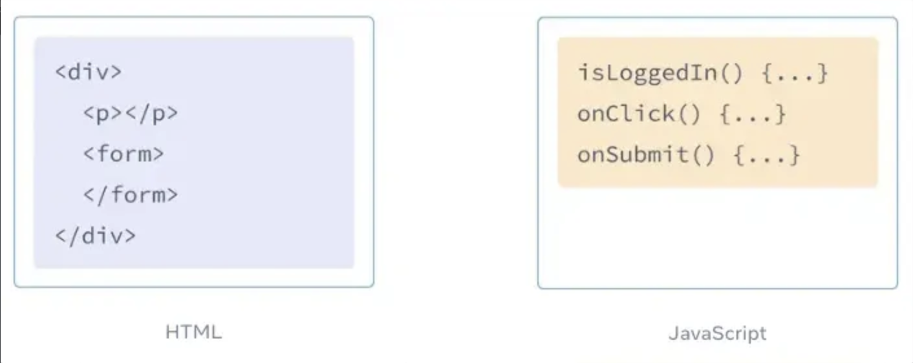
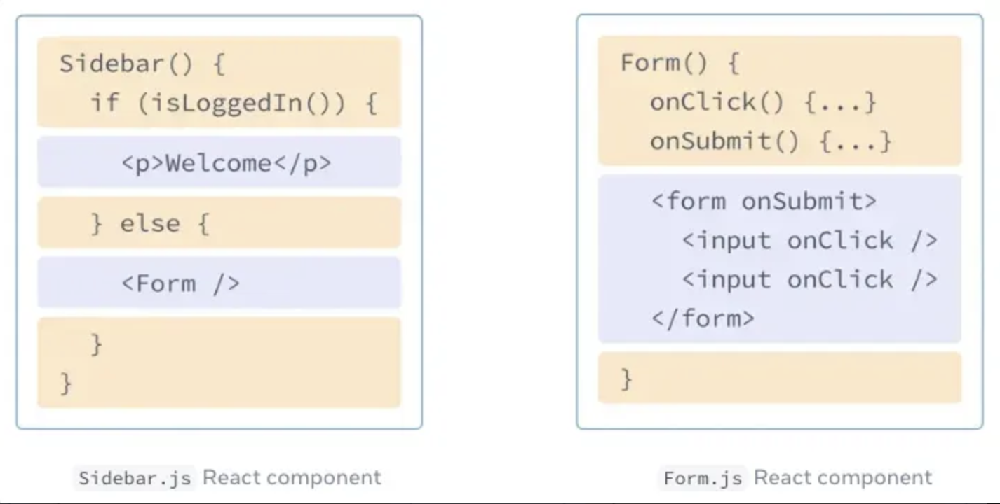

## 리액트란?

리액트는 “UI를 구현하는 라이브러리”이다.

전세계적으로 가장 관심도가 높고, 그만큼 많이 사용되고 있다.

리액트는 페이스북 소프트웨어 엔지니어 jordwalke에 의해 탄생했다.

jordwalke는 “React는 UI 제작을 위한 JavaScript 라이브러리이다.”라고 말했다.

여기서 라이브러리란? 자주 사용되는 기능들을 정리해 모아 놓은 모음집이라고 보면 된다.

UI란? User Interface, 즉 사용자 인터페이스를 뜻하고, 이는 사용자와 컴퓨터 프로그램이 서로 상호작용하기 위해 중간에서 서로 간 입출력을 제어해주는 것이다.

추후 “프레임워크”라는 단어도 듣게 될 것인데 프레임워크는 흐름의 제어 권한을 개발자가 아닌 프레임워크가 갖고 있는 것이다.

라이브러리는 이와 반대로 흐름에 대한 제어를 하지 않고 개발자가 필요한 부분만 필요할 때 가져다 사용하는 형태다. 제어 권한이 개발자에게 있는 것

또한, 리액트는 SPA를 구현하는데 최적화된 라이브러리라고 할 수 있다.

리액트가 SPA를 구현하는 방법은

1. 초기 로드 시 index.html 하나만 불러온다.
2. 이후 페이지 이동 시 JS가 필요한 부분만 변경한다.
3. 특히, react-router-dom을 사용하면, URL이 변경되더라도 페이지 새로고침 없이 컴포넌트만 변경된다.

그럼 간단히 리액트의 특징만 짚고 넘어가보자.

1. 컴포넌트 기반 개발 가능
2. 가상 DOM(Virtual DOM)을 사용
3. 선언형 UI: 기존의 `document.createElement()` 같은 명령형 방식이 아니라, return `<div>Hello, React!</div>` 같은 선언형 방식으로 UI를 작성
4. 단방향 데이터 흐름: 부모 → 자식 방향으로만 데이터가 흐름
5. 상태 관리: state라고 하는 상태를 관리할 수 있음
    - 여기서 state의 개념만 살짝 짚고 넘어가자면, state(상태)는 컴포넌트 내부에서 변경될 수 있는 데이터를 의미한다. 상태는 주로 사용자의 입력, 네트워크 요청 결과, 버튼 클릭 드으이 이벤트에 따라 변경된다.

## 새로운 리액트 앱 만들어보기

**`npm create vite@latest my-app -- --template react`**

위 명령어를 통해 리액트 앱을 만들 수 있다.

위 명령어에서 vite(비트)라는 것이 들어가 있는데, 비트는 빠르고 간결한 모던 웹 프로젝트 갭라 경험에 초점을 맞춰 탄생한 빌드 도구다.

Vite은 예전부터 널리 사용되던 번들러인 Webpack보다 설정이 훨씬 쉽고 간단하며, 설정이 필요 없기로 유명하던 번들러인 Parcel보다도 훨씬 빠르다. 

위 이유로 인해 현재 많은 개발자로부터 사랑을 받고 있는 번들러다.

번들러는 쉽게 말 해 우리가 작성하는 수 많은 파일들을 하나로 묶고 최적화해주며, 빠른 개발 환경을 제공해주는 도구다.

그럼 이제 리액트 앱을 다뤄보자.

리액트 폴더를 만들고 싶은 경로에 터미널을 열고 first-react-app이라는 리액트 프로젝트를 만들자. 명령어는 다음과 같이 치면 된다.

**`npm create vite@latest first-react-app -- --template react`**

위 명령어로 생성된 폴더를 vscode로 열고, 터미널을 열어 아래의 명령어를 순서대로 입력하자.

- `npm i`
- `npm run dev`

위 명령어를 차례로 치면 막 뭐가 실행되면서 마지막엔 우리의 로컬 주소가 나오게 된다.

ctrl + 클릭을 통해 주소를 열어주자. 그럼 다음과 같은 화면이 보일 것이다.


## 리액트로 첫 컴포넌트 만들어보기

> ❗ <br />
> React는 사용자 인터페이스(UI)를 렌더링하기 위한 JavaScript 라이브러리다. <br />
> UI는 버튼, 텍스트, 이미지와 같은 작은 요소로 구성된다. <br />
> React를 통해 작은 요소들을 재사용 가능하고 중첩할 수 있는 컴포넌트로 조합할 수 있다.<br />
> 웹 사이트에서 휴대전화 앱에 이르기까지 화면에 있는 모든 것을 컴포넌트로 나눌 수 있다. <br />
> 공식문서

첫 컴포넌트를 만들어보자.

컴포넌트란, 쉽게 말해 독립된 UI 조각이라고 보면 된다.

또한, 컴포넌트는 버튼처럼 작을 수도 있고, 전체 페이지와 같이 큰 경우도 있다.

아래 예시를 통해 먼저 컴포넌트의 구조를 살펴보자.

아까 만들었던 리액트 앱에서 `App.jsx` 파일의 코드를 아래 코드로 변경해보자.

```jsx
import "./App.css";

function Profile() {
  return ;
}

function App() {
  return (
    <section>
      <h1>Amazing scientists</h1>
      <Profile />
      <Profile />
      <Profile />
    </section>
  );
}

export default App;

```

여기서 유의해야할 점은 컴포넌트는 반드시 대문자로 시작해야한다는 것이다.

위 코드는 Profile이라는 컴포넌트를 정의한 것인데, 이건 반복돼서 사용되는 이미지이기에 재사용하기 위해 독립된 UI 조각으로 뺀 것이다.

위 코드는 사실 아래와 같은 코드인 것이다.

```jsx
function App() {
  return (
    <section>
		  <h1>Amazing scientists</h1>
		  
		  
		  
		</section>
  );
}
```

가만 보면 컴포넌트의 모습이 함수의 모습이다.

결국 맞는 말이다. 컴포넌트는 일반 자바스크립트 함수이다.

다만 `return`해주는 것이 HTML이라는 것에서 일반 자바스크립트 함수와 조금 다르다.

- 부모 컴포넌트와 자식 컴포넌트
    
    `Profile` 컴포넌트는 현재 `App` 컴포넌트 안에서 렌더링되고 있기 때문에 `App` 은 부모 컴포넌트, `Profile` 은 자식 컴포넌트라고 할 수 있다.
    
    주의할 점은 다음과 같이 정의를 중첩하는 것은 불가능하다는 것이다.
    
    ```jsx
    // ❌
    export default function App() {
    	// 컴포넌트 안에서 절대 다른 컴포넌트를 정의하지 마세요. 버그를 유발합니다.
    	function Profile() {
    		...
    	}
    }
    
    // ✅
    export default function App() { }
    
    // 최상위 레벨에서 컴포넌트 선언해야 합니다.
    function Profile() {
    		...
    }
    ```
    

## 컴포넌트를 `import` & `export` 해보자

한 파일에 모든 컴포넌트를 적게 되면 파일 하나의 길이가 어마무시할 것이다.

그렇기에 컴포넌트 파일을 따로 분리하여 재사용성을 높여볼 것이다.

리액트 프로젝트에서 src 폴더에 `Profile.jsx` 라는 새로운 폴더를 만들 것이다.

그리고 그 파일에 다음 코드를 작성하자.

```jsx
export default function Profile() {
  return ;
}
```

`export` 방법에는 2가지가 있다.

- `default` : 한 파일에 하나의 `default export` 만 존재
- `named export` : 한 파일에 여러 개 존재 가능

또한 사용되는 구문이 약간 다르다.

| Syntax | Export 구문 | Import 구문 |
| --- | --- | --- |
| Default | `export default function Button() {}` | `import Button from './button.js';` |
| Named | `export function Button() {}` | `import { Button } from './button.js';` |

```jsx
// App.jsx
import "./App.css";
import Profile, { Congratulations, Congratulations2 } from "./Profile";

function App() {
  return (
    <section>
      <h1>Amazing scientists</h1>
      <Profile />
      <Profile />
      <Profile />

      <Congratulations />
      <Congratulations2 />
    </section>
  );
}

export default App;

```

```jsx
// Profile.jsx
export default function Profile() {
  return ;
}

export function Congratulations() {
  return <h1>Good job!</h1>;
}
export function Congratulations2() {
  return <h1>Good job2222!</h1>;
}
```

## JSX 문법
> ❗ <br />
> JSX는 JavaScript를 확장한 문법으로, JavaScript 파일을 HTML과 비슷하게 마크업을 작성할 수 있도록 해준다. <br />
> 컴포넌트를 작성하는 다른 방법도 있지만, 대부분의 React 개발자는 JSX의 간결함을 선호하며 대부분의 코드 베이스에서 JSX를 사용한다.<br />
> 공식문서

리액트 이전의 웹 세상에서는 HTML, CSS, JS를 각각 분리된 파일로 관리했었다.



하지만, 웹이 더욱 인터렉티브해지며 로직이 내용을 결정하는 경우가 많아지게 되었다.

즉, JS를 통해 화면에 그려주는 내용이 결정되는 경우가 늘어난 것이다.

그래서 JS가 HTML을 담당하게 되었다.

리액트에서 렌더링 로직과 마크업이 같은 위치에 함께 있게 된 것이다.



React 컴포넌트는 React가 브라우저에 마크업을 렌더링할 수 있는 JS 함수다.

즉, React 컴포넌트는 JSX라는 확장된 문법을 사용하여 마크업을 나타낸다.

열심히 `return` 해주던 것들이 JSX라는 것이었다.

- JSX의 규칙
    1. 하나의 루트 엘리먼트로 반환하기
        
        한 컴포넌트에서 여러 엘리먼트를 반환할 때 반드시 하나의 부모 태그로 감싸줘야 한다.
        
        ```jsx
        // ❌
        function Component() {
        	return (
        		<h1>Hedy Lamarr's Todos</h1>
        	  
        	  <ul>
        	    ...
        	  </ul>
        	)
        }
        
        // ✅ 이렇게 div 를 부모 태그로 감싸줘야 한다.
        function Component() {
        	return (
        		<div>
        			<h1>Hedy Lamarr's Todos</h1>
        		  
        		  <ul>
        		    ...
        		  </ul>
        	  </div>
        	)
        }
        
        // 혹은 빈 태그를 사용해주셔도 좋다.
        function Component() {
        	return (
        		<>
        			<h1>Hedy Lamarr's Todos</h1>
        		  
        		  <ul>
        		    ...
        		  </ul>
        	  </>
        	)
        }
        ```
        
        위와 같이 빈 태그를 `Fragment`라고 한다.
        
        `Fragment` 는 브라우저상의 HTML 트리 구조에서 흔적을 남기지 않고 그룹화해주는 녀석이다.
        
    2. 모든 태그는 닫아주기
        
        JSX에서는 태그를 명시적으로 닫아야 한다.
        
        `` 처럼 닫는 태그가 필요 없는 태그도 반드시 닫는 태그 `` 형태로 작성해야 한다.
        
        ```jsx
        function Component() {
        	return (
        		<>
        		  
        		  <ul>
        		    <li>Invent new traffic lights</li>
        		    <li>Rehearse a movie scene</li>
        		    <li>Improve the spectrum technology</li>
        		  </ul>
        		</>
        	)
        }
        ```
        
    3. 대부분 카멜 케이스로 작성된다.
        
        원래는 `class`로 작성했는데 리액트에서 `className`으로 작성되는 것을 볼 수 있다.
        
        ```jsx
        function Component() {
        	return <h1 className="good">GOOD</h1>
        }
        ```
        
        하지만 `aria-*` `data-*` 의 어트리뷰트들은 동일하게 대시를 사용한다.
        

## 중괄호가 있는 JSX 안에서 자바스크립트를 사용하는 방법

변수를 JSX에 포함하고 싶을 때에는 어떻게 해야할까?

기존 방법은 따옴표로 어트리뷰트의 값을을 넘겨주었었다.

```jsx
export default function Avatar() {
  return (
    
  );
}
```

이제 이미지 주소와 설명을 변수로 빼서 동적으로 저장해보겠다.

아래와 같이 `{ }` 중괄호로 바꿔서 JS의 값을 사용할 수 있다.

```jsx
export default function Avatar() {
  const avatar = 'https://i.imgur.com/7vQD0fPs.jpg';
  const description = 'Gregorio Y. Zara';
  return (
    
  );
}

```

```jsx
export default function Avatar() {
  const avatar = 'https://i.imgur.com/7vQD0fPs.jpg';
  const description = 'Gregorio Y. Zara';
  return (
	  <>
	    
	    <p>{description}</p>
	  </>
  );
}

```

만약, JSX에 객체를 전달하고 싶다면 아래와 같이 이중 중괄호를 사용하면 된다.

또한, `style` 속성을 통해 인라인 css 스타일을 JSX에 넘겨주고 싶을 때에도 마찬가지다.

```jsx
function App() {
  return (
    <ul style={{
      backgroundColor: 'black',
      color: 'pink'
    }}>
      <li>Improve the videophone</li>
      <li>Prepare aeronautics lectures</li>
      <li>Work on the alcohol-fuelled engine</li>
    </ul>
  );
}

```

이런 식으로 하나의 객체로 옮기고 JSX에서 이렇게 활용할 수 있다.

```jsx
const person = {
  name: 'Gregorio Y. Zara',
  theme: {
    backgroundColor: 'black',
    color: 'pink'
  }
};

function App() {
  return (
    <div style={person.theme}>
      <h1>{person.name}'s Todos</h1>
      
      <ul>
        <li>Improve the videophone</li>
        <li>Prepare aeronautics lectures</li>
        <li>Work on the alcohol-fuelled engine</li>
      </ul>
    </div>
  );
}

```

## Props 전달

<aside>
❗

React 컴포넌트는 props를 이용해 서로 통신한다.

모든 부모 컴포넌트는 props를 줌으로써 몇몇의 정보를 자식 컴포넌트에게 전달할 수 있다.

props는 HTML 어트리뷰트를 생각나게 할 수도 있지만, 객체, 배열, 함수를 포함한 모든 JavaScript 값을 전달할 수 있다.

* 공식 문서 *

</aside>

컴포넌트에 props를 전달하는 방법을 알아보자.

- App.jsx
    
    ```jsx
    import "./App.css";
    import Avatar from "./Avatar";
    
    const person1 = {
      imgUrl: "https://i.imgur.com/7vQD0fPs.jpg",
      description: "Gregorio Y. Zara",
    };
    
    function App() {
      return <Avatar imgUrl={person1.imgUrl} description={person1.description} />;
    }
    
    export default App;
    ```
    
- Avatar.jsx
    
    ```jsx
    export default function Avatar({ imgUrl, description }) {
      return (
        <>
          
          <p>{description}</p>
        </>
      );
    }
    ```
    

이렇게 props로 데이터를 전달할 수 있으면 좋은 점이 뭘까?

같은 UI지만 다른 데이터를 보여줘야할 때 같은 컴포넌트를 사용하되 props만 변경하면되니 편하다.

- App.jsx
    
    ```jsx
    import "./App.css";
    import Avatar from "./Avatar";
    
    const person1 = {
      imgUrl: "https://i.imgur.com/7vQD0fPs.jpg",
      description: "Gregorio Y. Zara",
    };
    
    const person2 = {
      imgUrl: "https://i.imgur.com/1bX5QH6.jpg",
      description: "Lin Lanying",
    };
    
    function App() {
      return (
        <>
          <Avatar imgUrl={person1.imgUrl} description={person1.description} />
          <Avatar imgUrl={person2.imgUrl} description={person2.description} />
        </>
      );
    }
    
    export default App;
    ```
    

props가 혹시라도 넘어오지 않는다면 원하는대로 화면이 보이지 않을 것이다.

그럴 때를 위해 props의 기본값을 지정할 수도 있다.

- Avatar.jsx
    
    ```jsx
    export default function Avatar({ imgUrl, description = "default description" }) {
      return (
        <>
          
          <p>{description}</p>
        </>
      );
    }
    ```
    
- App.jsx
    
    ```jsx
    import "./App.css";
    import Avatar from "./Avatar";
    
    const person1 = {
      imgUrl: "https://i.imgur.com/7vQD0fPs.jpg",
      description: "Gregorio Y. Zara",
    };
    
    const person2 = {
      imgUrl: "https://i.imgur.com/1bX5QH6.jpg",
      description: "Lin Lanying",
    };
    
    function App() {
      return (
        <>
          <Avatar imgUrl={person1.imgUrl} description={person1.description} />
          <Avatar imgUrl={person2.imgUrl} />
        </>
      );
    }
    
    export default App;
    
    ```
    

props를 전달할 때 spread 문법도 사용할 수 있다.

- App.jsx
    
    ```jsx
    import "./App.css";
    import Avatar from "./Avatar";
    
    const person1 = {
      imgUrl: "https://i.imgur.com/7vQD0fPs.jpg",
      description: "Gregorio Y. Zara",
      inlineStyle: { backgroundColor: "yellow" },
    };
    
    const person2 = {
      imgUrl: "https://i.imgur.com/1bX5QH6.jpg",
      description: "Lin Lanying",
      inlineStyle: { backgroundColor: "pink" },
    };
    
    function App() {
      return (
        <>
          <Avatar {...person1} />
          <Avatar
            imgUrl={person2.imgUrl}
            description={person2.description}
            descriptionStyle={{ backgroundColor: "pink" }}
          />
        </>
      );
    }
    
    export default App;
    ```
    
- Avatar.jsx
    
    ```jsx
    export default function Avatar(props) {
      console.log(props);
      return (
        <>
          
          <p style={props.descriptionStyle}>{props.description}</p>
        </>
      );
    }
    
    // 당연히 이렇게도 잘 받아와집니다
    export default function Avatar({ imgUrl, description, descriptionStyle }) {
      return (
        <>
          
          <p style={descriptionStyle}>{description}</p>
        </>
      );
    }
    ```
    

다음으로 자식을 JSX로 전달하는 방법도 배워보자.

컴포넌트를 중첩하고 싶을 수도 있기 때문이다.

- App.jsx
    
    ```jsx
    import "./App.css";
    import Avatar from "./Avatar";
    
    const person1 = {
      imgUrl: "https://i.imgur.com/7vQD0fPs.jpg",
      description: "Gregorio Y. Zara",
      descriptionStyle: { backgroundColor: "yellow" },
    };
    
    const person2 = {
      imgUrl: "https://i.imgur.com/1bX5QH6.jpg",
      description: "Lin Lanying",
      descriptionStyle: { backgroundColor: "pink" },
    };
    
    function Card({ children }) {
      return (
        <div style={{ border: "1px solid black", margin: "10px", padding: "20px" }}>
          {children}
        </div>
      );
    }
    
    function App() {
      return (
        <>
          <Card>
            <Avatar {...person1} />
          </Card>
          
          <Card>
            <Avatar
              imgUrl={person2.imgUrl}
              description={person2.description}
              descriptionStyle={{ backgroundColor: "pink" }}
            />
          </Card>
          
          <Card>
            <h1>HI</h1>
          </Card>
        </>
      );
    }
    
    export default App;
    ```
    

## 조건부 렌더링

컴포넌트는 조건에 따라 다른 항목을 표시해야 하는 경우가 많다.

React는 `if`문, `&&`문 및 `? :` 연산자와 같은 자바스크립트 문법을 사용하여 조건부로 JSX를 렌더링할 수 있다.

`if/else`문으로 조건부 렌더링을 해보면 아래와 같다.

```jsx
import "./App.css";

export default function App() {
  const isBool = true;

  if (isBool) return <h1>TRUE</h1>;

  return <h1>FALSE</h1>;
}
```

만약, 특정 조건에 아무것도 반환하지 않고 싶다면 아래와 같이 `null` 을 반환하면 된다.

```jsx
import "./App.css";

export default function App() {
  const isBool = true;

  if (isBool) return null

  return <h1>FALSE</h1>;
}
```

위 조건부 렌더링을 좀 더 간결하게 쓰고 싶다면 `삼항연산자`를 사용할 수 있다.

```jsx
import "./App.css";

export default function App() {
  const isBool = true;

  return <h1>{isBool ? "✅ TRUE" : "❌ FALSE"}</h1>;
}

```

또, 논리 연산자 중 `AND 연산자 (&&)` 를 통해서도 조건부 렌더링을 작성할 수 있다.

React 컴포넌트에서는 조건이 참일 때 일부 JSX를 렌더링하거나 그렇지 않으면 아무것도 렌더링하지 않을 때를 나타내는 경우가 많다.

이 때, `&&` 연산자를 사용하면 `isBool`이 `true`인 경우에만 조건부로 렌더링할 수 있게 된다.

```jsx
import "./App.css";

export default function App() {
  const isBool = true;

  return <h1>{isBool && "✅ TRUE"}</h1>;
}
```

마찬가지로 컴포넌트도 `&&` 연산자로 원하는 경우에만 렌더링할 수 있다.

```jsx
import "./App.css";
import Mandoo from "./Mandoo";

export default function App() {
  const isBool = true;

  return (
    <>
      <p>isBool 이 참이면 만두 컴포넌트가 보일겁니다.</p>

      {isBool && <Mandoo borderColor={"pink"} imgWidth={300} />}
    </>
  )
}
```

코드에서 볼 수 있듯 중괄호는 JSX에서 JavaScript가 들어가는 창이다.

## 리스트 렌더링

JavaScript 배열 메서드를 사용하여 데이터 배열을 조작할 수 있다.

예를 들어, `filter`, `map`을 사용해 데이터 배열을 필터링하고, 컴포넌트 배열로 변환할 수 있다.

다음과 같은 데이터 배열이 있다고 가정해보자.

```jsx
const people = [
  'Creola Katherine Johnson: mathematician',
  'Mario José Molina-Pasquel Henríquez: chemist',
  'Mohammad Abdus Salam: physicist',
  'Percy Lavon Julian: chemist',
  'Subrahmanyan Chandrasekhar: astrophysicist'
];
```

이 데이터 배열의 요소들을 각각 `li`태그로 보여주고 싶다면?

그 때 `people` 의 요소를 새로운 JSX 노드 배열인 `listItems` 에 매핑한다.

```jsx
const people = [
  'Creola Katherine Johnson: mathematician',
  'Mario José Molina-Pasquel Henríquez: chemist',
  'Mohammad Abdus Salam: physicist',
  'Percy Lavon Julian: chemist',
  'Subrahmanyan Chandrasekhar: astrophysicist'
];

export default function App() {
  const listItems = people.map(person => <li>{person}</li>);
  return <ul>{listItems}</ul>;
}
```

이번엔 다음과 같은 데이터가 있다고 가정해보자.

```jsx
export const people = [{
  id: 0,
  name: 'Creola Katherine Johnson',
  profession: 'mathematician',
  accomplishment: 'spaceflight calculations',
  imageId: 'MK3eW3A'
}, {
  id: 1,
  name: 'Mario José Molina-Pasquel Henríquez',
  profession: 'chemist',
  accomplishment: 'discovery of Arctic ozone hole',
  imageId: 'mynHUSa'
}, {
  id: 2,
  name: 'Mohammad Abdus Salam',
  profession: 'physicist',
  accomplishment: 'electromagnetism theory',
  imageId: 'bE7W1ji'
}, {
  id: 3,
  name: 'Percy Lavon Julian',
  profession: 'chemist',
  accomplishment: 'pioneering cortisone drugs, steroids and birth control pills',
  imageId: 'IOjWm71'
}, {
  id: 4,
  name: 'Subrahmanyan Chandrasekhar',
  profession: 'astrophysicist',
  accomplishment: 'white dwarf star mass calculations',
  imageId: 'lrWQx8l'
}];

```

이 데이터 중에서 직업이 `chemist` 인 사람만 보여주고 싶다면?

그 때에는 `filter()` 를 사용할 수 있을 것이다.

`people`에서 `filter()`를 호출해 `person.profession === ‘chemist’`로 필터링해서 “chemist”로만 구성된 새로운 배열 `chemists`를 생성한다.

```jsx
const chemists = people.filter(person =>
  person.profession === 'chemist'
);

export default function App() {
  // 이제 chemists를 매핑한다.
	const listItems = chemists.map(person =>
	  <li>
	     
	     <p>
	       <b>{person.name}:</b>
	       {' ' + person.profession + ' '}
	       known for {person.accomplishment}
	     </p>
	  </li>
	);
	
  return <ul>{listItems}</ul>;
}
```

혹은 변수로 따로 빼지 않고 작성해줄 수도 있다.

```jsx
const people = [
  {
    id: 0,
    name: "Creola Katherine Johnson",
    profession: "mathematician",
    accomplishment: "spaceflight calculations",
    imageId: "MK3eW3A",
  },
  {
    id: 1,
    name: "Mario José Molina-Pasquel Henríquez",
    profession: "chemist",
    accomplishment: "discovery of Arctic ozone hole",
    imageId: "mynHUSa",
  },
  {
    id: 2,
    name: "Mohammad Abdus Salam",
    profession: "physicist",
    accomplishment: "electromagnetism theory",
    imageId: "bE7W1ji",
  },
  {
    id: 3,
    name: "Percy Lavon Julian",
    profession: "chemist",
    accomplishment:
      "pioneering cortisone drugs, steroids and birth control pills",
    imageId: "IOjWm71",
  },
  {
    id: 4,
    name: "Subrahmanyan Chandrasekhar",
    profession: "astrophysicist",
    accomplishment: "white dwarf star mass calculations",
    imageId: "lrWQx8l",
  },
];

const chemists = people.filter((person) => person.profession === "chemist");

export default function App() {
  return (
    <ul>
      {chemists.map((person) => (
        <li>{person.name}</li>
      ))}
    </ul>
  );
}

```

위와 같이 작성하면 화면을 잘 보이겠지만 콘솔을 열어보면 이런 에러가 나올 것이다.

`Each child in a list should have a unique “key” prop` 

리액트에서는 각 배열 항목에 다른 항목 중에서 고유하게 식별할 수 있는 문자열 또는 숫자를 `key` 로 지정해야 한다.

즉, `map()` 호출 내부의 JSX 엘리먼트에는 항상 `key` 가 필요하다는 것

`key` 는 각 컴포넌트가 어떤 배열 항목에 해당하는지 React에 알려주는 역할이다.

배열 항목이 정렬 등으로 인해 이동하거나 삽입되거나 삭제될 수 있는 경우 중요해진다.

`key` 를 잘 선택하면 React가 정확히 무슨 일이 일어났는지 추론하고 DOM 트리에 올바르게 업데이트 하는 데 도움이 된다.

그래서 반드시 `key` 값은 고유한 값이어야 한다.

위 코드에 `key` 값을 넣어줄 것인데, 데이터 정보를 활용할 것이다.

```jsx
import "./App.css";

const people = [
  {
    id: 0,
    name: "Creola Katherine Johnson",
    profession: "mathematician",
    accomplishment: "spaceflight calculations",
    imageId: "MK3eW3A",
  },
  {
    id: 1,
    name: "Mario José Molina-Pasquel Henríquez",
    profession: "chemist",
    accomplishment: "discovery of Arctic ozone hole",
    imageId: "mynHUSa",
  },
  {
    id: 2,
    name: "Mohammad Abdus Salam",
    profession: "physicist",
    accomplishment: "electromagnetism theory",
    imageId: "bE7W1ji",
  },
  {
    id: 3,
    name: "Percy Lavon Julian",
    profession: "chemist",
    accomplishment:
      "pioneering cortisone drugs, steroids and birth control pills",
    imageId: "IOjWm71",
  },
  {
    id: 4,
    name: "Subrahmanyan Chandrasekhar",
    profession: "astrophysicist",
    accomplishment: "white dwarf star mass calculations",
    imageId: "lrWQx8l",
  },
];

const chemists = people.filter((person) => person.profession === "chemist");

export default function App() {
  const listItems = chemists.map((person) => (
    <li key={person.id}> // ✅ 최상위 태그에 고유한 key 값 설정하기
      
      <p>
        <b>{person.name}:</b>
        {" " + person.profession + " "}
        known for {person.accomplishment}
      </p>
    </li>
  ));

  return <ul>{listItems}</ul>;
}

```

## 컴포넌트를 순수하게 유지하자.

함수형 프로그래밍에 대해 배울 때 잠시 언급된 적 있다.

다시 한 번 정리해보면 순수 함수는 아래와 같은 특징을 가진다.

- 자신의 일에 집중한다. → 함수가 호출되기 전에 존재했던 어떤 객체나 변수는 변경하지 않는다.
- 같은 입력, 같은 출력 → 같은 입력이 주어졌다면 순수함수는 같은 결과를 반환한다.

다음 함수는 순수 함수다.

3을 넘으면 항상 6을 반환한다.

그 날 시간에 따라서 3을 넣었을 때 다른 값을 반환하는 일은 없다.

```jsx
function double(number) {
  return 2 * number;
}
```

리액트에서 작성되는 모든 컴포넌트는 순수 함수라고 가정한다.

React 컴포넌트에 같은 입력이 주어진다면 반드시 같은 JSX를 반환한다는 것을 의미한다.

```jsx
function Recipe({ drinkers }) {
  return (
    <ol>
      <li>Boil {drinkers} cups of water.</li>
      <li>Add {drinkers} spoons of tea and {0.5 * drinkers} spoons of spice.</li>
      <li>Add {0.5 * drinkers} cups of milk to boil and sugar to taste.</li>
    </ol>
  );
}

export default function App() {
  return (
    <section>
      <h1>Spiced Chai Recipe</h1>
      <h2>For two</h2>
      <Recipe drinkers={2} />
      <h2>For a gathering</h2>
      <Recipe drinkers={4} />
    </section>
  );
}

```

`Recipe` 에 `drinkers={2}` 를 넘기면 항상 `2 cups of water` 를 포함한 JSX를 반환한다.

`drinkers={4}` 를 넘기면 항상 `4 cups of water` 를 포함한 JSX를 반환한다.

그럼 어떤 것이 순수하지 않은 컴포넌트일까?

컴포넌트는 JSX만을 반환해야 하며, 렌더링 이전에 존재했던 객체나 변수를 변경해서는 안된다.

그렇게 하면 컴포넌트는 순수하지 않은 것이다.

아래 코드는 사이드 이펙트를 유발하여 의도하지 않은 결과를 초래하는 순수 컴포넌트의 규칙을 위반하는 컴포넌트의 예시이다.

```jsx
let guest = 0;

function Cup() {
  // 나쁜 지점: 이미 존재했던 변수를 변경하고 있음
  guest = guest + 1;
  return <h2>Tea cup for guest #{guest}</h2>;
}

export default function TeaSet() {
  return (
    <>
      <Cup />
      <Cup />
      <Cup />
    </>
  );
}
```

위 컴포넌트는 컴포넌트 바깥에 선언된 변수 `guest` 를 읽고, 수정하고 있다.

즉, 컴포넌트를 여러 번 호출하면 다른 JSX를 생성한다는 것을 의미한다.

`guest` 변수의 값을 예측할 수 없으니 혼란스러운 버그로 이어질 수도 있을 것이다.

위 컴포넌트를 순수 컴포넌트로 수정하면 아래와 같다.

```jsx
function Cup({ guest }) {
  return <h2>Tea cup for guest #{guest}</h2>;
}

export default function TeaSet() {
  return (
    <>
      <Cup guest={1} />
      <Cup guest={2} />
      <Cup guest={3} />
    </>
  );
}
```

이제 JSX가 반환하는 것은 오직 `guest` 프로퍼티에만 의존하기 때문에 컴포넌트는 순수하다.

- 순수하지 않은 컴포넌트에서 “Guest #2”, “Guest #4”, “Guest #6” 이렇게 표시되는 이유
    
    React는 개발 중에 각 컴포넌트의 함수를 두 번 호출하는 “엄격 모드”를 제공한다.
    
    컴포넌트 함수를 두 번 호출함으로써, 엄격 모드는 이러한 규칙을 위반하는 컴포넌트를 찾는 데 도움을 준다.
    
    - main.jsx
        
        ```jsx
        createRoot(document.getElementById('root')).render(
          <StrictMode>
            <App />
          </StrictMode>,
        )
        ```
        
    
    원래 함수는 순수하지 않았기에 두 번 호출하는 것이 이 부분을 망가트렸다.
    
    그러나 수정된 순수 버전은 함수가 매번 두 번 호출되더라도 동작한다.
    
    순수 함수는 연산만 하므로 두 번 호출해도 아무것도 변하지 않는다.
    
    `double(2)` 를 두 번 호출하는게 반환된 것을 변경하지 않고 `y = 2x` 을 두 번 푸는게 y의 답을 바꾸지 않는 것 처럼, 항상 같은 입력이면 같은 출력이다.
    

순수 함수는 함수 스코프 밖의 변수나 호출 전에 생성된 객체를 변경하지 않는다.

하지만, 컴포넌트 내부에서 렌더링하는 동안 그냥 만든 변수와 객체를 변경하는 것은 문제되지 않는다.

```jsx
function Cup({ guest }) {
  return <h2>Tea cup for guest #{guest}</h2>;
}

export default function TeaGathering() {
  let cups = [];
  for (let i = 1; i <= 12; i++) {
    cups.push(<Cup key={i} guest={i} />);
  }
  return cups;
}
```

여기서 `cups` 배열은 `TeaGathering` 내부에서, 같은 렌더링 동안 생성했기 때문에 괜찮다.

`TeaGathering` 외부의 어떤 코드도 이 현상이 발생했다는 사실을 알 수 없다.

이를 “지역 변경”이라 하며, 이는 컴포넌트의 작은 비밀과도 같다.

## `<Fragment>` 내장 컴포넌트

`<Fragment>` 는 종종 `<>…</>` 구문으로 사용하고, 래퍼 노드 없이 엘리먼트를 그룹화할 수 있다.

`<Fragment>` 로 그룹화된 엘리먼트는 DOM 결과물에 영향을 주지 않는다.

빈 태그 대신 `<Fragment>` 가 사용도가 높은 이유는 `key` 를 명시해줄 수 있기 때문이다.